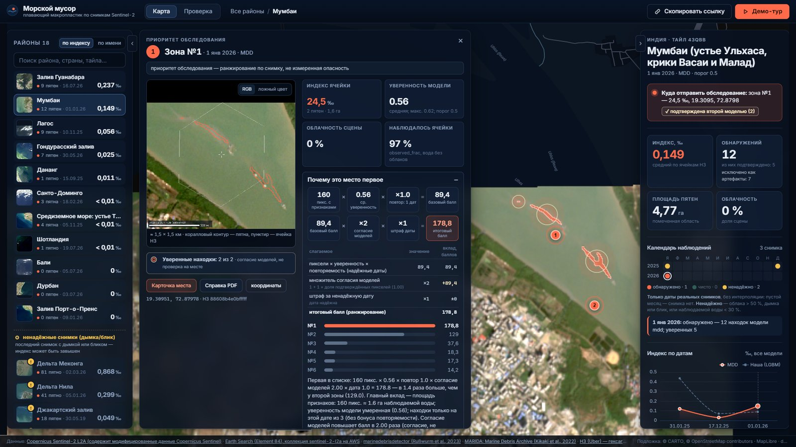

# Макропластик: обнаружение плавающего мусора по снимкам Sentinel-2

Система находит на снимке Sentinel-2 пиксели воды с признаками плавающего мусора и считает по сетке H3 показатель «доля наблюдаемой воды с признаками мусора» (‰). По нему выделяет зоны «приоритет обследования», сравнивает районы и даты на интерактивной карте и строит демонстрационный прогноз дрейфа найденных пятен на 72 ч. Это индекс по снимку, а не масса и не концентрация пластика: он показывает, куда направить обследование в первую очередь.

Полный отчёт — [reports/report.md](reports/report.md), журнал экспериментов — [reports/experiments.md](reports/experiments.md), презентация — `reports/deck.pptx`.


| Район с находками и зонами обследования | Дрейф 0–72 ч от найденных пятен |
|---|---|
|  |  |
| **Карточка находки: вырезка снимка, площадь, согласие моделей** | **Зона №1: почему это место первое (все множители балла)** |
|  |  |

## Главное

- **Модель**: пиксельный LightGBM (48 признаков: 11 каналов, спектральные индексы, статистики окна вокруг пикселя), обучен на MARIDA train и MADOS. F1 класса Marine Debris на val MARIDA — **0.923** (IoU 0.856, порог 0.63), 95 % интервал по сценам 0.877–0.970.
- **Новый район**: если район целиком убрать из обучения, F1 — **0.854**. Это наш прогноз для незнакомого места.
- Test MARIDA будет посчитан один раз на итоговой модели; до этого все решения принимались только по val.
- **Карта**: 18 районов, 64 живых снимка Sentinel-2 L2A, две модели (marinedebrisdetector и наша LightGBM), 287 уверенных находок (пятно видят обе модели в радиусе 20 м — согласие моделей, не проверка на месте), дрейф для 44 снимков. Лидеры рейтинга по надёжным снимкам (без дымки/блика на последнем снимке): Залив Гуанабара 0.237 ‰ → Мумбаи 0.047 ‰ → Гондурасский залив 0.025 ‰.
- **Скорость**: 300 чипов 256×256 холодным стартом — 5.65 с на GPU, 21.7 с на CPU с 20 потоками, 37.9 с на 8 потоках (таблица ниже).
- **Данные организаторов**: на репетиции с незнакомым архивом первый валидный сабмит — через 40 с после распаковки; обучение на их train — 0.058 → 0.317 F1 на скрытой разметке.

## Быстрый старт

Windows 10/11, Python 3.12 (`py -3.12`). Одна команда из корня репозитория:

```powershell
powershell -ExecutionPolicy Bypass -File run.ps1
```

`run.ps1` при первом запуске создаёт `.venv`, ставит пакеты, при необходимости собирает фронтенд (нужен Node.js 18+; собранный фронтенд уже лежит в `service\static_v2` — интерфейс v2 по умолчанию; прежний интерфейс — `$env:MACROPLASTIC_UI="v1"` перед запуском, сборка в `service\static`), поднимает сервис и открывает http://127.0.0.1:8000. Параметры: `-Port 8080`, `-DataRoot <папка с manifest.json>`, `-NoBrowser`, `-Cpu`.

### Установка: с NVIDIA или без

| | С видеокартой NVIDIA | Без NVIDIA (только CPU) |
|---|---|---|
| Команда | `powershell -ExecutionPolicy Bypass -File run.ps1` | `powershell -ExecutionPolicy Bypass -File run.ps1 -Cpu` |
| Что ставится | `requirements.txt`: PyTorch 2.11.0 с CUDA 12.8 | `requirements-cpu.txt`: те же пакеты, PyTorch 2.11.0 CPU (`https://download.pytorch.org/whl/cpu`) |
| Размер `.venv` (замер) | около 5,7 ГБ, из них torch с библиотеками CUDA 4,2 ГБ | около 1,6 ГБ |
| Время установки | зависит от канала: одно CUDA-колесо torch весит несколько гигабайт | 3,3 мин от `git clone` до ответа `/health` при тёплом кэше pip; без кэша по нашей оценке 10–20 мин |
| `inference.py`, 300 чипов | 5.65 с на GPU | 21.7 с на 20 потоках, 37.9 с на 8 потоках, 81.1 с на 4 потоках |

Если `nvidia-smi` не найден, `run.ps1` сам берёт `requirements-cpu.txt`. Ключ `-Cpu` включает CPU-вариант принудительно. Вручную: `.venv\Scripts\python.exe -m pip install -r requirements-cpu.txt`. Карта, LightGBM и `inference.py` работают на CPU. GPU нужен только для ускорения леса и для пересчёта слоя marinedebrisdetector.

- В репозитории лежит демо-набор: 3 района, 6 дат с находками, зонами и дрейфом. Полный слой (18 районов, 64 даты) собирается командами из раздела «Воспроизведение».
- Точные версии всех пакетов, с которыми получены числа, — в `requirements-lock.txt` (`.venv\Scripts\python.exe -m pip install -r requirements-lock.txt`; там CUDA-сборка torch).
- Прогноз дрейфа (OpenDrift) необязателен и ставится отдельно: `.venv\Scripts\python.exe -m pip install -r requirements-drift.txt`. Карта показывает готовый дрейф и без него.
- Проверка: http://127.0.0.1:8000/health, документация API — http://127.0.0.1:8000/docs.

### Инференс по своей папке GeoTIFF

```powershell
.venv\Scripts\python.exe inference.py --data-dir <папка> --output out\pred
```

Для каждого входного `<name>.tif` пишутся два файла в той же сетке (CRS и transform входа):

| Файл | Тип | Значение |
|---|---|---|
| `<name>_prob.tif` | uint8, 0..255 | вероятность класса Marine Debris: **P = значение / 255** (масштаб в теги GeoTIFF не пишется) |
| `<name>_mask.tif` | uint8, 0/1 | 1, если P ≥ порога модели (для LightGBM 0.63; другой порог — `--threshold`) |

Коды выхода: 0 — всё обработано, 1 — часть файлов с ошибкой (остальные записаны, список — `--report errors.json`), 2 — модель не загрузилась. Масштаб входа (отражение 0..1 или DN L2A со смещением +1000) определяется автоматически, см. `python inference.py --help`.

## Что показывает карта

- true-color снимок, находки двух моделей с карточкой (вырезка, площадь, уверенность, согласие моделей);
- сетка H3 res 8 (около 0,7 км²) с показателем, ячейки с `observed_frac < 0.5` серые, «нет данных»;
- зоны «приоритет обследования» с объяснением, почему зона первая, черновым порядком посещения и PDF-справкой;
- календарь снимков с пометкой ненадёжных дат, сравнение районов и дат, ряд по датам;
- вкладка «Проверка»: разметка находок человеком и дообучение по правилу принятия;
- дрейф 0–72 ч (OpenDrift, течения HYCOM, ветер GFS), выгрузка GeoJSON/CSV, демо-тур.

Показатель ячейки: `share (‰) = 1000 × flagged_water_px / observed_water_px`, где `observed_water_px` — вода без облаков, теней, суши и пропусков, `flagged_water_px` — пиксели с вероятностью не ниже порога модели. Рядом всегда дата, модель и порог.

## Качество (MARIDA, класс Marine Debris)

Модель, признаки, данные и порог выбирались только по официальному val MARIDA; метрики — по пулу размеченных пикселей.

| Модель | Сплит | F1 Marine Debris | IoU Marine Debris | Precision | Recall | Порог |
|---|---|---|---|---|---|---|
| LightGBM, MARIDA train + MADOS (итоговая) | val (выбор) | 0.923 | 0.856 | 0.930 | 0.915 | 0.63 |
| LightGBM, MARIDA train + MADOS (итоговая) | test | будет посчитан один раз на итоговой модели | | | | |
| RF + индексы (статья MARIDA, Table 4) | test | 0.80 | 0.67 | | | |

Сравнение вариантов (val, 3 seed; правило принятия: прирост F1 MD на val не меньше max(0.01, 2 x std по seed)):

| Модель | F1 Marine Debris, val (среднее ± std по seed) | Seed | Решение |
|---|---|---|---|
| LightGBM, только MARIDA | 0.9059 ± 0.0025 | 3 | база для сравнения |
| **LightGBM, MARIDA + MADOS** | 0.9228 ± 0.0005 | 3 | принята, итоговая модель |
| UNet (ResNet-34, EMA) | 0.8909 ± 0.0061 | 3 | отклонена |
| стек UNet + LightGBM (только MARIDA) | 0.9161 ± 0.0015 | 3 | отклонён |

Бейзлайны на том же val: лучшее правило по индексам FDI × NDVI — F1 0.415, RandomForest по протоколу статьи MARIDA — 0.865. Лёгкая и средняя модели и признаки относительно сцены проверены и отклонены — таблицы и причины в [отчёте](reports/report.md), разделы 4 и 6.

## Скорость

Холодный старт `inference.py` на 300 чипах 256×256×11, медиана 3 запусков; «CPU N потоков» — процессу доступны N логических ядер (13th Gen Intel(R) Core(TM) i5-13600KF, 32 GB RAM, 20 threads; NVIDIA GeForce RTX 4070 (driver 581.80); Windows 10, Python 3.12.7):

| Модель | CPU, 4 потока | CPU, 8 потоков | CPU, 20 потоков | GPU |
|---|---|---|---|---|
| **итоговая** (48 признаков, 400 деревьев) | **81,1 с** | **37,9 с** | **21,7 с** | **5,65 с** |
| средняя (20 признаков, 400 деревьев; отклонена) | 77,3 с | 35,9 с | 20,4 с | 4,28 с |
| ускорение средней | ×1,05 | ×1,06 | ×1,06 | ×1,32 |

На машине без NVIDIA время почти пропорционально числу потоков. GPU-путь — собственное CUDA-ядро леса, результат бит в бит совпадает с CPU. Интерфейс: загрузка карты до 3,20 с; перелёт к району 57 fps; вращение глобуса 60 fps; бандл JS+CSS 1,09 МБ gzip; ошибок в консоли 0.

## Данные и лицензии

| Источник | Что берём | Лицензия |
|---|---|---|
| [MARIDA](https://doi.org/10.5281/zenodo.5151941) (Kikaki et al., 2022) | 1 381 патч из 63 сцен, 3 399 px Marine Debris | CC BY 4.0 (данные), MIT (код) |
| [MADOS](https://zenodo.org/records/10664073) (Kikaki et al., 2024) | 1 612 патчей из 118 сцен, 2 536 px Marine Debris | CC BY 4.0 |
| [marinedebrisdetector](https://github.com/MarcCoru/marinedebrisdetector) | предобученные веса UNet++ (основной слой на живых снимках L2A) | MIT |
| Sentinel-2 L2A через [Earth Search](https://earth-search.aws.element84.com/v1) и Planetary Computer | живые снимки | Copernicus, свободно с атрибуцией |
| HYCOM ESPC-D-V02, NCEP GFS | течения и ветер для дрейфа | открытые данные |
| CARTO / OpenStreetMap, Esri World Imagery | подложка карты | условия поставщиков, атрибуция на карте |

«Contains modified Copernicus Sentinel data 2015–2026». Полный список — [reports/sources.md](reports/sources.md). marinedebrisdetector обучался в том числе на MARIDA, поэтому на MARIDA мы его не оцениваем.

Слой marinedebrisdetector на новых снимках пересчитывается, только если есть его код и веса: `git clone https://github.com/MarcCoru/marinedebrisdetector data_cache\marinedebrisdetector`, веса `unet++1` по ссылке из README репозитория → `models\mdd\unet++1\`. Для показа карты это не нужно.

## Воспроизведение

```powershell
.venv\Scripts\python.exe scripts\eda_marida.py                               # EDA MARIDA (data\MARIDA, data\MADOS)
.venv\Scripts\python.exe scripts\train_lgbm_mados.py overlap                  # пересечения MADOS с val MARIDA
.venv\Scripts\python.exe scripts\train_lgbm_mados.py train --data combined --seed 0 --exp c_noextra_exclplace --set mados_extra=false exclude_same_place_val=true --final   # веса -> weights_exp\mados\final, затем копируются в weights\lgbm
.venv\Scripts\python.exe scripts\baselines.py                                 # бейзлайны на val
.venv\Scripts\python.exe scripts\fetch_live.py --region honduras --n 1       # живые снимки L2A
.venv\Scripts\python.exe scripts\run_mdd.py --all; .venv\Scripts\python.exe scripts\run_lgbm_live.py --all
.venv\Scripts\python.exe scripts\build_service_data.py --live-dir data\live --out service\data
.venv\Scripts\python.exe scripts\validate_service_data.py service\data
.venv\Scripts\python.exe scripts\final_numbers.py; .venv\Scripts\python.exe scripts\render_docs.py; .venv\Scripts\python.exe scripts\make_deck.py
.venv\Scripts\python.exe -m pytest -q
```

Сиды зафиксированы, инференс в fp32 без TTA. Все числа README, отчёта и презентации берутся из [reports/final_numbers.json](reports/final_numbers.json). Карта файлов — [docs/FILEMAP.md](docs/FILEMAP.md), инструменты для нового датасета — [docs/TOOLS.md](docs/TOOLS.md).

## Структура

`src/macroplastic/` — код (признаки, модели, сетка H3, фильтры облаков и артефактов, дрейф), `scripts/` — обучение, сборка слоя карты, отчёты, `service/` — API и фронтенд, `tests/` — тесты, `configs/` — каналы и параметры, `weights/` — веса итоговой LightGBM, `docs/` — речь, демо, карта файлов.

В `reports/` имена файлов с префиксом `lN_` — номер этапа работы, в котором сделан разбор. Что внутри:

| Файл в `reports/` | Что внутри |
|---|---|
| `report.md`, `experiments.md` | итоговый отчёт и сводный журнал экспериментов |
| `l3_lgbm.md`, `experiments_l3.md` | пиксельный LightGBM только на MARIDA: признаки, порог, seed |
| `l4_unet.md`, `experiments_l4.md` | UNet и стек с LightGBM (отклонены) |
| `l13_mados.md`, `experiments_l13.md` | MADOS в обучении: пересечения с val MARIDA, выбор итоговой модели |
| `l16_metric_audit.md` | аудит метрики: пересчёт F1, утечка «того же места», leave-region-out, интервалы по сценам |
| `l23_channels_speed.md` | модели на подмножествах каналов и лёгкая быстрая модель, скорость |
| `l31_midsize.md` | средняя модель под CPU и порог смещения L2A +1000 DN |
| `l33_scene_relative.md` | признаки «относительно воды своей сцены» для нового района (отклонены) |
| `l35_asis_check.md` | почему на репетиции модель «как есть» (без обучения на данных организаторов) дала низкий F1 |
| `speed.md`, `ui_perf.md` | скорость `inference.py` по потокам и скорость интерфейса |
| `model_agreement.md`, `artifacts.md`, `cloud_edge.md` | согласие двух моделей, фильтр швов, кильватеров, судов и маленьких лодок (метка общая для двух моделей, разделы L37, L41, L42, L43), фильтр облаков и краёв |
| `robustness.md`, `rehearsal.md`, `rehearsal2.md`, `offline_check.md`, `qa.md` | проверки устойчивости, репетиции с незнакомым датасетом, работа без сети, ответы на вопросы |
| `drift.md`, `marida_regions.md`, `sources.md` | дрейф, районы MARIDA, источники и лицензии |
| `tools/marida_*`, `tools/org_*` | отчёты инструментов первого часа (`docs/TOOLS.md`) на MARIDA и на датасете репетиции |
| `tools/fire_*` | те же инструменты на незнакомом датасете прошлого хакатона (пожары: гари и активный огонь). Это проверка, что инструменты работают на чужих данных; к мусору эти файлы не относятся |

## Ограничения

- **Не масса.** Показатель — доля помеченной воды на снимке; он зависит от порога, облачности, блика и разрешения 10 м.
- **Перенос.** На новом районе F1 около 0.854, а не 0.923; в MARIDA размечено около 1 % пикселей.
- **Сдвиг домена.** Итоговая модель обучена на ACOLITE, живые снимки — L2A, поэтому основной слой на карте — marinedebrisdetector.
- **Ложные срабатывания**: пена, водоросли, суда и их следы, кромки облаков, речные шлейфы; остальное проверяет человек.
- **Скорость на CPU**: на 4–8 потоках 300 чипов обрабатываются дольше 30 с.
- **Дрейф** демонстрационный. Проверка на 18 парах снимков (эксперимент): прогноз 7/18, базовая линия «на месте» 7/18 — не лучше; подробно `reports/drift_check.md`.
- **Контекст и инциденты.** На карте 2 438 объектов OSM (фермы, пляжи, охраняемые зоны, порты) — только контекст, без предупреждений; 7 494 инцидента со статусами, из них 1 078 исключены системой как артефакты, проверено человеком пока 0.
