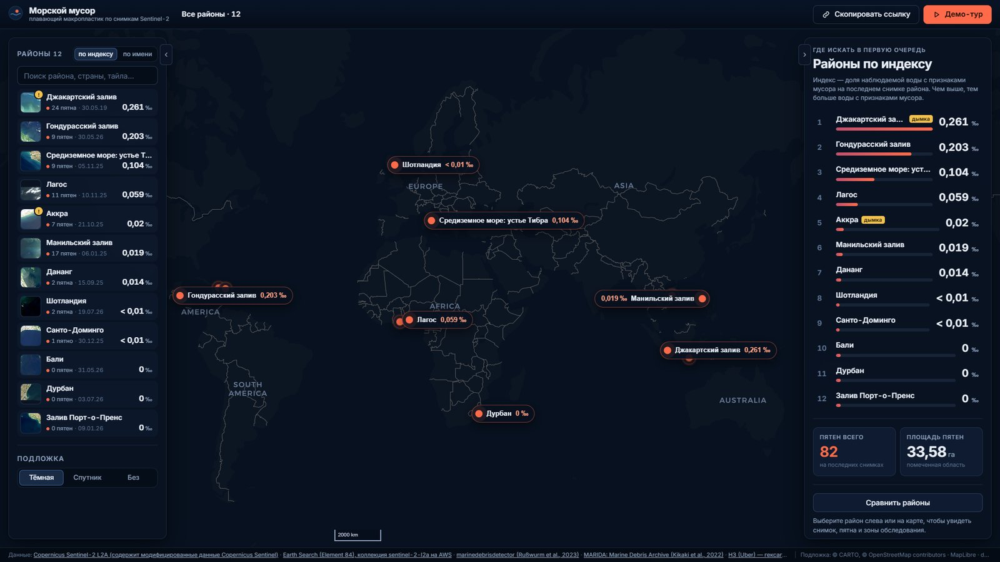
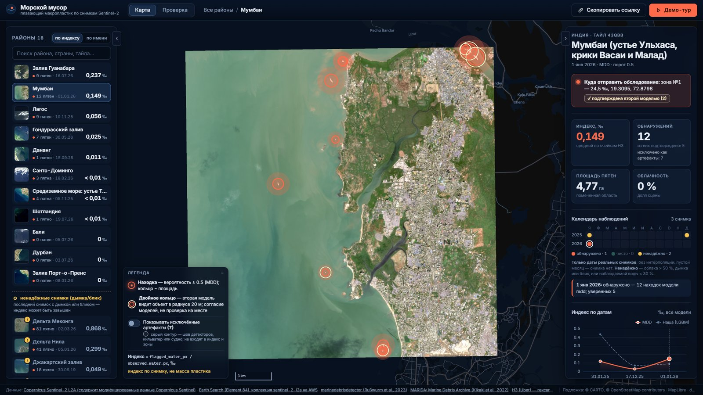
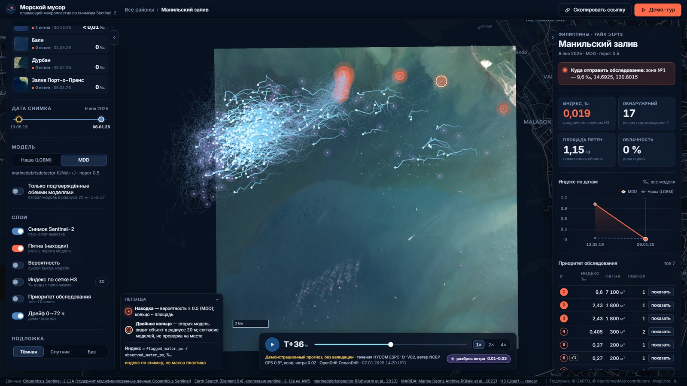
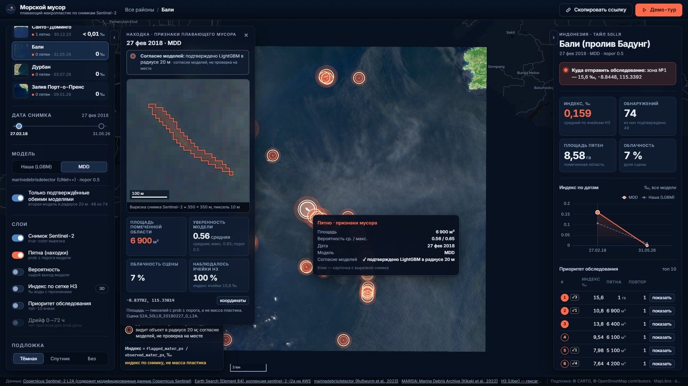

# Макропластик: обнаружение плавающего мусора по снимкам Sentinel-2

Система берёт снимок Sentinel-2, находит на воде пиксели с признаками плавающего мусора и считает по сетке H3 показатель «доля наблюдаемой воды с признаками мусора» (‰). По нему она выделяет зоны «приоритет обследования», сравнивает районы и даты на интерактивной карте и строит демонстрационный прогноз дрейфа найденных пятен на 72 ч. Это индекс по снимку, а не масса и не физическая концентрация пластика: он показывает, куда стоит направить обследование в первую очередь.



| Район с находками и зонами обследования | Дрейф 0–72 ч от найденных пятен |
|---|---|
|  |  |



## Главное

- **Модель**: пиксельный LightGBM, обученный на MARIDA train и MADOS. F1 класса Marine Debris на val MARIDA — **0.923** (IoU 0.856, порог 0.63); разброс по seed 0.0005 (по 3 seed, среднее 0.923).
- **Сравнение моделей** шло по одному правилу: изменение принимается, если F1 на val вырос не меньше чем на max(0.01, 2 × std по seed). UNet и стек UNet + LightGBM это правило не прошли (таблица ниже).
- Test MARIDA будет посчитан один раз на итоговой модели; до этого все решения принимались только по val.
- **Карта**: 12 районов, 29 дат живых сцен Sentinel-2 L2A, две модели (marinedebrisdetector и наша LightGBM). Дрейф посчитан для 11 свежих сцен (2025–2026).
- **Уверенные находки**: пятно одной модели, которое вторая модель видит в радиусе 20 м. На живых сценах таких объектов 200 в 15 из 29 сцен. Это согласие двух моделей, а не проверка на месте.

## Быстрый старт

Нужны Windows 10/11, Python 3.12 (`py -3.12`) и Node.js 18+ (Node нужен, только если пересобирать фронтенд: собранный фронтенд уже лежит в `service\static`). Все команды запускаются из корня репозитория:

```powershell
powershell -ExecutionPolicy Bypass -File run.ps1            # порт 8000
powershell -ExecutionPolicy Bypass -File run.ps1 -Port 8080
```

`run.ps1` при первом запуске создаёт `.venv` и ставит пакеты. Если фронтенд не собран, собирает его, затем поднимает сервис и открывает браузер на http://127.0.0.1:8000.

Те же шаги вручную:

```powershell
py -3.12 -m venv .venv
.venv\Scripts\python.exe -m pip install -r requirements.txt
cd service\frontend; npm ci; npm run build; cd ..\..      # только если меняли фронтенд; сборка кладётся в service\static
.venv\Scripts\python.exe -m service                       # --port 8000 --data-root <папка с manifest.json>
```

- `requirements.txt` ставит PyTorch с CUDA 12.8 (около 3 ГБ). Если GPU нет, удалите из файла строку `--extra-index-url`: поставится CPU-сборка, карта и LightGBM работают без GPU.
- Прогноз дрейфа (`scripts\run_drift.py`) требует OpenDrift: `.venv\Scripts\python.exe -m pip install opendrift`. Для показа карты он не нужен: готовые треки лежат в данных сервиса.

Сервис берёт данные из `service\data\`, а если их нет, то из `service\demo\`. В репозитории лежит демо-набор: 2 района, 4 даты с находками, зонами и дрейфом. Полный слой (12 районов, 29 дат) весит около 200 МБ и собирается командами из раздела «Воспроизведение». Проверка: http://127.0.0.1:8000/health, документация API — http://127.0.0.1:8000/docs.

### Живой слой: код и веса marinedebrisdetector

Для показа карты ничего скачивать не нужно: сервис показывает готовые данные (демо-набор из репозитория или собранный `service\data`). Код и веса marinedebrisdetector (MDD) нужны только, чтобы посчитать находки на новых сценах (`scripts\run_mdd.py`):

```powershell
git clone https://github.com/MarcCoru/marinedebrisdetector data_cache\marinedebrisdetector
# веса: по ссылке на Google Drive из README репозитория MDD (раздел о весах; хостинг автора закрыт, доступ к данным — по запросу автору)
# скачать архив unet++1.zip и распаковать в models\mdd\, чтобы получился файл
#   models\mdd\unet++1\epoch=54-val_loss=0.50-auroc=0.987.ckpt
.venv\Scripts\python.exe scripts\run_mdd.py --all
```

Без `data_cache\marinedebrisdetector` и `models\mdd\` сервис, карта, выгрузки и наша LightGBM работают как обычно; не пересчитывается только слой MDD на новых сценах.

## Что показывает карта

- **Снимок**: true-color вырезка Sentinel-2 L2A поверх спутниковой или тёмной подложки.
- **Находки**: пятна, где вероятность мусора не ниже порога модели. По клику открывается карточка: вырезка снимка, площадь помеченной области, уверенность модели, дата, облачность, `observed_frac` и строка «согласие моделей».
- **Уверенные находки**: двойное кольцо и переключатель «Только подтверждённые обеими моделями». Находка считается подтверждённой, если вторая модель видит объект в радиусе 20 м.
- **Сетка H3** (res 8, ячейка около 0,7 км²): показатель по ячейкам, в режиме 2D или 3D.
- **Приоритет обследования**: топ ячеек с рангом и причиной выбора.
- **Сравнение**: два района или две даты рядом плюс таблица различий.
- **Ряд по датам** и **дрейф 0–72 ч**: частицы OpenDrift от найденных пятен с разбросом по коэффициенту ветрового сноса 1–3 %.
- Выгрузка слоёв в GeoJSON/CSV, ссылка на текущее состояние карты, демо-тур.

Районы в полном слое (последняя дата каждого района; таблица генерируется из данных сервиса):

| Район | Тайл | Дат | Последняя дата | Индекс, ‰ | Пятен | из них уверенных | Площадь пятен, га | Дрейф |
|---|---|---|---|---|---|---|---|---|
| Джакартский залив | 48MXU | 2 | 2019-05-30 | 0.261 | 24 | 9 | 15.69 | нет |
| Гондурасский залив (Омоа – Пуэрто-Кортес – устье Мотагуа) | 16PCC | 5 | 2026-05-30 | 0.203 | 9 | 1 | 10.43 | есть |
| Средиземное море: устье Тибра (Рим, Остия) | 33TTG | 1 | 2025-11-05 | 0.104 | 9 | 1 | 2.76 | есть |
| Лагос (вход в лагуну, порт Апапа) | 31NEG | 1 | 2025-11-10 | 0.059 | 11 | 0 | 1.90 | есть |
| Аккра (лагуна Корле, порт Тема) | 30NZM | 1 | 2025-10-21 | 0.020 | 7 | 0 | 0.94 | есть |
| Манильский залив | 51PTS | 2 | 2025-01-06 | 0.018 | 17 | 1 | 1.15 | есть |
| Дананг (устье Тхубон, Хойан) | 48PZC | 2 | 2025-09-15 | 0.014 | 2 | 0 | 0.61 | есть |
| Шотландия (Ферт-оф-Форт) | 30VWH | 2 | 2026-07-19 | 0.002 | 2 | 1 | 0.08 | есть |
| Санто-Доминго (устье Осамы) | 19QDA | 2 | 2025-12-30 | < 0.001 | 1 | 0 | 0.02 | есть |
| Бали (пролив Бадунг) | 50LLR | 2 | 2026-05-31 | 0.000 | 0 | 0 | 0.00 | нет |
| Дурбан | 36JUN | 5 | 2026-07-03 | 0.000 | 0 | 0 | 0.00 | есть |
| Залив Порт-о-Пренс (Гаити) | 18QYF | 4 | 2026-01-09 | 0.000 | 0 | 0 | 0.00 | нет |

Пятен на последних снимках: 82 (модель MDD, порог 0.50), из них уверенных: 13; уверенных находок по всем датам: 165.

## Показатель: доля наблюдаемой воды с признаками мусора

Для каждой ячейки H3 res 8:

```
share (‰) = 1000 × flagged_water_px / observed_water_px
```

- `observed_water_px`: пиксели воды без облаков, теней, суши и пропусков.
- `flagged_water_px`: те из них, где вероятность мусора не ниже порога модели (после постобработки убираются одиночные компоненты и пиксели у кромки облаков и суши).
- `observed_frac`: доля ячейки, которую удалось наблюдать. Ячейки с `observed_frac < 0.5` окрашены **серым как «нет данных»**, а не нулём.
- Рядом с показателем всегда указаны дата снимка, порог и модель. Один пиксель 10 м в ячейке даёт около 0,14 ‰, поэтому шкала легенды нелинейная.
- **Честная подпись**: индекс по снимку, не масса пластика. Он отражает оптические признаки плавающего материала (FDI и родственные признаки) на конкретную дату, а не количество пластика в воде.

Зоны «приоритет обследования» отбираются по числу помеченных пикселей воды в ячейке с учётом уверенности модели и повторяемости по датам.

## Модели

| Модель | Что это | Где используется |
|---|---|---|
| **LightGBM (наша, итоговая)** | пиксельный градиентный бустинг: 48 признаков = 19 базовых (11 каналов Sentinel-2 и индексы FDI, FAI, NDVI, NDWI, NDMI, SI, BSI, NRD) + 29 оконных (среднее и std в окнах 3/7/15, контраст с локальной медианой); бинарная задача «Marine Debris против всего остального»; обучена на MARIDA train + MADOS; порог 0.63 подобран на val | оценка на MARIDA, `inference.py` (веса `weights\lgbm`) |
| LightGBM для живых сцен | та же схема признаков, обучена на MARIDA train с аугментацией под L2A (сдвиг и усиление отражения); порог 0.64 подобран на val MARIDA (F1 0.912); вход гармонизируется по медиане воды | слой «Наша (LGBM)» на карте (веса `weights\lgbm_live`) |
| **marinedebrisdetector** (Rußwurm et al., 2023) | сторонняя модель UNet++, лицензия MIT, вход — 12 каналов Sentinel-2 L2A; порог показа 0.50 | основной слой находок на живых сценах L2A |

marinedebrisdetector обучался в том числе на MARIDA, поэтому на MARIDA мы его **не оцениваем**: такая оценка не была бы независимой.

## Качество модели (MARIDA, класс Marine Debris)

Модель, признаки, обучающие данные и порог выбирались только по официальному val-сплиту MARIDA. Test MARIDA будет посчитан один раз на итоговой модели; до этого все решения принимались только по val. Метрики считаются по пулу всех размеченных пикселей (неразмеченные игнорируются).

| Модель | Сплит | F1 Marine Debris | IoU Marine Debris | Precision | Recall | Порог |
|---|---|---|---|---|---|---|
| LightGBM, MARIDA train + MADOS (итоговая) | val (выбор) | 0.923 | 0.856 | 0.930 | 0.915 | 0.63 |
| LightGBM, MARIDA train + MADOS (итоговая) | test | будет посчитан один раз на итоговой модели | | | | |
| RF + индексы (статья MARIDA, Table 4) | test | 0.80 | 0.67 | | | |

Бейзлайны на том же val и в той же метрике (`scripts/baselines.py` → `reports/baselines.json`). Пороги правил подобраны на val, поэтому их F1 оптимистичен; последний столбец — F1 на val при порогах, подобранных на train. 95 % интервал — бутстрэп по 12 сценам val:

| Модель / правило | Признаки | Порог | F1 MD val | IoU MD | Precision | Recall | 95 % CI F1 по сценам | F1, порог с train |
|---|---|---|---|---|---|---|---|---|
| Порог FDI (одно правило) | FDI | подобран на val | 0.021 | 0.010 | 0.010 | 0.869 | 0.007…0.044 | 0.014 |
| Интервал FDI (два порога) | FDI | подобраны на val | 0.323 | 0.193 | 0.243 | 0.482 | 0.151…0.494 | 0.203 |
| Порог NDVI (лучший из NDVI / FAI) | NDVI | подобран на val | 0.168 | 0.092 | 0.104 | 0.433 | 0.055…0.340 | 0.126 |
| FDI и NDVI в интервалах (4 порога) | FDI, NDVI | подобраны на val | 0.415 | 0.262 | 0.286 | 0.754 | 0.148…0.693 | 0.351 |
| RandomForest, параметры статьи MARIDA | 11 каналов + 8 индексов | argmax, без подбора | 0.861 ± 0.004 (3 seed) | 0.762 | 0.890 | 0.841 | 0.772…0.949 | — |
| LightGBM без оконных признаков | 11 каналов + 8 индексов | подобран на val | 0.893 ± 0.000 (3 seed) | 0.806 | 0.886 | 0.899 | — | — |
| LightGBM + оконные признаки, только MARIDA | 19 + 29 оконных (3–31 px) | подобран на val | 0.906 ± 0.003 (3 seed) | 0.828 | 0.904 | 0.912 | 0.853…0.959 | — |
| **LightGBM + окна, MARIDA + MADOS (итоговая)** | 19 + 29 оконных (3–31 px) | подобран на val | **0.923 ± 0.001** (3 seed) | 0.856 | 0.930 | 0.915 | 0.877…0.970 | — |

Одно пороговое правило по индексу мусор не отделяет: у мутной воды с взвесью и у Sargassum FDI выше, чем у мусора. Обученный классификатор на тех же 19 признаках даёт скачок F1 с 0.4 до 0.86–0.89, оконные признаки и MADOS добавляют ещё +0.03.

Сравнение вариантов (val, 3 seed; правило принятия: прирост F1 MD на val не меньше max(0.01, 2 x std по seed)):

| Модель | F1 Marine Debris, val (среднее ± std по seed) | Seed | Решение |
|---|---|---|---|
| LightGBM, только MARIDA | 0.9059 ± 0.0025 | 3 | база для сравнения |
| **LightGBM, MARIDA + MADOS** | 0.9228 ± 0.0005 | 3 | принята, итоговая модель |
| UNet (ResNet-34, EMA) | 0.8909 ± 0.0061 | 3 | отклонена |
| стек UNet + LightGBM (только MARIDA) | 0.9161 ± 0.0015 | 3 | отклонён |

- MADOS принят: порог принятия 0.916, получено 0.923. Прирост идёт от меньшего числа ложных срабатываний при той же полноте. Сцены MADOS, снятые в тот же день или в том же месте, что и val MARIDA, из обучения исключены (16 сцен).
- UNet и стек отклонены: порог принятия 0.918 от модели только на MARIDA.
- Проверка переноса на новый район (leave-region-out, 4 района MARIDA, 3 seed): средний F1 MD 0.854 ± 0.006 против 0.923 на официальном val (падение 0.069); по районам: Гондурасский залив 0.828, Порт-о-Пренс 0.946, Джакарта 0.934, острова Ислас-де-ла-Баия 0.706. Тот же протокол для модели только на MARIDA даёт 0.755: MADOS помогает именно переносу. 95 % бутстрэп-интервал F1 на val по сценам: 0.877…0.970; прирост от MADOS в парном бутстрэпе по сценам 0.015 (95 % интервал 0.007…0.038).

Строка RF взята из статьи MARIDA и приведена для ориентира: там другая модель и другой протокол.

## Скорость

`inference.py` на 300 чипах 256×256×11 (первые патчи val MARIDA), холодный старт — новый процесс от запуска до выхода, медиана 3 запусков:

| Режим | Холодный старт | Разброс запусков | Тёплый режим, чипов/с | До оптимизации |
|---|---|---|---|---|
| GPU (GeForce RTX 4070) | **5,65 с** | 5,58–5,66 с | 64,3 | 44,9 с |
| CPU, 20 потоков | **21,43 с** | 20,98–21,76 с | 13,6 | 40,2 с |

Лёгкая модель (20 признаков, 200 деревьев, листьев в дереве до 31) замерена на отдельном стенде: пакет lightgbm, CPU 10 потоков, машина под чужой нагрузкой. Секунды сравнимы только внутри этой таблицы:

| Модель | F1 MD val (3 seed) | Холодный старт, 300 чипов | Тёплый режим, чипов/с |
|---|---|---|---|
| итоговая (48 признаков, 400 деревьев) | 0.923 ± 0.001 | 50,6 с | 6,9 |
| лёгкая (кандидат, в `inference.py` не включена) | 0.924 ± 0.002 | 16,8 с | 19,0 |

Железо: 13th Gen Intel(R) Core(TM) i5-13600KF, 32 GB RAM, 20 threads; NVIDIA GeForce RTX 4070 (driver 581.80); Windows 10, Python 3.12.7.

Интерфейс (реальные данные, 12 районов): загрузка карты до 1,16 с; перелёт к району 53 fps; анимация дрейфа 60 fps; бандл JS+CSS 1,08 МБ gzip.

## Данные и лицензии

| Источник | Что берём | Лицензия |
|---|---|---|
| [MARIDA](https://doi.org/10.5281/zenodo.5151941) (Kikaki et al., 2022) | патчи 256×256 (1 381 шт., сцен: 63), 11 каналов (ACOLITE rhorc), 15 классов и уверенность разметки; Marine Debris — 3 399 px | CC BY 4.0 (данные), MIT (код) |
| [MADOS](https://zenodo.org/records/10664073) (Kikaki et al., 2024) | дополнительная разметка для обучения: 1 612 патчей из 118 сцен, 2 536 px Marine Debris | CC BY 4.0 |
| [marinedebrisdetector](https://github.com/MarcCoru/marinedebrisdetector) | предобученные веса UNet++ | MIT |
| Sentinel-2 L2A через [Earth Search](https://earth-search.aws.element84.com/v1) (запасной канал — Planetary Computer) | живые сцены, COG | Copernicus Sentinel data, свободное использование с атрибуцией |
| HYCOM ESPC-D-V02, NCEP GFS (через OPeNDAP) | течения и ветер для прогноза дрейфа | открытые данные |
| Подложка CARTO / OpenStreetMap, Esri World Imagery | фон карты | условия поставщиков, атрибуция на карте |

Атрибуция снимков: «Contains modified Copernicus Sentinel data 2015–2026». Полные ссылки и цитирование — в [reports/sources.md](reports/sources.md).

Размечена только часть пикселей MARIDA (0.93 %), поэтому площадь загрязнения по её маскам не считается.

## Структура репозитория

```
src/macroplastic/      ядро: чтение данных, признаки, метрики, сплиты, модели, живые сцены, сетка H3, дрейф, адаптер датасетов
service/               FastAPI (API + статика) и фронтенд service/frontend (Vite, React, MapLibre, deck.gl); service/demo — демо-набор
scripts/               обучение, загрузка сцен, инференс, сборка слоя данных, отчёты; scripts/tools — инструменты для нового датасета
configs/               каналы, конфиг LightGBM, конфиги адаптера
weights/               lgbm (итоговая модель), lgbm_live (слой на живых сценах)
reports/               EDA, источники, отчёт, презентация, итоговые числа (final_numbers.json)
docs/                  карта файлов, инструменты, картинки README
tests/                 pytest
inference.py           CLI: папка GeoTIFF -> вероятность и маска
```

Полная карта файлов — [docs/FILEMAP.md](docs/FILEMAP.md). Все числа этого README берутся из [reports/final_numbers.json](reports/final_numbers.json); отчёт — [reports/report.md](reports/report.md), презентация — `reports/deck.pptx`.

## Инструменты для нового датасета

Набор, чтобы за час подключить незнакомый датасет (описание — [docs/TOOLS.md](docs/TOOLS.md)). Все команды — из корня репозитория:

```powershell
.venv\Scripts\python.exe scripts\tools\inspect_dataset.py --help      # каналы, типы, nodata, CRS, разрешение, классы и баланс -> HTML
.venv\Scripts\python.exe scripts\tools\label_forensics.py --help      # насколько разметку можно вывести из спектра
.venv\Scripts\python.exe scripts\tools\adapter.py --config configs\adapter_marida.yaml --dry-run   # чужие каналы, масштаб, классы -> наш формат
.venv\Scripts\python.exe scripts\tools\provenance_check.py --help     # пересечения тайлов, дат и хешей с нашими обучающими данными
```

`scripts\tools\adapter.py` — обёртка над `macroplastic.organizer_adapter`, конфиги — `configs\adapter_*.yaml`.

## Воспроизведение

```powershell
# 1. Данные MARIDA -> data\MARIDA (zenodo 5151941), MADOS -> data\MADOS (zenodo 10664073), EDA
.venv\Scripts\python.exe scripts\eda_marida.py
# 2. Итоговая LightGBM (MARIDA train + MADOS, только train/val): исключение пересечений MADOS с val MARIDA, обучение;
#    веса -> weights_exp\mados\final, затем копируются в weights\lgbm (параметры и состав данных — в meta.json)
.venv\Scripts\python.exe scripts\train_lgbm_mados.py overlap
.venv\Scripts\python.exe scripts\train_lgbm_mados.py train --data combined --seed 0 --exp c_noextra_exclplace --set mados_extra=false exclude_same_place_val=true --final
#    модель только на MARIDA (для сравнения)
.venv\Scripts\python.exe scripts\train_lgbm.py --exp bin_win --seed 0
# 3. Живые сцены Sentinel-2 L2A (STAC Earth Search) -> data\live\<region>\<date>
.venv\Scripts\python.exe scripts\fetch_live.py --region honduras --n 1
# 4. Модели по сценам: marinedebrisdetector (см. «Живой слой») и наша LightGBM
.venv\Scripts\python.exe scripts\run_mdd.py --all
.venv\Scripts\python.exe scripts\run_lgbm_live.py --all
# 5. Слой данных сервиса (вероятность, пятна, H3, зоны, ряд по датам) и проверка по контрактам
.venv\Scripts\python.exe scripts\build_service_data.py --live-dir data\live --out service\data
.venv\Scripts\python.exe scripts\validate_service_data.py service\data
# 6. Итоговые числа и документы
.venv\Scripts\python.exe scripts\final_numbers.py
.venv\Scripts\python.exe scripts\render_docs.py
.venv\Scripts\python.exe scripts\make_deck.py
# Инференс по своей папке GeoTIFF
.venv\Scripts\python.exe inference.py --data-dir <папка> --output out\pred --model lgbm
# Тесты
.venv\Scripts\python.exe -m pytest -q
```

Сиды зафиксированы, инференс идёт в fp32 без TTA.

## Ограничения

- **Частичная разметка.** В MARIDA размечено около 1 % пикселей, а пятна мусора маленькие (медиана 2 px), поэтому метрики относятся к размеченным пикселям, а площадь по маскам не считается.
- **Перенос на новые районы.** На официальном val F1 выше, чем при проверке на районе, которого не было в обучении (раздел «Качество модели»). Ориентироваться стоит на второе число.
- **Сдвиг домена.** Итоговая LightGBM обучена на ACOLITE rhorc (из L1C), а живые сцены приходят в L2A (Sen2Cor). Поэтому на карте наш слой считается вариантом с аугментацией под L2A, а основной слой — marinedebrisdetector, обученный на L2A.
- **Ложные срабатывания.** Их дают пена, водоросли (Sargassum), природная органика, суда и их следы, кромки облаков, мутные шлейфы рек. Часть отсекается масками облаков и суши, постобработкой и фильтром судов, остальное остаётся на экспертную проверку.
- **Согласие моделей — не проверка.** «Уверенная находка» значит только, что две разные модели видят объект в одном месте; обе могут одинаково ошибаться, например на фронтах мутной воды.
- **Дрейф демонстрационный.** Треки 0–72 ч (OpenDrift, течения HYCOM, ветер NCEP GFS) не валидированы и показывают только направление возможного переноса.
- **Показатель — не масса.** Доля помеченной воды зависит от порога, облачности, волнения и разрешения 10 м. Сравнивать её корректно между датами и районами при одной модели и одном пороге.
