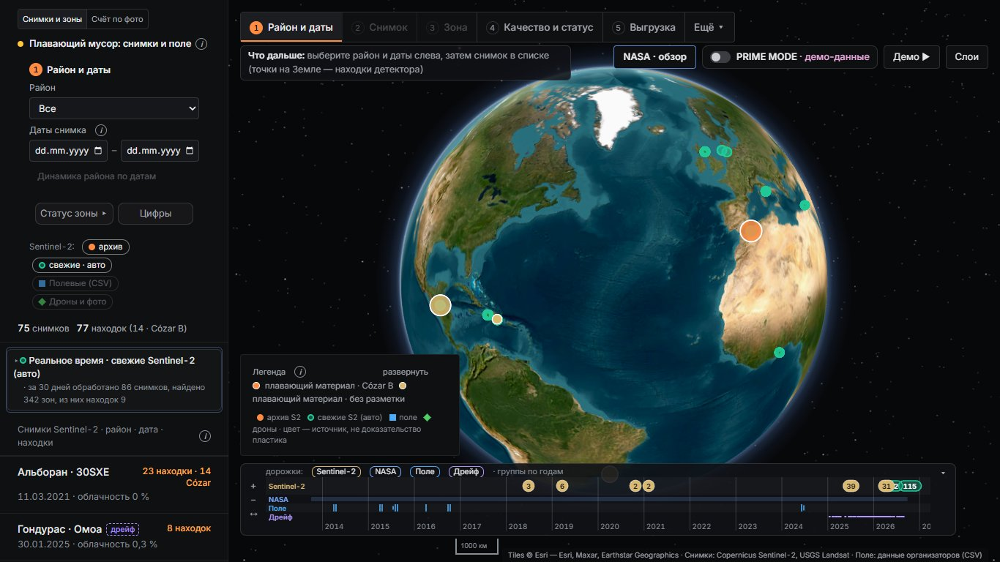
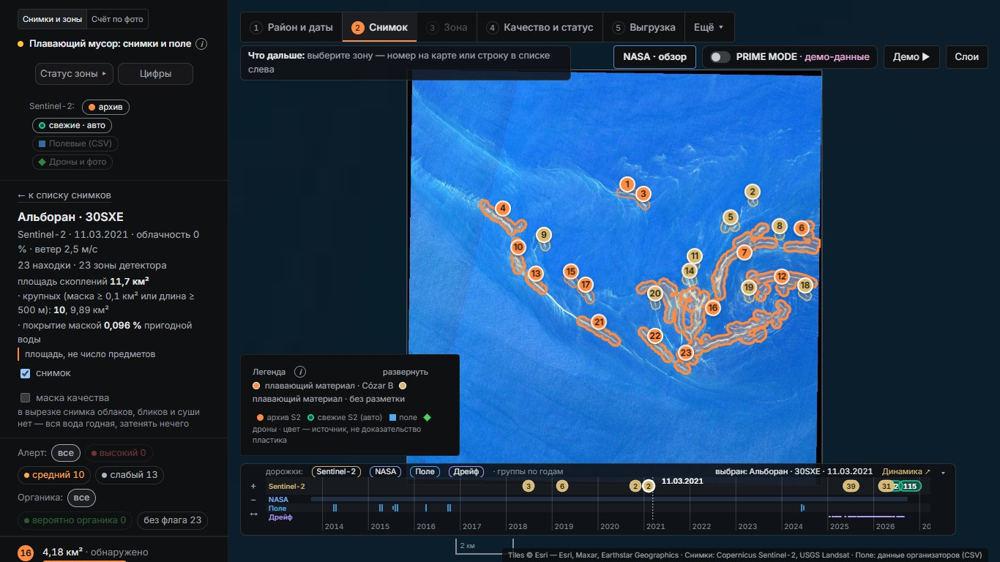
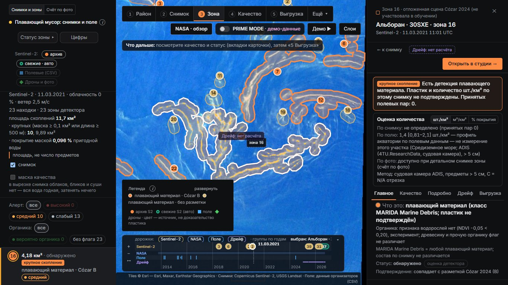
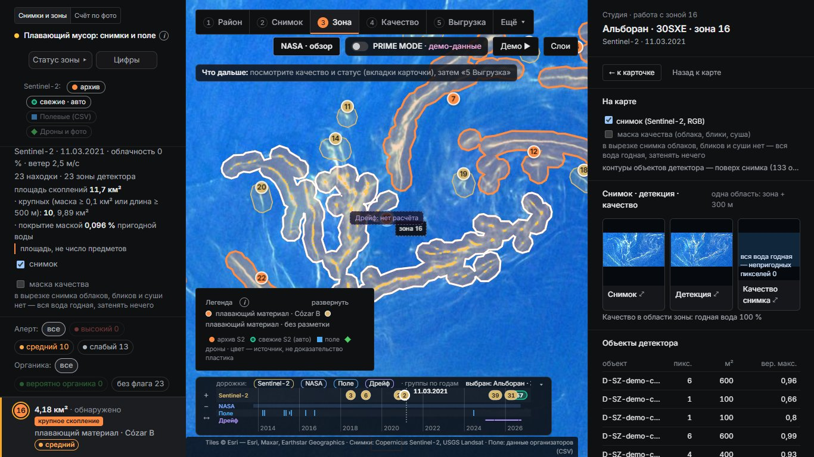
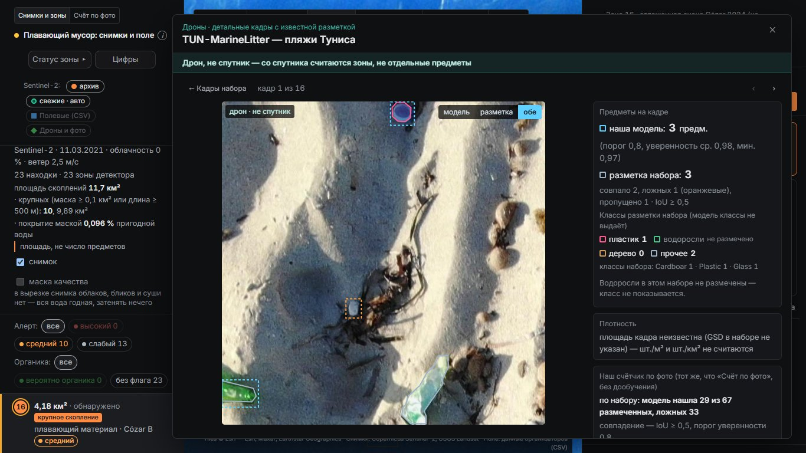
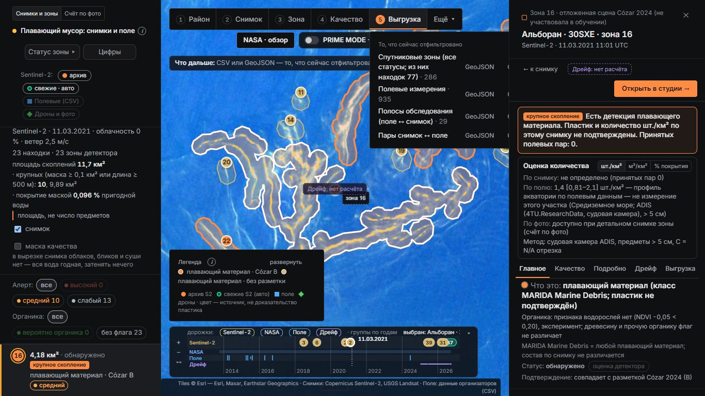

# Скриншоты интерфейса

Сняты автоматически (Python Playwright, окно 1366×768) с локального сервиса скриптом `scripts/case/readme_screenshots.py`. У каждого кадра указан источник изображения: спутник, фото или подложка карты.

| Кадр | Что на нём | Источник изображения |
|---|---|---|
|  | **Земля.** Точки — находки детектора; слева — переключатели источников (Sentinel-2: архив / свежие · авто; полевые данные CSV; дроны и фото) и список снимков: район, дата, число находок, облачность. Цвет точки — источник, а не доказательство пластика. | спутник Sentinel-2 (Copernicus); подложка Esri World Imagery |
|  | **Снимок с зонами.** Альборан, тайл 30SXE, 11.03.2021 — отложенная сцена, не участвовала в обучении. Оранжевые контуры совпали с разметкой Cózar 2024, бежевые — без независимой разметки. | спутник Sentinel-2 L2A, 10 м |
|  | **Карточка зоны.** Итог «пластик и количество шт./км² по этому снимку не подтверждены», оценка по полю — профиль акватории, не измерение участка; вкладки «Качество», «Подробно», «Дрейф», «Выгрузка». | спутник Sentinel-2 L2A; полевые данные ADIS |
|  | **Студия.** Снимок, маска детекции и маска качества рядом, таблица объектов детектора. | спутник Sentinel-2 L2A |
|  | **«Дроны»: детальный кадр.** Пляж Туниса, набор TUN-MarineLitter. Рамки «модель / разметка / обе»: наш счётчик по фото (без дообучения на этом наборе) рядом с разметкой авторов; итог по набору — сколько размеченных предметов нашла модель и сколько ложных. Площадь кадра неизвестна — шт./м² не считаются. **Дрон, не спутник.** | фото с дрона (набор TUN-MarineLitter) |
|  | **Выгрузка.** GeoJSON или CSV того, что сейчас отфильтровано: спутниковые зоны, полевые измерения, полосы обследования, пары «снимок ↔ поле». | — (интерфейс) |
