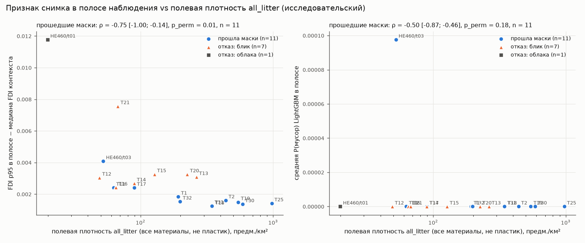
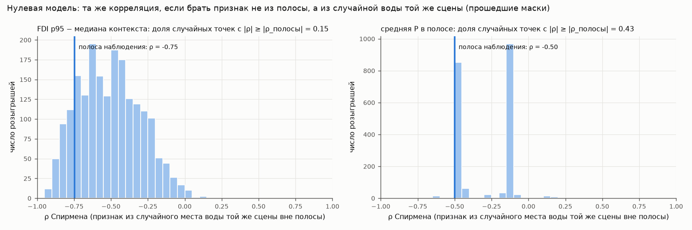

# Детектор на парах vs полевой all_litter (исследовательский эксперимент)

Скрипт `scripts/case/pairs_experiment.py`. Вход: выходы `scripts/case/pair_quality.py` (`data/pairs/quality/*/{meta.json,quality.tif,prob.tif}`), FDI пересчитан из тех же вырезок S2 L2A (кэш `data/pairs/experiment/<dir>/fdi.npy`). Числа: `experiment.json`.

**Эталон — плотность ВСЕГО плавающего мусора (all_litter, все материалы), не пластика.** Калибровки в шт./км² по снимку нет: проверяется только, упорядочивает ли признак снимка события так же, как полевая плотность.

Признаки только из снимка (P — LightGBM из pair_quality.py, порог 0.63; FDI Biermann 2020). Предрегистрированные основные: `s_fdi_p95_anom`, `s_p_mean`; остальные — разведочные (поправка Холма). Группа для бутстрэпа = район × день наблюдения.

## Пары

| событие | статус | группа | поле, предм./км² | основа | вода полосы, px | P≥0.63 в полосе | P ср. | пятен/км² | FDI p95−ctx | FDI доля выс. |
|---|---|---|---:|---|---:|---:|---:|---:|---:|---:|
| S3:HE460_MarLitter_transect03 | accept | S3_north_sea|2016-04-10 | 52.3 | concentration_items_km2 | 7633 | 0.00000 | 0.0001 | 0.0 | 0.0041 | 0.0126 |
| S4:DOORS3:T1 | accept | S4_black_sea|2024-06-02 | 192.5 | concentration_items_km2 | 8049 | 0.00000 | 0.0000 | 0.0 | 0.0018 | 0.0047 |
| S4:DOORS3:T11 | accept | S4_black_sea|2024-06-04 | 62.5 | concentration_items_km2 | 8042 | 0.00000 | 0.0000 | 0.0 | 0.0024 | 0.0076 |
| S4:DOORS3:T17 | accept | S4_black_sea|2024-06-04 | 89.6 | concentration_items_km2 | 8046 | 0.00000 | 0.0000 | 0.0 | 0.0024 | 0.0097 |
| S4:DOORS3:T18 | accept | S4_black_sea|2024-06-05 | 348.7 | concentration_items_km2 | 8044 | 0.00000 | 0.0000 | 0.0 | 0.0012 | 0.0014 |
| S4:DOORS3:T19 | accept | S4_black_sea|2024-06-05 | 544.7 | concentration_items_km2 | 8043 | 0.00000 | 0.0000 | 0.0 | 0.0015 | 0.0040 |
| S4:DOORS3:T2 | accept | S4_black_sea|2024-06-02 | 439.8 | concentration_items_km2 | 8042 | 0.00000 | 0.0000 | 0.0 | 0.0016 | 0.0020 |
| S4:DOORS3:T25 | accept | S4_black_sea|2024-06-11 | 976.0 | concentration_items_km2 | 8041 | 0.00000 | 0.0000 | 0.0 | 0.0014 | 0.0000 |
| S4:DOORS3:T30 | accept | S4_black_sea|2024-06-17 | 587.4 | concentration_items_km2 | 8045 | 0.00000 | 0.0000 | 0.0 | 0.0014 | 0.0076 |
| S4:DOORS3:T31 | accept | S4_black_sea|2024-06-17 | 345.3 | concentration_items_km2 | 8041 | 0.00000 | 0.0000 | 0.0 | 0.0013 | 0.0025 |
| S4:DOORS3:T32 | accept | S4_black_sea|2024-06-17 | 198.5 | concentration_items_km2 | 8039 | 0.00000 | 0.0000 | 0.0 | 0.0015 | 0.0031 |
| S4:DOORS3:T33 | accept | S4_black_sea|2024-06-18 | 340.9 | concentration_items_km2 | — | — | — | — | — | — |
| S3:HE419_MarLitter_transect29 | cloud | S3_north_sea|2014-04-11 | 17.3 | concentration_items_km2 | — | — | — | — | — | — |
| S3:HE460_MarLitter_transect01 | cloud | S3_north_sea|2016-04-08 | 19.9 | concentration_items_km2 | 512 | 0.00000 | 0.0000 | 0.0 | 0.0118 | 0.0000 |
| S3:HE419_MarLitter_transect30 | cloud(qa_suspect:red_sr<0.03) | S3_north_sea|2014-04-11 | 195.1 | concentration_items_km2 | — | — | — | — | — | — |
| S4:DOORS3:T6 | cloud(qa_suspect:red_sr<0.03) | S4_black_sea|2024-06-03 | 268.2 | concentration_items_km2 | — | — | — | — | — | — |
| S4:DOORS3:T7 | cloud(qa_suspect:red_sr<0.03) | S4_black_sea|2024-06-03 | 131.2 | concentration_items_km2 | — | — | — | — | — | — |
| S4:DOORS3:T8 | cloud(qa_suspect:red_sr<0.03) | S4_black_sea|2024-06-03 | 218.0 | concentration_items_km2 | — | — | — | — | — | — |
| S4:DOORS3:T12 | glint | S4_black_sea|2024-06-04 | 49.0 | concentration_items_km2 | 8041 | 0.00000 | 0.0000 | 0.0 | 0.0030 | 0.0061 |
| S4:DOORS3:T13 | glint | S4_black_sea|2024-06-04 | 263.6 | concentration_items_km2 | 8045 | 0.00000 | 0.0000 | 0.0 | 0.0031 | 0.0067 |
| S4:DOORS3:T14 | glint | S4_black_sea|2024-06-04 | 89.4 | concentration_items_km2 | 8045 | 0.00000 | 0.0000 | 0.0 | 0.0027 | 0.0005 |
| S4:DOORS3:T15 | glint | S4_black_sea|2024-06-04 | 127.1 | concentration_items_km2 | 8046 | 0.00000 | 0.0000 | 0.0 | 0.0033 | 0.0065 |
| S4:DOORS3:T16 | glint | S4_black_sea|2024-06-04 | 64.9 | concentration_items_km2 | 8045 | 0.00000 | 0.0000 | 0.0 | 0.0024 | 0.0030 |
| S4:DOORS3:T20 | glint | S4_black_sea|2024-06-07 | 224.9 | concentration_items_km2 | 7693 | 0.00000 | 0.0000 | 0.0 | 0.0033 | 0.0023 |
| S4:DOORS3:T21 | glint | S4_black_sea|2024-06-07 | 67.3 | concentration_items_km2 | 8040 | 0.00000 | 0.0000 | 0.0 | 0.0076 | 0.0274 |
| S4:DOORS3:T3 | glint | S4_black_sea|2024-06-03 | 686.1 | concentration_items_km2 | 0 | — | — | — | — | — |
| S4:DOORS3:T4 | glint | S4_black_sea|2024-06-03 | 269.6 | concentration_items_km2 | 0 | — | — | — | — | — |
| S4:DOORS3:T5 | glint | S4_black_sea|2024-06-03 | 389.7 | concentration_items_km2 | 0 | — | — | — | — | — |
| S3:HE419_MarLitter_transect32 | insufficient_coverage | S3_north_sea|2014-04-11 | 19.7 | concentration_items_km2 | — | — | — | — | — | — |

## Связь: прошедшие маски, S2 (детектор + FDI) (n = 11, групп день×район = 6)

| признак | n | уник. | ρ Спирмена | 95% ДИ (бутстрэп групп; доля выборок с постоянным признаком) | τ Кендалла | 95% ДИ τ | p перест. | p Холм | ρ по средним групп (p точн.) | ρ без одной группы, min…max | нуль: медиана ρ [2.5; 97.5] | доля нуля с abs ρ ≥ полосы |
|---|---:|---:|---:|---|---:|---|---:|---:|---|---|---|---:|
| `s_frac_p_thr` | 11 | 1 | — | constant feature (all equal) -> correlation undefined | | | | | | | | |
| `s_p_mean` **(осн.)** | 11 | 2 | -0.50 | [-0.87; -0.46]; 0.33 | -0.43 | [-0.79; -0.40] | 0.180 | 0.530 | -0.65 (0.33, k=6) | -0.58…-0.52 | -0.13 [-0.50; -0.12] | 0.43 |
| `s_p_p95` | 11 | 1 | — | constant feature (all equal) -> correlation undefined | | | | | | | | |
| `s_spots_km2` | 11 | 1 | — | constant feature (all equal) -> correlation undefined | | | | | | | | |
| `s_fdi_p95_anom` **(осн.)** | 11 | 11 | -0.75 | [-1.00; -0.14]; 0.00 | -0.64 | [-1.00; -0.12] | 0.012 | 0.125 | -0.83 (0.06, k=6) | -0.86…-0.53 | -0.52 [-0.85; -0.09] | 0.15 |
| `s_fdi_med_anom` | 11 | 11 | -0.59 | [-0.88; +0.20]; 0.00 | -0.38 | [-0.73; +0.30] | 0.055 | 0.429 | -0.77 (0.10, k=6) | -0.70…-0.45 | +0.01 [-0.61; +0.66] | 0.07 |
| `s_fdi_frac_hi` | 11 | 11 | -0.70 | [-0.98; +0.05]; 0.00 | -0.56 | [-0.94; +0.03] | 0.020 | 0.177 | -0.94 (0.02, k=6) | -0.88…-0.47 | -0.27 [-0.72; +0.33] | 0.03 |
| `c_frac_p_thr` | 11 | 2 | -0.50 | [-0.88; -0.46]; 0.33 | -0.43 | [-0.81; -0.40] | 0.177 | 0.530 | -0.65 (0.33, k=6) | -0.58…-0.52 | — | — |
| `c_p_mean` | 11 | 7 | +0.09 | [-0.67; +0.76]; 0.00 | +0.06 | [-0.51; +0.63] | 0.806 | 0.806 | -0.49 (0.36, k=6) | -0.10…+0.47 | — | — |
| `c_fdi_p95` | 11 | 11 | -0.49 | [-0.95; +0.38]; 0.00 | -0.42 | [-0.87; +0.42] | 0.132 | 0.528 | -0.60 (0.24, k=6) | -0.76…-0.20 | — | — |
| `x_p_mean` | 11 | 3 | -0.61 | [-0.89; -0.30]; 0.08 | -0.53 | [-0.82; -0.26] | 0.056 | 0.429 | -0.51 (0.40, k=6) | -0.70…-0.41 | — | — |
| `x_fdi_p95_anom` | 11 | 11 | -0.61 | [-0.93; +0.16]; 0.00 | -0.42 | [-0.88; +0.10] | 0.054 | 0.429 | -0.77 (0.10, k=6) | -0.74…-0.40 | — | — |
| `x_fdi_frac_hi` | 11 | 11 | -0.61 | [-0.80; +0.08]; 0.00 | -0.38 | [-0.65; +0.15] | 0.057 | 0.429 | -0.71 (0.14, k=6) | -0.73…-0.40 | — | — |

## Связь: прошедшие маски, только Чёрное море S4 (n = 10, групп день×район = 5)

| признак | n | уник. | ρ Спирмена | 95% ДИ (бутстрэп групп; доля выборок с постоянным признаком) | τ Кендалла | 95% ДИ τ | p перест. | p Холм | ρ по средним групп (p точн.) | ρ без одной группы, min…max | нуль: медиана ρ [2.5; 97.5] | доля нуля с abs ρ ≥ полосы |
|---|---:|---:|---:|---|---:|---|---:|---:|---|---|---|---:|
| `s_frac_p_thr` | 10 | 1 | — | constant feature (all equal) -> correlation undefined | | | | | | | | |
| `s_p_mean` **(осн.)** | 10 | 1 | — | constant feature (all equal) -> correlation undefined | | | | | | | | |
| `s_p_p95` | 10 | 1 | — | constant feature (all equal) -> correlation undefined | | | | | | | | |
| `s_spots_km2` | 10 | 1 | — | constant feature (all equal) -> correlation undefined | | | | | | | | |
| `s_fdi_p95_anom` **(осн.)** | 10 | 10 | -0.66 | [-1.00; +0.08]; 0.00 | -0.56 | [-1.00; +0.04] | 0.046 | 0.369 | -0.70 (0.23, k=5) | -0.79…-0.33 | -0.37 [-0.82; +0.24] | 0.15 |
| `s_fdi_med_anom` | 10 | 10 | -0.52 | [-0.88; +0.41]; 0.00 | -0.33 | [-0.78; +0.40] | 0.129 | 0.650 | -0.90 (0.08, k=5) | -0.69…-0.29 | +0.03 [-0.67; +0.71] | 0.18 |
| `s_fdi_frac_hi` | 10 | 10 | -0.60 | [-0.98; +0.32]; 0.00 | -0.47 | [-0.92; +0.18] | 0.069 | 0.480 | -0.90 (0.08, k=5) | -0.82…-0.24 | -0.14 [-0.67; +0.49] | 0.06 |
| `c_frac_p_thr` | 10 | 1 | — | constant feature (all equal) -> correlation undefined | | | | | | | | |
| `c_p_mean` | 10 | 6 | +0.47 | [+0.04; +0.87]; 0.00 | +0.33 | [-0.03; +0.73] | 0.174 | 0.650 | -0.10 (0.95, k=5) | +0.39…+0.71 | — | — |
| `c_fdi_p95` | 10 | 10 | -0.32 | [-0.90; +0.81]; 0.00 | -0.29 | [-0.84; +0.52] | 0.368 | 0.736 | -0.30 (0.68, k=5) | -0.67…+0.14 | — | — |
| `x_p_mean` | 10 | 2 | -0.41 | [-0.74; -0.08]; 0.33 | -0.35 | [-0.67; -0.08] | 0.402 | 0.736 | +0.00 (1.00, k=5) | -0.55…-0.41 | — | — |
| `x_fdi_p95_anom` | 10 | 10 | -0.54 | [-0.96; +0.49]; 0.00 | -0.38 | [-0.92; +0.20] | 0.108 | 0.650 | -0.70 (0.23, k=5) | -0.79…-0.17 | — | — |
| `x_fdi_frac_hi` | 10 | 10 | -0.54 | [-0.81; +0.38]; 0.00 | -0.33 | [-0.66; +0.27] | 0.112 | 0.650 | -0.60 (0.35, k=5) | -0.72…-0.17 | — | — |

## Связь: все S2-пары с валидной водой в полосе (в т.ч. блик/облака — загрязнённые) (n = 19, групп день×район = 8)

| признак | n | уник. | ρ Спирмена | 95% ДИ (бутстрэп групп; доля выборок с постоянным признаком) | τ Кендалла | 95% ДИ τ | p перест. | p Холм | ρ по средним групп (p точн.) | ρ без одной группы, min…max | нуль: медиана ρ [2.5; 97.5] | доля нуля с abs ρ ≥ полосы |
|---|---:|---:|---:|---|---:|---|---:|---:|---|---|---|---:|
| `s_frac_p_thr` | 19 | 1 | — | constant feature (all equal) -> correlation undefined | | | | | | | | |
| `s_p_mean` **(осн.)** | 19 | 2 | -0.30 | [-0.65; -0.20]; 0.35 | -0.25 | [-0.58; -0.17] | 0.318 | 1.000 | -0.41 (0.50, k=8) | -0.39…-0.30 | — | — |
| `s_p_p95` | 19 | 1 | — | constant feature (all equal) -> correlation undefined | | | | | | | | |
| `s_spots_km2` | 19 | 1 | — | constant feature (all equal) -> correlation undefined | | | | | | | | |
| `s_fdi_p95_anom` **(осн.)** | 19 | 19 | -0.74 | [-0.92; -0.20]; 0.00 | -0.57 | [-0.80; -0.18] | 0.000 | 0.004 | -0.86 (0.01, k=8) | -0.79…-0.68 | — | — |
| `s_fdi_med_anom` | 19 | 19 | -0.32 | [-0.89; +0.12]; 0.00 | -0.23 | [-0.74; +0.08] | 0.179 | 0.895 | -0.62 (0.11, k=8) | -0.62…-0.21 | — | — |
| `s_fdi_frac_hi` | 19 | 18 | -0.28 | [-0.74; +0.31]; 0.00 | -0.22 | [-0.62; +0.21] | 0.251 | 1.000 | -0.32 (0.43, k=8) | -0.49…-0.17 | — | — |
| `c_frac_p_thr` | 19 | 2 | -0.30 | [-0.67; -0.20]; 0.34 | -0.25 | [-0.58; -0.17] | 0.322 | 1.000 | -0.41 (0.50, k=8) | -0.39…-0.30 | — | — |
| `c_p_mean` | 19 | 12 | -0.03 | [-0.61; +0.44]; 0.00 | -0.02 | [-0.47; +0.33] | 0.908 | 1.000 | -0.64 (0.10, k=8) | -0.21…+0.11 | — | — |
| `c_fdi_p95` | 19 | 19 | -0.67 | [-0.83; -0.09]; 0.00 | -0.49 | [-0.66; -0.08] | 0.002 | 0.014 | -0.76 (0.04, k=8) | -0.72…-0.59 | — | — |
| `x_p_mean` | 18 | 3 | -0.48 | [-0.83; -0.26]; 0.09 | -0.41 | [-0.74; -0.24] | 0.036 | 0.262 | -0.53 (0.29, k=7) | -0.61…-0.36 | — | — |
| `x_fdi_p95_anom` | 18 | 18 | -0.45 | [-0.86; +0.03]; 0.00 | -0.29 | [-0.76; +0.03] | 0.068 | 0.409 | -0.71 (0.09, k=7) | -0.55…-0.29 | — | — |
| `x_fdi_frac_hi` | 18 | 18 | -0.52 | [-0.85; +0.04]; 0.00 | -0.37 | [-0.70; -0.04] | 0.033 | 0.262 | -0.68 (0.11, k=7) | -0.60…-0.36 | — | — |

## Мощность (α = 0.05 двусторонний, мощность 0.8)

| n | мин. обнаружимый abs ρ (Fisher z, Bonett–Wright) | мин. abs ρ (Монте-Карло, Спирмен) |
|---:|---:|---:|
| 6 | 0.96 | 0.95 |
| 11 | 0.82 | 0.8 |
| 19 | 0.65 | 0.65 |
| 29 | 0.53 | 0.55 |
| 50 | 0.41 | 0.45 |

Нужно независимых пар (групп), чтобы обнаружить ρ: ρ = 0.3 → n ≈ 89, ρ = 0.5 → n ≈ 33, ρ = 0.7 → n ≈ 16.

## Графики

## Вывод (5–8 строк, для отчёта и речи)

1. Пар с чистой полосой S2: 11 (плюс 1 Landsat без детектора), независимых групп «район × день» — 6. Эталон — плотность всего плавающего мусора (all_litter), не пластика; калибровки шт./км² нет.
2. Детектор в полосе: на 10 чёрноморских парах P ≥ 0.63 — 0 пикселей (признаки постоянны, корреляция не определена). На 11 парах ρ = -0.50 [-0.87; -0.46], p_перест = 0.180, p_Холм = 0.53 — ненулевая только одна пара Северного моря (низкая плотность), т. е. это контраст районов, а не связь; ДИ условный: в 33% бутстрэп-выборок признак постоянен.
3. FDI (предрегистрированный `s_fdi_p95_anom`): ρ = -0.75 [-1.00; -0.14], p_перест = 0.012, p_Холм = 0.12, но нулевая модель (случайная вода той же сцены): медиана ρ = -0.52, доля розыгрышей с |ρ| ≥ |ρ_полосы| = 0.15; тот же признак только из контекста (без полосы): ρ = -0.49. Основная часть связи — уровень сцены/дня, а не полосы.
4. Остаток, специфичный для полосы (полоса − медиана случайных мест той же сцены): ρ = -0.61 [-0.93; +0.16], p_перест = 0.054, p_Холм = 0.43; по средним групп ρ = -0.77 (p = 0.10, k = 6); без одной группы ρ от -0.74 до -0.40; на всех 19 S2-парах -0.45. Поправку на множественность (13 признаков × 3 набора) и групповой уровень не проходит, знак отрицательный (мусор должен поднимать FDI, а не снижать) — сигналом мусора не считаем. Причина не установлена: у S4 «полоса» — круг 500 м вокруг центра трансекты при оценке дрейфа 11–28 км против допуска 3 км (реестр пар `find_pairs.py`, сценарий typical), т. е. фактически случайная вода; при 6 группах такой ρ достижим случайно; волнение/ветер проверить нельзя (sea_state_beaufort и ветер у S3/S4 в реестре пустые).
5. Мощность: при n = 11 обнаружим только |ρ| ≥ 0.82 (α 0.05, мощность 0.8), при 6 независимых группах — |ρ| ≥ 0.96. Поэтому вывод — «сильной связи, специфичной для полосы, не видно», а не «связи нет».
6. Для переноса нужно: ≥ 33 независимых (разнесённых по дням) пар для ρ = 0.5 и ≈ 89 для ρ = 0.3; известное время наблюдения (у S4 только дата → дрейф 10+ км); пары для профиля пластика — их в реестре 0 (S1/S2 без сцен в окне ±1 сут).
7. Итог для сдачи: детектор проверяется по разметке MARIDA, концентрация — по полю (C = N/A с ДИ); связь «снимок → шт./км²» на имеющихся парах не установлена.

