# Маски качества и детектор на принятых парах «событие ↔ сцена»

Скрипт `scripts/case/pair_quality.py`, пороги `configs/case_pairs.yaml`. Вход: `data/pairs/best_per_event.csv` (реестр пар `scripts/case/find_pairs.py`, 29 событий с принятой парой). Таблица: `data/pairs/pair_quality.csv`. Картинки: `data/pairs/quality/<event_id>/` (двоеточия в id заменены на `_`).

**Обработано 29 из 29 пар; прошли маски: 12; отклонены: 17; ошибки чтения: 0.**

Пороги: покрытие полосы ≥ 0.8, облака ≤ 0.2, суша ≤ 0.5, валидная вода ≥ 0.5, блик: медиана B11 по воде полосы > 0.01.

## Решения по источникам

| источник | всего | accept | reject |
|---|---:|---:|---:|
| earth-search/sentinel-2-l2a | 20 | 10 | 10 |
| planetary-computer/landsat-c2-l2 | 7 | 1 | 6 |
| planetary-computer/sentinel-2-l2a | 2 | 1 | 1 |

## Причины отказа

| причина | пар |
|---|---:|
| glint | 10 |
| cloud(qa_suspect:red_sr<0.03) | 4 |
| cloud | 2 |
| insufficient_coverage | 1 |

## Все пары

| событие | сцена | Δt, ч | покрытие | вода | облака | суша | B11 воды | решение | пятен в полосе | площадь, м² | p max | поле, предм./км² |
|---|---|---:|---:|---:|---:|---:|---:|---|---:|---:|---:|---:|
| S3:HE460_MarLitter_transect03 | S2A_MSIL2A_20160411T105022_R051_T32ULF_20210211T031140 | 18.1 | 1.00 | 1.00 | 0.00 | 0.00 | 0.0046 | accept  | 3 | 400 | 0.89 | 52.3 |
| S4:DOORS3:T1 | S2A_35TQJ_20240602_0_L2A | -3.0 | 1.00 | 1.00 | 0.00 | 0.00 | 0.0046 | accept  | 0 | 0 | 0.00 | 192.5 |
| S4:DOORS3:T11 | S2A_36TYN_20240603_0_L2A | -27.5 | 1.00 | 1.00 | 0.00 | 0.00 | 0.0084 | accept  | 0 | 0 | 0.00 | 62.5 |
| S4:DOORS3:T17 | S2A_37TDG_20240603_0_L2A | -27.5 | 1.00 | 1.00 | 0.00 | 0.00 | 0.0045 | accept  | 0 | 0 | 0.00 | 89.6 |
| S4:DOORS3:T18 | S2B_37TFG_20240605_0_L2A | -3.7 | 1.00 | 1.00 | 0.00 | 0.00 | 0.0021 | accept  | 0 | 0 | 0.00 | 348.7 |
| S4:DOORS3:T19 | S2B_37TFG_20240605_0_L2A | -3.7 | 1.00 | 1.00 | 0.00 | 0.00 | 0.0026 | accept  | 0 | 0 | 0.00 | 544.7 |
| S4:DOORS3:T2 | S2A_35TQJ_20240602_0_L2A | -3.0 | 1.00 | 1.00 | 0.00 | 0.00 | 0.0055 | accept  | 0 | 0 | 0.00 | 439.8 |
| S4:DOORS3:T25 | S2B_37TGG_20240612_0_L2A | 20.1 | 1.00 | 1.00 | 0.00 | 0.00 | 0.0046 | accept  | 0 | 0 | 0.00 | 976.0 |
| S4:DOORS3:T30 | S2B_36TUN_20240617_0_L2A | -3.0 | 1.00 | 1.00 | 0.00 | 0.00 | 0.0014 | accept  | 0 | 0 | 0.00 | 587.4 |
| S4:DOORS3:T31 | S2B_36TUN_20240617_0_L2A | -3.0 | 1.00 | 1.00 | 0.00 | 0.00 | 0.0013 | accept  | 0 | 0 | 0.00 | 345.3 |
| S4:DOORS3:T32 | S2B_36TUN_20240617_0_L2A | -3.0 | 1.00 | 1.00 | 0.00 | 0.00 | 0.0018 | accept  | 0 | 0 | 0.00 | 198.5 |
| S4:DOORS3:T33 | LC09_L2SP_180030_20240618_02_T1 | -3.3 | 1.00 | 1.00 | 0.00 | 0.00 | — | accept  | — | — | — | 340.9 |
| S3:HE419_MarLitter_transect29 | LC08_L2SP_196022_20140412_02_T1 | 23.6 | 1.00 | 0.00 | 1.00 | 0.00 | — | reject cloud | — | — | — | 17.3 |
| S3:HE419_MarLitter_transect30 | LC08_L2SP_196022_20140412_02_T1 | 21.2 | 0.81 | 0.00 | 1.00 | 0.00 | — | reject cloud(qa_suspect:red_sr<0.03) | — | — | — | 195.1 |
| S3:HE419_MarLitter_transect32 | LC08_L2SP_196022_20140412_02_T1 | 15.8 | 0.57 | 0.00 | 1.00 | 0.00 | — | reject insufficient_coverage | — | — | — | 19.7 |
| S3:HE460_MarLitter_transect01 | S2A_MSIL2A_20160408T104022_R008_T32UMF_20210211T022918 | -6.0 | 1.00 | 0.02 | 0.89 | 0.00 | 0.0225 | reject cloud | 0 | 0 | 0.23 | 19.9 |
| S4:DOORS3:T12 | S2A_37TCH_20240603_0_L2A | -27.5 | 1.00 | 0.00 | 0.00 | 0.00 | 0.0143 | reject glint | 0 | 0 | 0.02 | 49.0 |
| S4:DOORS3:T13 | S2A_37TCH_20240603_0_L2A | -27.5 | 1.00 | 0.00 | 0.00 | 0.00 | 0.0155 | reject glint | 0 | 0 | 0.01 | 263.6 |
| S4:DOORS3:T14 | S2A_37TCG_20240603_0_L2A | -27.5 | 1.00 | 0.00 | 0.00 | 0.00 | 0.0236 | reject glint | 1 | 100 | 0.71 | 89.4 |
| S4:DOORS3:T15 | S2A_37TDG_20240603_0_L2A | -27.5 | 1.00 | 0.00 | 0.00 | 0.00 | 0.0178 | reject glint | 0 | 0 | 0.01 | 127.1 |
| S4:DOORS3:T16 | S2A_37TDG_20240603_0_L2A | -27.5 | 1.00 | 0.07 | 0.00 | 0.00 | 0.0123 | reject glint | 0 | 0 | 0.00 | 64.9 |
| S4:DOORS3:T20 | S2A_37TGG_20240607_0_L2A | -3.9 | 1.00 | 0.00 | 0.04 | 0.00 | 0.0182 | reject glint | 1 | 100 | 0.79 | 224.9 |
| S4:DOORS3:T21 | S2A_37TGG_20240607_0_L2A | -3.9 | 1.00 | 0.00 | 0.00 | 0.00 | 0.0165 | reject glint | 1 | 600 | 0.94 | 67.3 |
| S4:DOORS3:T3 | S2A_36TVN_20240602_0_L2A | -27.0 | 1.00 | 0.00 | 0.00 | 0.00 | — | reject glint | 0 | 0 | — | 686.1 |
| S4:DOORS3:T4 | S2A_36TVN_20240602_0_L2A | -27.0 | 1.00 | 0.00 | 0.00 | 0.00 | — | reject glint | 0 | 0 | — | 269.6 |
| S4:DOORS3:T5 | S2A_36TVN_20240602_0_L2A | -27.0 | 1.00 | 0.00 | 0.00 | 0.00 | — | reject glint | 0 | 0 | — | 389.7 |
| S4:DOORS3:T6 | LC09_L2SP_178030_20240604_02_T2 | 20.5 | 1.00 | 0.00 | 1.00 | 0.00 | — | reject cloud(qa_suspect:red_sr<0.03) | — | — | — | 268.2 |
| S4:DOORS3:T7 | LC09_L2SP_178030_20240604_02_T2 | 20.5 | 1.00 | 0.00 | 1.00 | 0.00 | — | reject cloud(qa_suspect:red_sr<0.03) | — | — | — | 131.2 |
| S4:DOORS3:T8 | LC09_L2SP_178030_20240604_02_T2 | 20.5 | 1.00 | 0.00 | 1.00 | 0.00 | — | reject cloud(qa_suspect:red_sr<0.03) | — | — | — | 218.0 |

## Примеры (RGB с контуром полосы наблюдения — пурпурный; маска детектора — красный; качество: синий вода, коричневый суша, белый облака SCL, оранжевый спектральные облака, серый прочее, чёрный нет данных)

### S3:HE460_MarLitter_transect03 — accept 

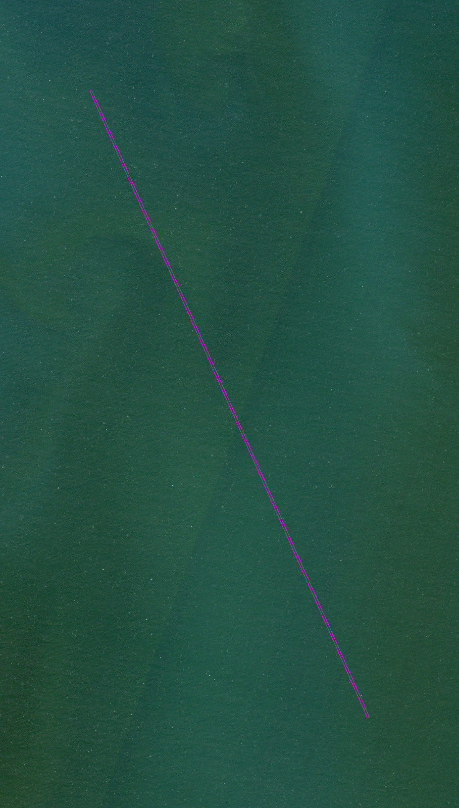  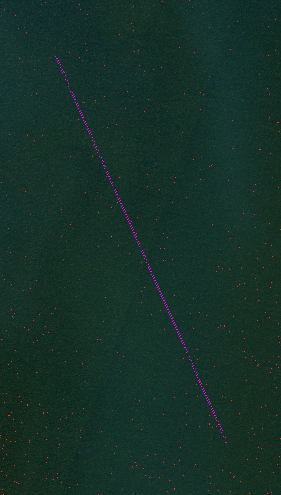

### S4:DOORS3:T1 — accept 

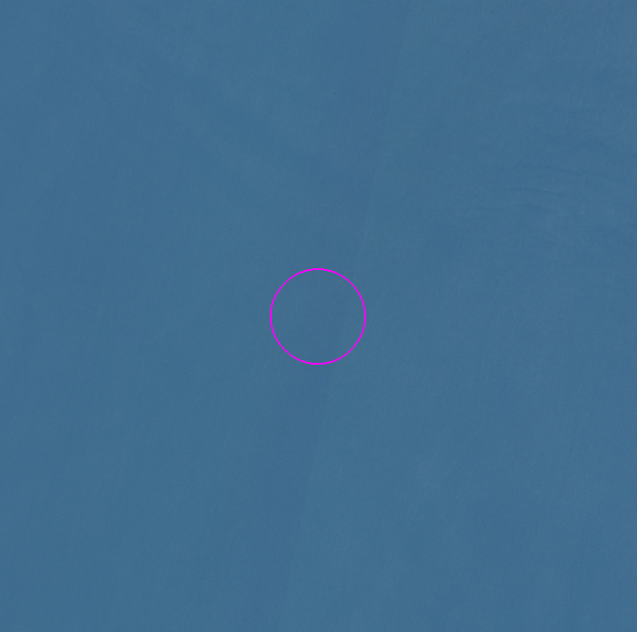  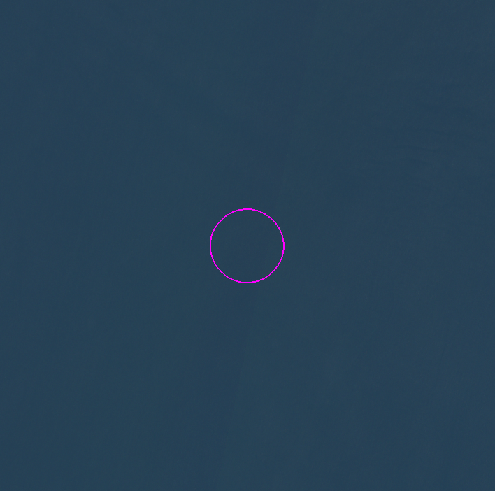

### S4:DOORS3:T11 — accept 

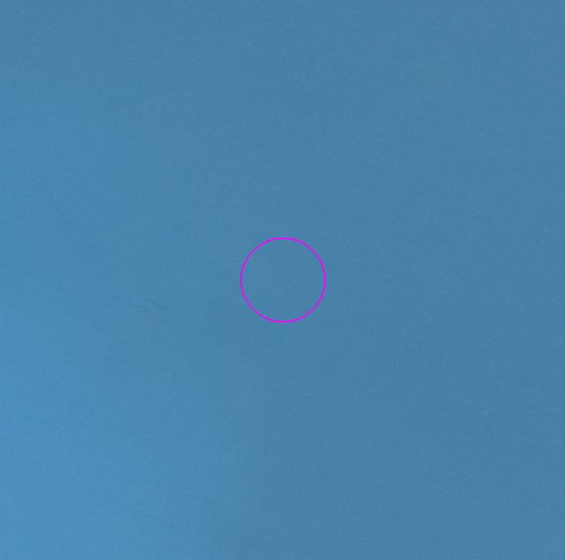  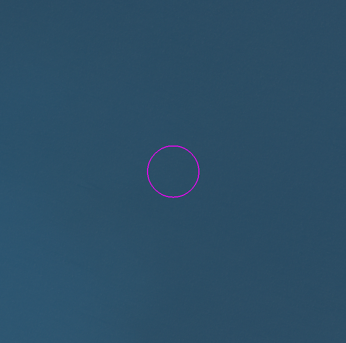

### S3:HE460_MarLitter_transect01 — reject cloud

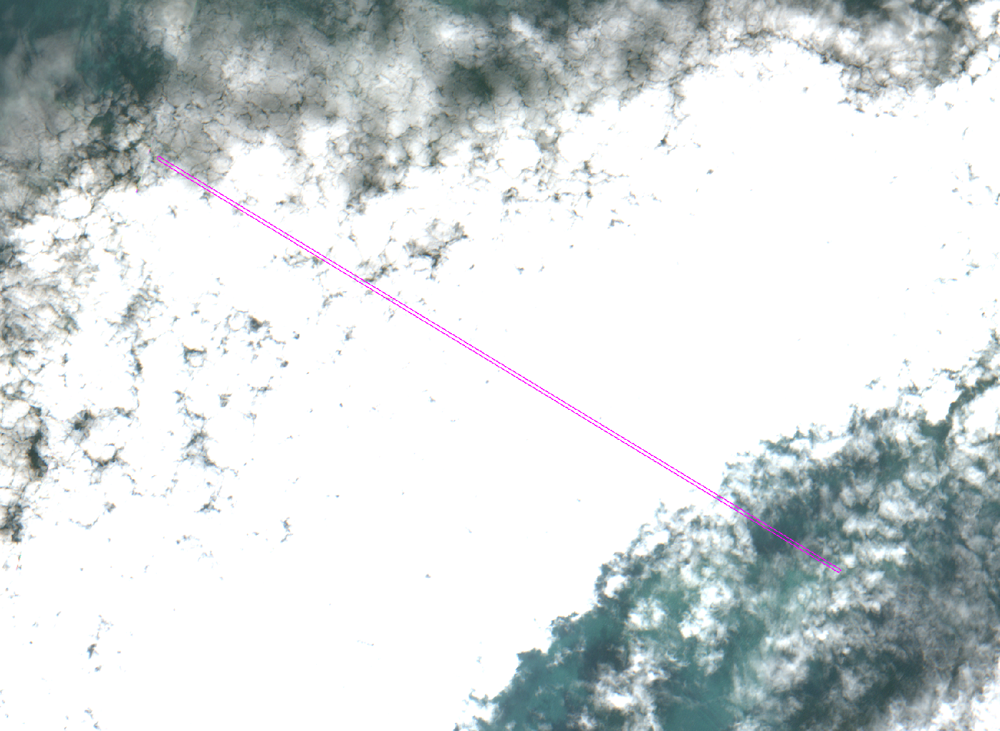 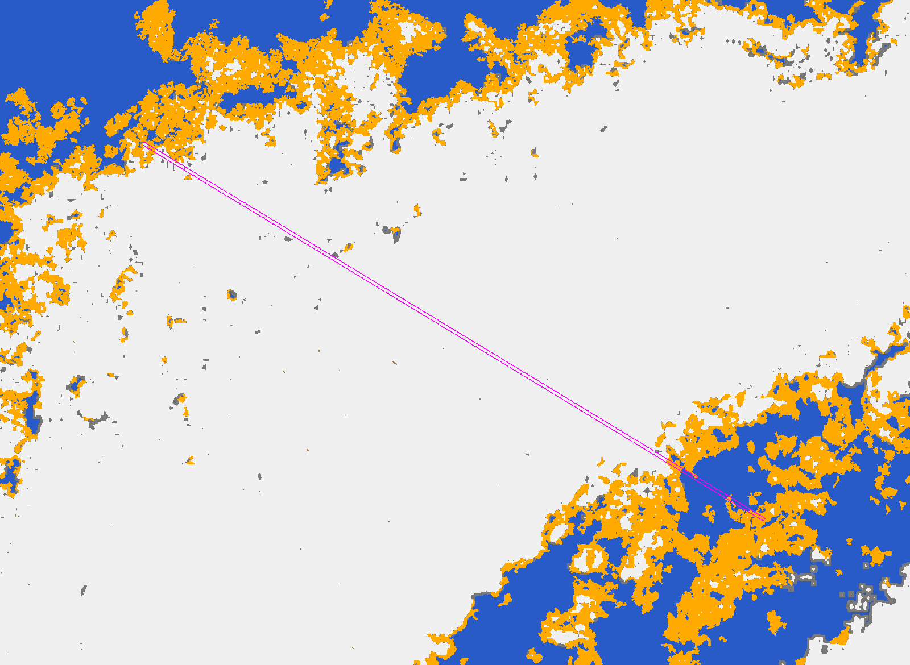 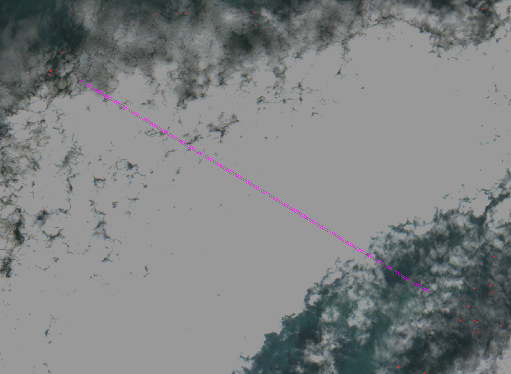

### S4:DOORS3:T21 — reject glint

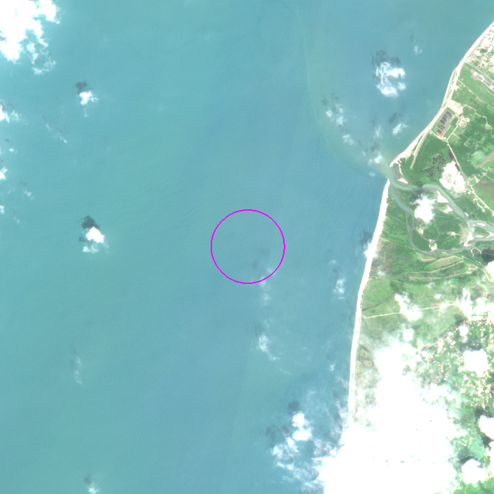 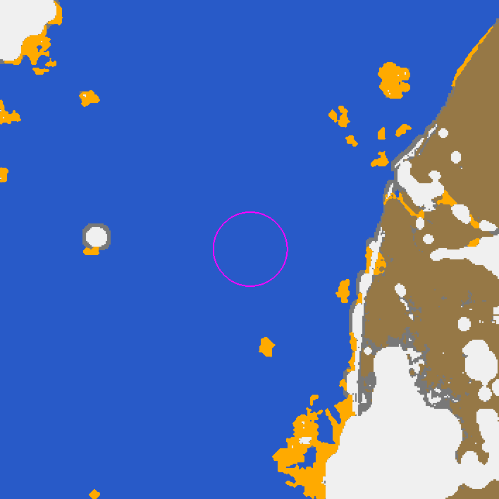 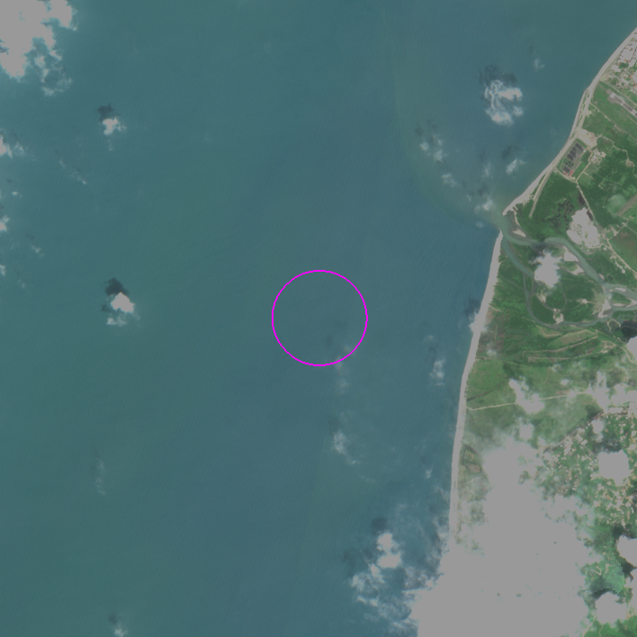

### S4:DOORS3:T3 — reject glint

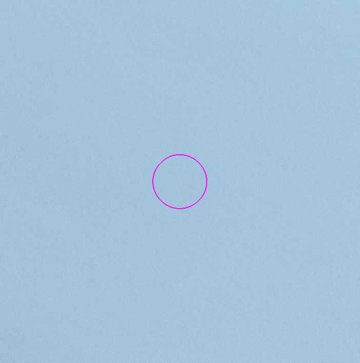 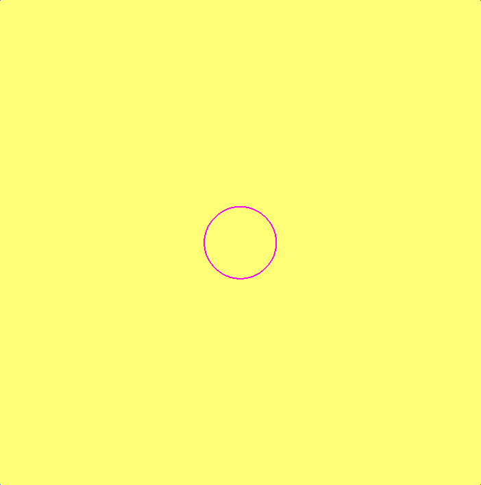 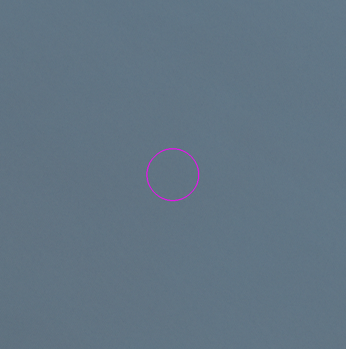

## Что видит детектор на 10 м (автоматическая сводка; вывод — в отчёте задачи)

- Пар S2 с запуском детектора: 22; из них принятых масками: 11.
- Принятых пар с ≥1 пятном в полосе: 1; суммарно пятен 3, площадь 400 м².
- Доля воды вырезки выше порога (медиана по принятым парам): 0.00e+00.
- Сравнение с фоном: ожидаемое по случайности число пикселей-детекций в полосе = доля воды вырезки выше порога × пикселей валидной воды полосы; по принятым парам сумма наблюдаемых 4 px против ожидаемых 2.9 px.
- Полевые плотности трансект: десятки–сотни предметов >2 см на км² (медиана по принятым парам 345 предм./км²), т. е. на пиксель 10×10 м (1e-4 км²) приходится в среднем ≪1 предмета; пиксельный сигнал от такого мусора не ожидается. Совпадение/несовпадение детекций с полевыми точками — не проверка концентрации.

## Вывод (честно)

- Маски отсекают больше половины пар: главная причина на Чёрном море 2–7 июня 2024 — солнечный блик (у сцен облачность ~0 %, но вода яркая: медиана B11 0.012–0.024, а на T3–T5 блик на всю вырезку и спектральный облачный тест grid.cloudmask срабатывает на 100 % воды — такие сцены помечены glint, а не cloud).
- Детекции LightGBM, попавшие в полосу наблюдения, есть только в двух бликовых сценах (T14, T21; p до 0.97) и в одной чистой (Северное море, HE460 transect03: 3 пятна по 1–2 пикселя на полосе 25 км, при фоне 724 пятна в вырезке — число в полосе на уровне случайного). На 10 принятых черноморских парах в полосе детекций нет.
- Это согласуется с физикой: полевые плотности — десятки–сотни предметов >2 см на км², а пиксель 10 м видит только скопления (линии/пятна плавающего материала площадью от долей пикселя с высоким покрытием). Отсутствие детекций не означает отсутствия мусора; наличие детекции не даёт концентрации.
- Landsat: решение только по QA_PIXEL; на 4 из 6 отклонённых «облачных» сценах отражение red в полосе < 0.03 (тёмная открытая вода), т. е. флаг облака QA_PIXEL сомнителен — помечено `qa_suspect`.

