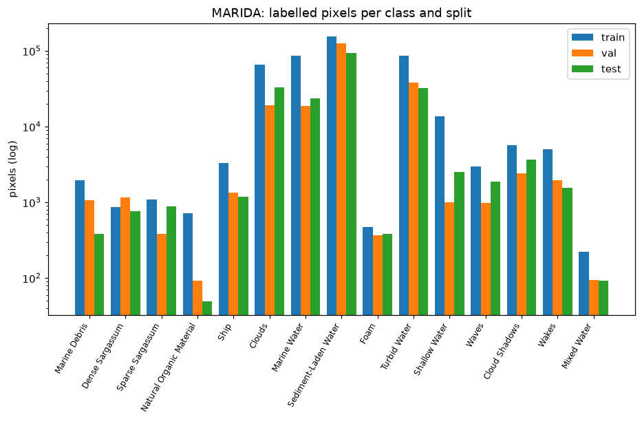
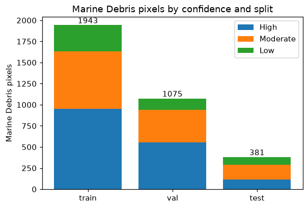
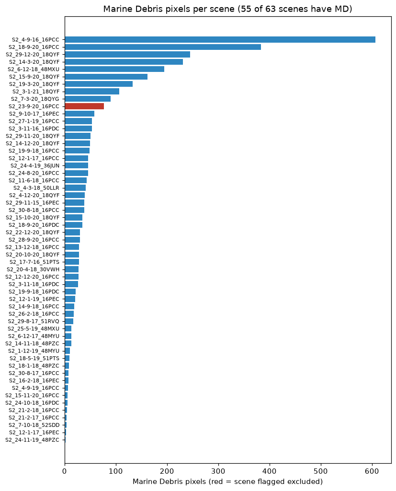
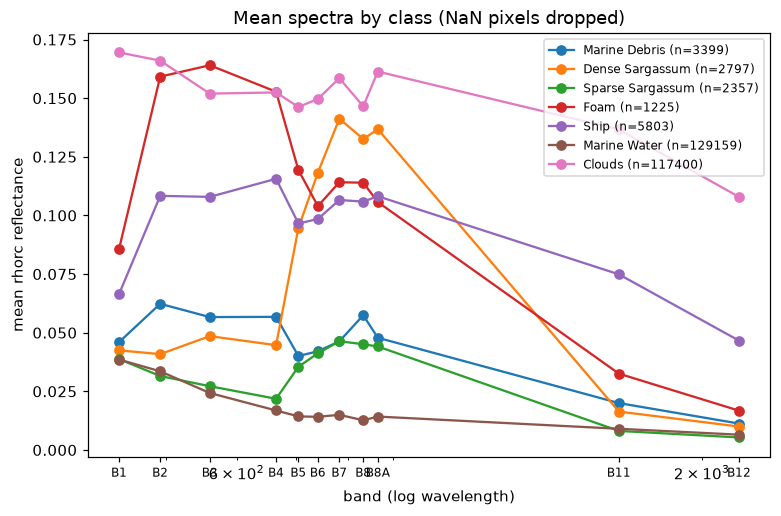
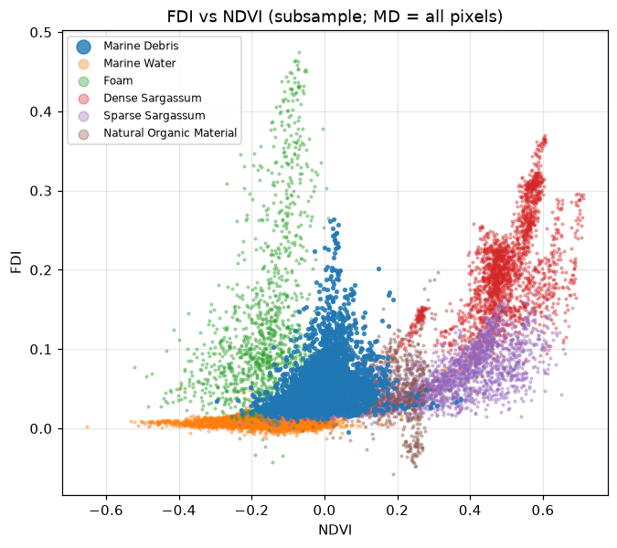
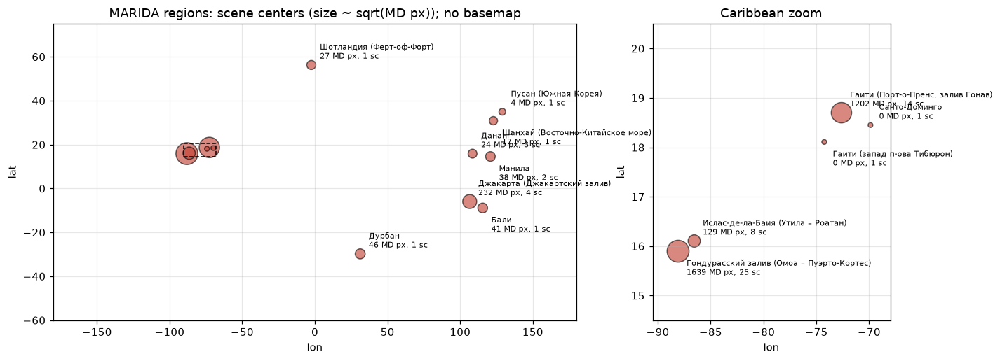
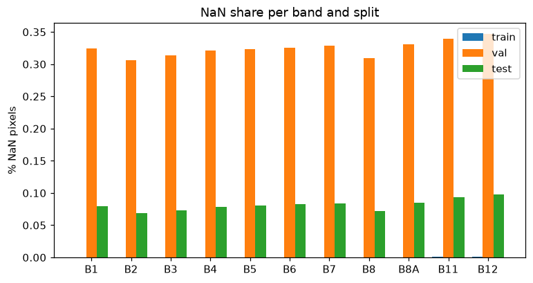
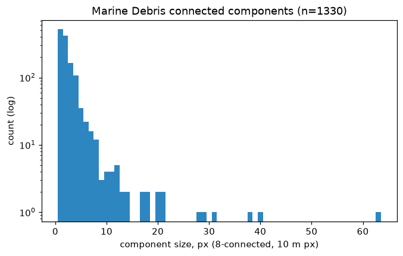

# MARIDA — EDA

Сгенерировано `scripts/eda_marida.py` за 21 с. Корень данных: `data\MARIDA`.

## Состав

- Патчей на диске: **1381** (ожидалось 1381); сцен: **63** (ожидалось 63).
- Сплиты: train **694**, val **328**, test **359** (ожидалось {'train': 694, 'val': 328, 'test': 359}). Патчей вне сплитов: 0; строк сплита без файла: 0.
- Формы: [(11, 256, 256)]; dtype: ['float32']; CRS: 10 разных (EPSG:32616, EPSG:32618, EPSG:32619, EPSG:32630, EPSG:32648, EPSG:32651, EPSG:32652, EPSG:32736, EPSG:32748, EPSG:32750).
- Каналы: B1, B2, B3, B4, B5, B6, B7, B8, B8A, B11, B12 (ACOLITE rhorc).

## Marine Debris

- Всего MD px: **3399** (ожидалось 3399); по conf High/Moderate/Low: **1625 / 1235 / 539** (ожидалось 1625/1235/539); без conf: 0.
- Патчей с MD: **373** (ожидалось 373); по сплитам: train 190, val 82, test 101.

| split | MD px | High | Moderate | Low | патчей с MD |
|---|---|---|---|---|---|
| train | 1943 | 954 | 681 | 308 | 190 |
| val | 1075 | 556 | 381 | 138 | 82 |
| test | 381 | 115 | 173 | 93 | 101 |

- Компоненты MD (8-связность): 1330; медиана 2 px, среднее 2.6, макс 63; одиночных пикселей 521 (39 %); ≤ 4 px: 91 %.

## Пиксели по классам и сплитам

| id | класс | train | val | test | всего | High | Moderate | Low |
|---|---|---|---|---|---|---|---|---|
| 0 | Unlabelled | 45052572 | 21282706 | 23332561 | 89667839 |  |  |  |
| 1 | Marine Debris | 1943 | 1075 | 381 | 3399 | 1625 | 1235 | 539 |
| 2 | Dense Sargassum | 870 | 1167 | 760 | 2797 | 2797 | 0 | 0 |
| 3 | Sparse Sargassum | 1091 | 385 | 881 | 2357 | 2052 | 290 | 15 |
| 4 | Natural Organic Material | 723 | 92 | 49 | 864 | 556 | 201 | 107 |
| 5 | Ship | 3289 | 1340 | 1174 | 5803 | 5755 | 48 | 0 |
| 6 | Clouds | 65295 | 19262 | 32843 | 117400 | 117382 | 9 | 9 |
| 7 | Marine Water | 86877 | 18839 | 23443 | 129159 | 129143 | 16 | 0 |
| 8 | Sediment-Laden Water | 154335 | 125565 | 93037 | 372937 | 372917 | 0 | 20 |
| 9 | Foam | 469 | 369 | 387 | 1225 | 1120 | 90 | 15 |
| 10 | Turbid Water | 86820 | 38566 | 32226 | 157612 | 157612 | 0 | 0 |
| 11 | Shallow Water | 13852 | 1011 | 2506 | 17369 | 17369 | 0 | 0 |
| 12 | Waves | 2975 | 987 | 1865 | 5827 | 4865 | 121 | 841 |
| 13 | Cloud Shadows | 5675 | 2404 | 3649 | 11728 | 11728 | 0 | 0 |
| 14 | Wakes | 4974 | 1946 | 1570 | 8490 | 8487 | 3 | 0 |
| 15 | Mixed Water | 224 | 94 | 92 | 410 | 400 | 9 | 1 |

Размечено 837377 из 90505216 px (0.93 %): разметка частичная — площадь по маскам не считать.

## NaN

| band | train | val | test |
|---|---|---|---|
| B1 | 0.000 % | 0.324 % | 0.080 % |
| B2 | 0.000 % | 0.307 % | 0.069 % |
| B3 | 0.000 % | 0.314 % | 0.074 % |
| B4 | 0.000 % | 0.321 % | 0.078 % |
| B5 | 0.000 % | 0.324 % | 0.081 % |
| B6 | 0.000 % | 0.326 % | 0.083 % |
| B7 | 0.000 % | 0.328 % | 0.084 % |
| B8 | 0.000 % | 0.310 % | 0.072 % |
| B8A | 0.000 % | 0.331 % | 0.085 % |
| B11 | 0.001 % | 0.340 % | 0.094 % |
| B12 | 0.001 % | 0.347 % | 0.098 % |

## Средние спектры (rhorc, без NaN)

| класс | n px | B1 | B2 | B3 | B4 | B5 | B6 | B7 | B8 | B8A | B11 | B12 |
|---|---|---|---|---|---|---|---|---|---|---|---|---|
| Marine Debris | 3399 | 0.0460 | 0.0623 | 0.0567 | 0.0568 | 0.0401 | 0.0421 | 0.0463 | 0.0575 | 0.0479 | 0.0200 | 0.0113 |
| Dense Sargassum | 2797 | 0.0425 | 0.0409 | 0.0485 | 0.0447 | 0.0947 | 0.1183 | 0.1412 | 0.1326 | 0.1368 | 0.0164 | 0.0100 |
| Sparse Sargassum | 2357 | 0.0387 | 0.0315 | 0.0272 | 0.0218 | 0.0355 | 0.0412 | 0.0464 | 0.0451 | 0.0441 | 0.0081 | 0.0053 |
| Foam | 1225 | 0.0857 | 0.1592 | 0.1640 | 0.1527 | 0.1193 | 0.1040 | 0.1142 | 0.1139 | 0.1057 | 0.0325 | 0.0168 |
| Ship | 5803 | 0.0665 | 0.1084 | 0.1079 | 0.1156 | 0.0966 | 0.0985 | 0.1066 | 0.1059 | 0.1082 | 0.0749 | 0.0466 |
| Marine Water | 129159 | 0.0386 | 0.0335 | 0.0243 | 0.0168 | 0.0143 | 0.0141 | 0.0150 | 0.0127 | 0.0142 | 0.0090 | 0.0065 |
| Clouds | 117400 | 0.1695 | 0.1660 | 0.1519 | 0.1524 | 0.1462 | 0.1497 | 0.1585 | 0.1465 | 0.1613 | 0.1366 | 0.1079 |

## FDI / NDVI (медианы по выборке)

FDI по формуле ТЗ §2 (λ4 = 664.8, λ8 = 832.9, λ11 = 1612.05 нм).

| класс | n | median FDI | median NDVI |
|---|---|---|---|
| Marine Debris | 3399 | 0.0449 | -0.001 |
| Marine Water | 6000 | 0.0072 | -0.138 |
| Foam | 1225 | 0.1002 | -0.154 |
| Dense Sargassum | 2227 | 0.1950 | 0.492 |
| Sparse Sargassum | 2357 | 0.0557 | 0.341 |
| Natural Organic Material | 863 | 0.0428 | 0.182 |

## Регионы (по MD px)

| регион | тайлы | сцен | MD px | MD px High | bbox MD (lon_min,lat_min,lon_max,lat_max) |
|---|---|---|---|---|---|
| Гондурасский залив (Омоа – Пуэрто-Кортес) | 16PCC,16PDC | 25 | 1639 | 896 | -88.8549,15.7134,-87.0181,16.1524 |
| Гаити (Порт-о-Пренс, залив Гонав) | 18QYF,18QYG | 14 | 1202 | 585 | -72.8460,18.5396,-72.3550,19.3436 |
| Джакарта (Джакартский залив) | 48MXU,48MYU | 4 | 232 | 94 | 105.9264,-6.0618,106.9141,-5.8085 |
| Ислас-де-ла-Баия (Утила – Роатан) | 16PEC,16QED | 8 | 129 | 20 | -86.9795,15.7867,-86.2524,16.1059 |
| Дурбан | 36JUN | 1 | 46 | 20 | 31.0511,-29.8973,31.2138,-29.6675 |
| Бали | 50LLR | 1 | 41 | 0 | 115.1862,-8.9933,115.5122,-8.6680 |
| Манила | 51PTS | 2 | 38 | 5 | 120.7249,14.5486,120.8621,14.6520 |
| Шотландия (Ферт-оф-Форт) | 30VWH | 1 | 27 | 0 | -2.4836,56.1526,-2.4417,56.1987 |
| Дананг | 48PZC | 3 | 24 | 5 | 108.4182,15.6968,108.5894,15.9450 |
| Шанхай (Восточно-Китайское море) | 51RVQ | 1 | 17 | 0 | 123.0199,30.9305,123.0467,30.9536 |
| Пусан (Южная Корея) | 52SDD | 1 | 4 | 0 | 128.9904,34.9199,129.0745,34.9661 |
| Гаити (запад п-ова Тибюрон) | 18QWF | 1 | 0 | 0 |  |
| Санто-Доминго | 19QDA | 1 | 0 | 0 |  |

## Исключённая сцена

- `S2_23-9-20_16PCC`: **присутствует в архиве**, патчей 56 (train 56, val 0, test 0), MD px 77. примечание: сцена Bay Islands 23.09.2020 исключена авторами MARIDA (плохая атмосферная коррекция); в архиве v1.0.0 присутствует (все патчи в train), в README/Zenodo подтверждения не найдено; тайл 16PCC географически — Омоа/Пуэрто-Кортес, не Ислас-де-ла-Баия. В `marida_scenes.csv` помечена `excluded=True`.

## Рисунки

- `reports/eda/01_class_pixels_by_split.png` (38 КБ)
  
- `reports/eda/02_md_by_conf.png` (22 КБ)
  
- `reports/eda/03_md_by_scene.png` (95 КБ)
  
- `reports/eda/04_spectra_by_class.png` (93 КБ)
  
- `reports/eda/05_fdi_ndvi_scatter.png` (146 КБ)
  
- `reports/eda/06_world_map.png` (71 КБ)
  
- `reports/eda/07_nan_by_band.png` (19 КБ)
  
- `reports/eda/08_md_component_sizes.png` (17 КБ)
  

## Сверка с ожиданиями

| величина | факт | ожидание | совпало |
|---|---|---|---|
| патчей | 1381 | 1381 | да |
| сцен | 63 | 63 | да |
| train | 694 | 694 | да |
| val | 328 | 328 | да |
| test | 359 | 359 | да |
| MD px | 3399 | 3399 | да |
| MD High | 1625 | 1625 | да |
| MD Moderate | 1235 | 1235 | да |
| MD Low | 539 | 539 | да |
| патчей с MD | 373 | 373 | да |
