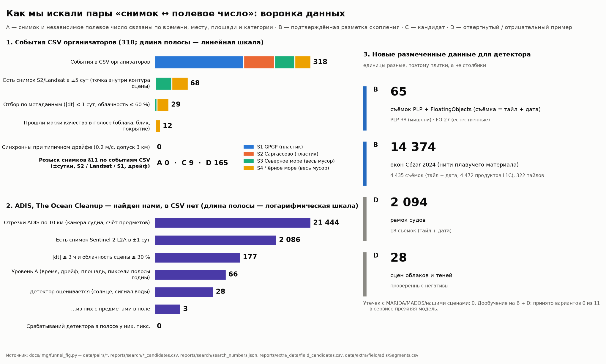
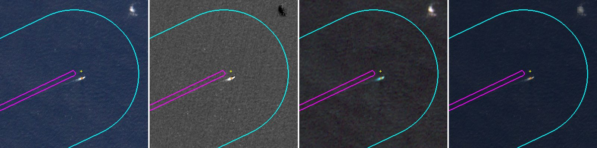
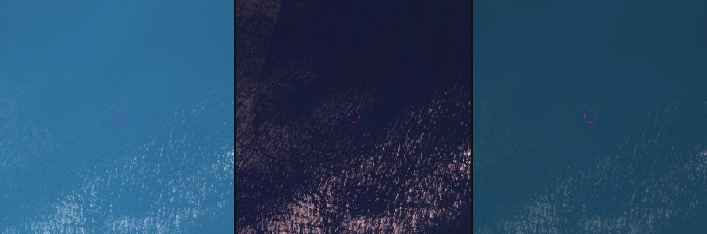
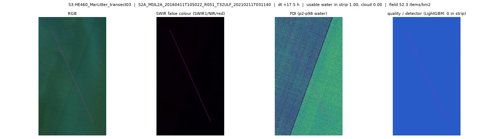

# Детектирование и оценка концентрации макропластика: отчёт

Все числа отчёта подставляются из `reports/final_numbers.json`. Этот файл собирает `scripts/final_numbers.py` из отчётов, конфигов и сводки прогона `reports/case_run/run_summary.json`. Руками числа не пишутся. Числа разбиты на разделы, у каждого свой источник и протокол (7–13 — расследование данных, раздел 10):

| Раздел | Главные числа | Протокол | Источник |
|---|---|---|---|
| 1. Детектор на MARIDA test | LightGBM F1 0.871 [0.823–0.920], RF 0.771, FDI × NDVI 0.042; 15 сцен | официальный test MARIDA, один раз после заморозки; порог и настройки бейзлайнов — только по val; класс Marine Debris против остальных размеченных классов, неразмеченные не считаются фоном; ДИ — бутстреп по сценам | `reports/case_detector/metrics.json` |
| 2. Полевая dev-проверка | S2 (44 события): ridge_log MAE 28.5 против медианы 44.2, ΔMAE [−31.6; −0.3]; S1 (58): knn5_log 434.0 против 527.4 | кросс-валидация внутри dev по 5 участкам маршрута с буфером 1 сут (route_buf1); протокол и правило выбора записаны до CV; ДИ разности MAE — бутстреп по дням рейса | `reports/case_conc/dev_cv.json, configs/case_conc_model.yaml` |
| 3. Полевой отложенный test | S2 (14): ridge_log 30.0 против медианы 25.2, ΔMAE [−1.6; +12.9] — основная модель не лучше медианы; S1 (19): knn5_log 370.0 против медианы 371.1, ΔMAE [−60.7; +49.2] — разницы с медианой нет | отложенный участок маршрута (+ буфер 1 сут), состав зафиксирован до моделей (sha256 в configs/case_selection.yaml), посчитан один раз; основная модель против медианы dev на тех же событиях; ДИ — бутстреп по дням рейса test. Ограничение: ранняя разведка бейзлайнов видела все события профиля | `reports/case_conc/final_test.json, reports/case_conc/final_test_predictions.csv` |
| 4. Эксперимент на снимках | 11 пар S2 (6 групп), весь мусор, не пластик: FDI ρ -0.75, p Холма 0.12, случайная вода сцены -0.52 — связь не установлена | пары, прошедшие маски качества; эталон — полевая плотность всего мусора (all_litter), не пластика; ранговая связь Спирмена, бутстреп по группам «район × день», поправка Холма, нулевая модель — случайная вода той же сцены | `reports/case_pairs/experiment.json` |
| 5. Детектор на снимках пар (L2A), текущий режим | 5 объектов на 22 вырезках, в полосах обследования 0; гармонизация выключена (выбор по MARIDA val) | текущий режим детектора на вырезках Sentinel-2 L2A пар: LightGBM weights/lgbm, порог P ≥ 0.63, harmonize = 'none'; объекты — 8-связные компоненты на пригодной воде без объектов у облаков; «в полосе» — пересечение с растровой полосой обследования | `reports/case_pairs/detector_current.json (из data/pairs/quality/*/meta.json)` |
| 6. Прежний режим с гармонизацией (до решения об отказе от неё, docs/DECISIONS.md) — основание для отказа | 975 объектов, в полосах 6; без HE460 t03 ложные типы (блик, облака) 55.0 %; визуально «вероятное скопление» ≈ 1.7 % | 22 вырезки Sentinel-2 L2A пар; объекты пересобраны как в pair_quality.py; типы назначены правилами (grid.artifacts, край облака, мелкое облако по B11, блик по B11, берег), без ручной разметки; визуальная разметка — ИИ-агент, один аннотатор, по вырезкам, не полевая | `reports/case_pairs/detector_review.json (разбор: reports/case_pairs/detector_review.md)`, `reports/case_pairs/visual_review.json` |
| 7. Розыск снимков (§11) | события CSV: A 0, C 9; все строки-кандидаты вместе с ADIS: A 66 / C 12 / D 273 | розыск снимков под события CSV организаторов (L86–L88, L98) и под отрезки ADIS (L100); уровень доказательности A–D у каждой строки; стоп-правило §11: нет A или убедительного C за пилот — поиск по дрейфу не расширяем; дрейф — область поиска, не доказательство | `reports/search/{s1,s2,s3,s4}_candidates.csv, reports/search/adis_candidates.csv, docs/img/funnel.json` |
| 8. Пары ADIS ↔ Sentinel-2 | A 66 (≈ 52 проходов), с предметами 6 — пикселей детектора 0 при 3.5–4.4 шт./км² | отрезки ADIS 10 км (камера судна, счёт >5/>10/>50 см, площадь обследования) × Sentinel-2 L2A; A = |dt| и дрейф в допуске, пиксели полосы годны по маскам качества, площадь и размерные классы из ADIS; детектор weights/lgbm без гармонизации, те же маски и код, что у пар CSV (pair_quality.process_s2); TP/FP по пикселям не утверждаются: пара A даёт только «на снимке N срабатываний при полевых M шт./км²» | `reports/search/adis_candidates.csv (копия data/search/adis/candidates.csv, L100), reports/search/adis.md` |
| 9. Новые размеченные данные B/D | B: 65 съёмок PLP/FloatingObjects + 14 374 окон Cózar; D: 2 094 судов, 28 сцен облаков; утечек 0 | B — подтверждённая разметка скопления (без числа предметов), D — проверенный отрицательный пример; пиксели — S2 L2A той же съёмки (тот же ридер, что у live-сцен); утечка = та же съёмка (тайл+дата) или те же пиксели (LBP) с MARIDA/MADOS/нашими сценами; текущий детектор weights/lgbm без дообучения, порог с MARIDA val | `reports/extra_data/registry.csv (L89), registry_negatives.csv (L90), registry_cozar2024.csv.gz (L98), content_overlap.csv, current_detector_zero_shot.csv, fp_current_detector.json` |
| 10. Детектор v2 (дообучение на B + D) | вариантов 11 × 3 seed, принято 0; в сервисе weights/lgbm | проверка зафиксирована до экспериментов (sha256 в experiments.json): MARIDA val + 3-fold по снимкам для новых B/D; 3 seed; правило принятия записано заранее (ΔF1 val ≥ max(0.01, 2σ) и не хуже на D/B); test MARIDA не читался; порог каждой модели — по val | `reports/detector_v2/experiments.json (L92), configs/detector_v2_eval.yaml` |
| 11. Бейзлайн U-Net MARIDA | test F1 0.501; LightGBM лучше на 0.370 [0.215; 0.481] | официальные веса U-Net MARIDA (Kikaki et al. 2022, эпоха 44), код и предобработка авторов, не переобучали; та же функция оценки, что у LightGBM (detector_compare.evaluate); порог U-Net — только по val; test MARIDA посчитан один раз; ДИ и парная разность — бутстреп по сценам | `reports/detector_v2/unet_test.json, unet_baseline.json (L99)` |
| 12. Количество: поле и доля покрытия раздельно | калибровки нет (пар A с ненулевым сигналом 0); для k в ×/÷2 нужно 4–12 пар с сигналом | раздельно: полевая плотность C = N/A (шт./км², интервал Пуассона) и спутниковая доля покрытия подозрительного материала (м² маски на км² пригодной воды, как LWD у Cózar et al. 2024); доля покрытия ≠ мусор и ≠ шт./км²; связь между ними — только калибровка на парах A, которой нет; сценарий «площадь / размер предмета» — помеченный исследовательский диапазон, на карту не идёт | `reports/quantity/{field,calibration,coverage_live,coverage_pairs,scenario,adis_field}.json (L93), docs/QUANTITY.md` |
| 13. Нефтяное пятно (эксперимент, выключен) | MADOS test F1 0.733 против OSI 0.324; контроль Wakashio на L2A не пройден | MADOS класс Oil Spill, сплит по сценам заморожен до обучения (без съёмок MARIDA val/test); отдельная голова LightGBM, основной детектор не тронут; выбор только по val, test открыт один раз; бейзлайн — порог OSI = (B3+B4)/B2; положительный контроль на S2 L2A — разлив Wakashio 2020; единица — площадь, км², не объём и не масса | `reports/oil/{val_runs,test,control}.json (L101), configs/oil_eval.yaml, docs/OIL.md` |

Первая часть отчёта — кейс. Вторая, «Подготовка», — детектор и карта по живым снимкам, сделанные до выдачи кейса. Детектор оттуда используется в кейсе без изменений.

## Кратко

- **Целевая величина** — суммарный плавающий пластик, предметы > 2 см, шт./км², визуальная полоса 10 м с судна (профиль `S2_visual_GT2 / total_plastic`, 63 события). Второй профиль, только для полевой проверки, — трал 5–50 см в Тихом океане (83 события). Весь мусор (`all_litter`) пластиком не считаем.
- **Концентрация**: C = N/A с точным интервалом Пуассона; контрольный пример 12 / 0,20 = 60.0 шт./км². Основная модель на S2 — ridge_log: MAE 28.5 против медианы 44.2 на кросс-валидации по участкам маршрута внутри dev; выигрыш слабый. На отложенном test, посчитанном один раз (14 событий S2, 19 событий S1), основная модель S2 основная модель не лучше медианы (30.0 против 25.2 шт./км²), у S1 разницы с медианой нет (370.0 против 371.1). По правилу, записанному до открытия test, оценка по полевым данным на карте — медиана профиля.
- **Детектор** (класс Marine Debris MARIDA — любой плавающий мусор, пластик отдельно не выделяется): LightGBM, F1 Marine Debris на test MARIDA 0.871 [0.823–0.920] против RandomForest 0.771; разница 0.100 [0.049; 0.150]. На саргассуме, мутной воде и воде со взвесью — 0 ложных срабатываний.
- **Расследование данных** (раздел 10): у событий CSV пар уровня A — 0; в найденных нами данных ADIS — 66 пар A, и во всех 6 с предметами детектор дал 0 пикселей — это предел обнаружения, а не калибровка. Новые B/D: 65 съёмок PLP/FloatingObjects, 14 374 окон Cózar, 2 094 судов, утечек 0. Дообучение: принято 0 из 11 вариантов. U-Net MARIDA на test — F1 0.501.
- **Спутниковые пары**: из 318 событий по метаданным проходят 29, маски — 12, синхронных при типичном дрейфе — 0. Для профилей пластика сцен нет вообще. Связь признаков снимка с полевой плотностью на имеющихся парах не установлена. Поэтому перенос шт./км² на снимок не заявляем, и у всех зон на карте стоит «концентрация недоступна».

## 1. Задача и целевая величина

**Пользователь** — специалист по экологическому мониторингу. Ему нужно выбрать акваторию и дату, проверить возможные зоны скопления, сравнить их с полевыми измерениями, понять качество и неопределённость и выгрузить результат.

**Состав реестра** (`task/macroplastic_marine_samples.csv`): 935 строк, 318 событий, четыре источника.

| Источник | Событий | Метод | Совокупность |
|---|---:|---|---|
| S1 Тихий океан, мусорное пятно | 181 | тралы, аэросъёмка | пластик: суммарный 5–50 см, категории > 5 см, мегапластик > 50 см |
| S2 Саргассово море, MSM41 | 63 | визуальные трансекты с судна | пластик > 2 см: суммарный и категории |
| S3 Северное море | 41 | визуальные трансекты | весь мусор > 2 см и категория промыслового мусора |
| S4 Чёрное море, DOORS 3 | 33 | визуальные трансекты | весь мусор > 2,5 см; нет времени, площади и числителя |

По `target_scope` строки распределены так: суммарный пластик 162, категории пластика 321, весь мусор 74, категория промыслового мусора 41, объектные строки 337.

**Почему основной профиль — S2 `total_plastic`:**
- это одна совокупность: пластик всех полимеров, > 2 см, один метод и один рейс;
- одна строка на событие;
- у всех 63 событий есть N и A. Значит, формулу C = N/A можно проверить на данных и дать интервал Пуассона. N от 1 до 55, A от 0.092 до 0.255 км² — масштаб контрольного примера постановки;
- поверхностный визуальный учёт ближе всего к тому, что в принципе видно со спутника.

**Почему S1 только второй профиль.** Событий у него больше (83), но C там — опубликованная оценка без числителя, а размерный класс и метод другие (трал, 5–50 см). Профили не смешиваются, метрики у каждого свои.

**Что исключено и почему.**
- Весь мусор S3 и S4 — это не пластик: доля пластика из публикации на отдельное наблюдение не переносится.
- Категории не суммируются: наборы категорий на событие разные, а пустая строка не означает ноль.
- Объектные строки — это отдельные предметы, у них нет плотности.
- Аэросъёмка S1 > 50 см даёт одно опубликованное число на 16 строк.

**Измерение и оценка** различаются во всех слоях:
- полевое C = N/A — измерение с интервалом Пуассона;
- прогноз модели по полевым данным — «оценка по полевым данным, не по снимку», с интервалом и его фактическим покрытием;
- зона детектора — площадь полосы и площадь маски, без шт./км².

## 2. Данные, отбор и реестр пар

### 2.1 Отбор записей

- Код — `src/macroplastic/case/selection.py`, параметры — `configs/case_selection.yaml`.
- Сначала применяются правила команды (`team_rules`), затем фильтры профиля: источник, тип записи, совокупность, профиль измерения, размерный класс, материал и флаги качества.
- Каждая строка получает решение «принята» или первую сработавшую причину отказа.
- Профиль S2: принято 63, отказов 872. Из них объектные строки 337, категории пластика 321, весь мусор 74, категория промыслового мусора 41, аэросъёмка 16, другой профиль 83.
- Профиль S1: принято 83, отказов 852.
- Сверка C = N/A с опубликованной концентрацией: 467 из 467 строк в пределах 2 % (`reports/case_conc/consistency.csv`). У S1 и S2 совпадение точное, у S3 расхождение до 0,9 % из-за округления в источнике.

**Утечки.** Поля с ответом или производные от него не бывают признаками:
- `concentration_*`, `items_count`, `density_numerator_items`;
- `source_object_filtered_items`, `source_reported_total_items`;
- `reported_*`, `parent_*`, `zero_scope`;
- а также `quality_flags`, `notes`, `calculation_method`.

Тест проверяет, что порча этих полей не меняет прогноз ни одной модели.

### 2.2 Поиск сцен

`scripts/case/find_pairs.py` опрашивает для каждого события четыре коллекции STAC в окне ±5 сут: Earth Search Sentinel-2 L2A и L1C, Planetary Computer Sentinel-2 L2A и Landsat C2 L2. Ответы кэшируются. Получилось 1 774 строки, сцен-кандидатов среди них 673.

| Источник | Событий | S2 ±1 сут | Landsat ±1 сут | любая сцена ±1 | ±3 | ±5 сут |
|---|---:|---:|---:|---:|---:|---:|
| S1 Тихий океан, мусорное пятно (2015–2016) | 181 | 0 | 0 | 0 | 0 | 0 |
| S2 Саргассово море (04.2015) | 63 | 0 | 1 | 1 | 1 | 1 |
| S3 Северное море (2014, 2016) | 41 | 2 | 13 | 14 | 26 | 34 |
| S4 Чёрное море (06.2024) | 33 | 32 | 14 | 33 | 33 | 33 |
| **все** | 318 | 34 | 28 | 48 | 60 | 68 |

- Для профилей пластика пар нет. S1 и S2 — открытый океан, который Sentinel-2 не снимает по плану. Кроме того, рейс MSM41 (апрель 2015) прошёл до начала работы Sentinel-2A.
- Сцены есть только у всего мусора S3 и S4.
- Время наблюдения неизвестно у 64 событий: все события S4 и часть S1. Для них окно поиска расширено на полсуток, а сдвиг по дрейфу считается по худшему случаю.

Причины отказа по строкам кандидатов (у строки может быть несколько):
- сцены в окне нет — 798;
- миссия ещё не запущена — 303;
- |dt| > 1 сут — 476;
- облачность сцены > 60 % — 227;
- точка вне контура — 43;
- недостоверная синхронизация по дрейфу — 669.

### 2.3 Синхронизация с учётом дрейфа

По метаданным (|dt| ≤ 1 сут, облачность ≤ 60 %, точка внутри контура) проходят 29 событий, 105 строк.

Но полевая плотность относится ко всей обследованной полосе, а за часы между наблюдением и снимком вода смещается. Поэтому сдвиг пары оцениваем так:
- смещение = (скорость течения + 1–3 % скорости ветра) × |dt|;
- при неизвестном времени берётся |dt| + 12 ч, то есть худший случай;
- допуск = полуширина полосы + 3.0 км. Это тот же буфер контекста, что у вырезки масок.

Скорости течений взяты из литературы по дрифтерам, Основному черноморскому течению и остаточной циркуляции Северного моря. Ссылки — в `configs/case_pairs.yaml`.

| Сценарий течения | м/с | Медиана сдвига за |dt|, км (p25–p75) | Проходят при допуске 3 км | 10 км | ½ длины трансекты |
|---|---:|---|---:|---:|---:|
| низкий | 0.05 | 5.9 (2.9–7.1) | 12 | 29 | 15 |
| **типичный (принят)** | 0.20 | 23.4 (11.4–28.4) | 0 | 1 | 2 |
| высокий | 0.50 | 58.5 (28.6–71.1) | 0 | 0 | 0 |

При типичной скорости 0,2 м/с пара синхронна, только если |dt| ≤ ≈ 4.2 ч. У S4 времени нет, поэтому это условие для них не выполняется никогда. Результат — **0 синхронных пар**. Решение принято осознанно: мягкий допуск в половину длины трансекты оставил бы 2 события, но проверять детекцию «в точке наблюдения» по такой паре нельзя.

### 2.4 Маски качества в полосе наблюдения

`scripts/case/pair_quality.py` делает вырезку вокруг полосы наблюдения: трансекта с полушириной не меньше 10 м или точка с буфером 500 м, плюс контекст 3 км. Дальше строится маска качества по SCL (для Landsat — по QA_PIXEL) и спектральному тесту облаков. Пригодность пикселя (валидная вода, облака и тени, суша, пропуски) проверяется отдельно от класса.

Правила решения из конфига:
- покрытие полосы ≥ 0.8;
- облака ≤ 0.2;
- суша ≤ 0.5;
- валидная вода ≥ 0.5;
- блик — медиана B11 по воде > 0.01.

Результат:
- обработано 29 пар: 22 Sentinel-2 и 7 Landsat;
- прошли 12, отклонены 17: блик 10, облака 6, недостаточное покрытие 1;
- у 4 сцен Landsat флаг облака QA противоречит отражению (красный канал < 0,03). Такие отказы помечены как сомнительные;
- главная причина отказа летом в Чёрном море — блик, а не облака.

### 2.5 Реестр пар

`data/case/run/registry_pairs.csv` — одна строка на каждое из 318 событий. В строке: статус, этап отказа (метаданные, дрейф, маски), все причины, статус без учёта дрейфа, лучшая сцена, dt, облачность, сдвиг и допуск, решение по маскам, число детекций, sample_id.

Сейчас:
- отклонены все 318: на этапе метаданных 289, на этапе дрейфа 29;
- без учёта дрейфа приняли бы 12;
- `data/case/run/registry_samples.csv` — то же для каждой пары sample_id × профиль.

Тесты маршрута проверяют:
- каждое событие и sample_id есть ровно один раз, с непустой причиной;
- решения совпадают с прямым вызовом отбора;
- повторная подготовка даёт те же sha256.

## 3. Детектор

### 3.1 Метод

- Положительный класс — Marine Debris разметки MARIDA: любой плавающий мусор (пластик, дерево, ткань и т. п.), часто вместе с органикой. Пластик отдельно не выделяется, поэтому маска детектора — «вероятное скопление плавающего мусора».
- Пиксельный LightGBM, 48 признаков: 11 каналов Sentinel-2, спектральные индексы и статистики окна вокруг пикселя.
- Обучен на MARIDA train + MADOS, порог P(MD) ≥ 0.63 подобран по F1 на val MARIDA.
- Подробно — часть «Подготовка», разделы П.2, П.4–П.7.
- На вырезках пар L2A детектор работает **без гармонизации** (решение об отказе от гармонизации, [docs/DECISIONS.md](../docs/DECISIONS.md), принято по MARIDA val: F1 0.923 без сдвига против 0.897 со сдвигом на сцену). Слой живых снимков подготовительного этапа по-прежнему гармонизируется по медиане воды. Облака и тени отсекаются маской.

### 3.2 Проверка на одной выборке

- **Эталон** — разметка MARIDA, класс Marine Debris против остальных размеченных классов, пул пикселей. В test 359 патчей из 15 сцен, 381 пиксель мусора.
- **Неразмеченные пиксели** не считаются фоном. Доля срабатываний на них показана отдельно.
- **Настройки бейзлайнов** (пороги индексов, порог RandomForest) выбраны на val. RandomForest с параметрами статьи MARIDA — без подбора. На test ничего не настраивалось.
- **Воспроизводимость.** Основной детектор на test совпадает с однократным `reports/lgbm_final_test.json` во всех полях. Сохранённые предсказания 7 моделей пересчитываются шагом `run_all eval` с той же точностью.

| Детектор | Настройка (выбрана на val) | F1 val | Precision test | Recall test | **F1 test** | IoU test | 95 % ДИ F1 test (по сценам) | Помечено неразмеченных пикселей test, % |
|---|---|---|---|---|---|---|---|---|
| **LightGBM, MARIDA + MADOS (основной)** | `P(MD) >= 0.63` | 0.923 | 0.824 | 0.924 | **0.871** | 0.772 | 0.823–0.920 | 0.013 |
| RandomForest, протокол статьи MARIDA | `argmax of 11 classes (12-15 merged into Marine Water)` | 0.865 | 0.707 | 0.848 | **0.771** | 0.627 | 0.709–0.834 | 0.066 |
| RandomForest, порог P(MD) | `P(MD) >= 0.36` | 0.860 | 0.710 | 0.861 | **0.778** | 0.637 | 0.710–0.843 | 0.057 |
| окно FDI × NDVI (4 порога) | `FDI in [0.0234, 0.11202], NDVI in [-0.06544, inf]` | 0.415 | 0.022 | 0.580 | **0.042** | 0.022 | 0.017–0.312 | 1.774 |
| интервал FDI (2 порога) | `FDI in [0.03027, 0.05919]` | 0.323 | 0.013 | 0.457 | **0.025** | 0.013 | 0.011–0.092 | 1.838 |
| один порог FDI | `FDI <= 0.08186` | 0.020 | 0.003 | 0.971 | **0.006** | 0.003 | 0.003–0.012 | 94.943 |
| один порог NDVI | `NDVI >= 0.02161` | 0.168 | 0.012 | 0.247 | **0.024** | 0.012 | 0.007–0.078 | 6.458 |

Парный бутстрэп по сценам test (2000 повторов):
- основной детектор лучше RandomForest на 0.100 F1 [0.049; 0.150], доля повторов с ΔF1 ≤ 0 — 0.0005;
- лучше в 9 сценах, хуже в 3.

Индексные правила на val выглядят приемлемо (окно FDI × NDVI 0.415), но на test падают до 0.042. При этом они помечают больше 1 % неразмеченной воды. Один порог FDI — 0.006.

### 3.3 Ошибки и сложный фон

| Класс фона MARIDA (test) | Размечено пикселей | Ложных срабатываний основного детектора | Доля класса, % |
|---|---:|---:|---:|
| суда | 1 174 | 27 | 2.30 |
| природная органика | 49 | 21 | 42.86 |
| волны | 1 865 | 12 | 0.64 |
| смешанная вода | 92 | 6 | 6.52 |
| кильватерные следы | 1 570 | 5 | 0.32 |
| чистая вода | 23 443 | 2 | 0.01 |
| облака | 32 843 | 1 | 0.00 |
| пена | 387 | 1 | 0.26 |
| вода со взвесью | 93 037 | 0 | 0.00 |
| мутная вода | 32 226 | 0 | 0.00 |
| тени облаков | 3 649 | 0 | 0.00 |
| мелководье | 2 506 | 0 | 0.00 |
| саргассум разреженный | 881 | 0 | 0.00 |
| саргассум плотный | 760 | 0 | 0.00 |
| **всего** | | **75** | |

- Саргассум, мутная вода и вода со взвесью (126 904 размеченных пикселей test) дают основному детектору 0 ложных срабатываний. Окно FDI × NDVI помечает 46 % пикселей саргассума.
- Суда и природная органика — 64 % всех ложных срабатываний. Органика спектрально близка к мусору и часто плавает вместе с ним.
- Пропуски: 21 из 29 приходятся на три сцены (3-11-16_16PDC, 17-7-16_51PTS, 19-9-18_16PDC), где полосы мусора размечены отдельными точками.
- Вырезки 64×64 с разметкой и масками моделей — `reports/case_detector/examples/`: две удачи, ложные на саргассуме, пене, судне, кильватере, взвеси и органике, пропуск, срабатывания на неразмеченных пикселях.

### 3.4 Детектор на спутниковых парах

- Текущий режим, без гармонизации (`reports/case_pairs/detector_current.json`): на 22 вырезках 5 объектов, в полосах обследования 0. Все объекты на одной вырезке (S3 HE460 transect03): по правилам 1 судно и 4 одиночных пикселя; максимум P 0.15. Подозрительных пикселей у участков нет.
- Полевая плотность всего мусора на принятых черноморских парах — от 52 до 976 шт./км², пиксельного сигнала она не даёт.
- Физически это ожидаемо. Даже самая высокая плотность реестра — меньше одного предмета на пиксель 10 м, поэтому видны только плотные скопления и полосы.

### 3.5 Прежний режим с гармонизацией: разбор и визуальная разметка (основание для отказа)

Всё в этом разделе относится к прогону **до решения об отказе от гармонизации ([docs/DECISIONS.md](../docs/DECISIONS.md))**, когда вход сдвигался к медиане воды MARIDA (`water_median`). Воспроизводится `pair_quality.py --harmonize scene_median`. К текущему результату (раздел 3.4) эти числа не относятся.

Скрипт `scripts/case/pairs_detector_review.py`, числа — `reports/case_pairs/detector_review.json`, разбор с кадрами — `reports/case_pairs/detector_review.md`. Объекты пересобраны так же, как в `pair_quality.py`, и сверены с ним: число объектов и объекты в полосе совпали на всех вырезках. Типы назначены правилами без ручной разметки: судно, кильватер и шов (`grid.artifacts`), край облака, мелкое облако вне маски (по B11), блик (по B11), берег. Всё, что правила не объяснили, попадает в «остальное», и это не значит «мусор».

- Всего 975 объектов на 22 вырезках, в полосах обследования 6. Ложные типы — 14.4 % объектов.
- Без HE460 t03 ложные типы дают 55.0 % из 251 объектов: блик 26.7 %, края облаков и мелкие облака 25.1 %. На MARIDA test класса «блик» нет, а облака почти не дают срабатываний. **Сложный фон реальных сцен другой, чем на MARIDA test.**
- На 10 вырезках, отклонённых по блику, 172 объектов; все 3 объекта в полосах — ложные: блик и мелкие облака, пропущенные маской.
- HE460 t03 (принята масками): 724 объекта, 721 вне полосы, 575 одиночных пикселей. У 691 плоский белый спектр без SWIR, разброс равномерный по ветреному морю. Вероятно, это барашки и пена. Предметы, которые считало поле (сантиметровые, около 52 на км²), такого избытка яркости в пикселе 10 м дать не могут.
- **Гармонизация `water_median`** определяет ответ почти целиком: без неё на всех вырезках 5 объектов вместо 975, но пропадает и настоящее судно с кильватером на T25.
- Визуальная разметка 111 мест (`reports/case_pairs/visual_review.md`; разметка ИИ-агентом по вырезкам: один аннотатор, не полевая проверка; κ = 0.77 — согласие с его же слепым повтором 20 мест): «вероятное скопление» — 1 из 100 вне полос (≈ 1.7 %, ДИ 0.0–5.0 %), 0 из 6 в полосах, 0 из 5 без гармонизации.
- На MARIDA val гармонизация тоже хуже: F1 0.897 (сдвиг на сцену) и 0.824 (на патч) против 0.923 без сдвига; ΔF1 -0.025 [-0.072; -0.013] (`reports/case_pairs/harmonize_val.json`). Решение принято **по MARIDA val**. Визуальная разметка — оценка, а не критерий выбора.
- Вывод: F1 0.871 на MARIDA test на снимки пар не переносится; итог «0 подтверждённых пар» не меняется.

## 4. Концентрация шт./км²

### 4.1 Формула и контрольные примеры

Код — `src/macroplastic/case/concentration.py`.
- C = N / A.
- Площадь полосы — длина × ширина с переводом единиц.
- Агрегация — ΣN / ΣA.
- Интервал поля — точный интервал Пуассона (Гарвуд) для N, делённый на A.
- Статусы: «обнаружено», «не обнаружено» (N = 0, с верхней границей), «недостаточно данных» (нет N или A, некорректные входы — без деления).

Контрольные примеры в тестах:
- 12 / 0,20 = 60.0 шт./км², 95 % ДИ 31.0–104.8;
- модель 75 → абсолютная ошибка 15.0.

Основная метрика — MAE, дополнительные — RMSE, медиана абсолютной ошибки и MAE в log1p. MAPE не используем: в реестре есть нули.

### 4.2 Разбиение: почему участки маршрута

Все события S2 — один рейс, S1 — одна экспедиция. Соседние станции одного дня рейса похожи, поэтому разбиение по событиям или «день × ячейка» пропускает в train соседей test-записи. Мы сравнили шесть схем на одних и тех же бейзлайнах (`scripts/case/baseline_concentration.py`, `reports/case_conc/baseline.md`):

| Схема разбиения | Профиль | MAE медианы | MAE kNN-5 (log) | ΔMAE kNN − медиана [95 % ДИ] | Соседей kNN из того же или соседнего дня рейса |
|---|---|---:|---:|---|---:|
| по событиям | S2 | 33.0 | 26.3 | −6.7 [−15.1; +0.6] | 64 % |
| день × ячейка 1° | S2 | 33.1 | 24.8 | −8.2 [−19.8; +2.2] | 48 % |
| день рейса | S2 | 34.9 | 30.3 | −4.6 [−10.3; +1.4] | 42 % |
| связные компоненты ≤ 100 км и ≤ 2 сут | S2 | 37.2 | 25.6 | −11.6 [−23.1; −0.9] | 27 % |
| участки маршрута | S2 | 36.1 | 35.0 | −1.0 [−7.9; +7.1] | 9 % |
| **участки маршрута + буфер 1 сут (основная)** | S2 | 35.9 | 31.7 | −4.2 [−12.0; +3.4] | 0 % |
| по событиям | S1 | 406.3 | 323.4 | −82.8 [−142.5; −30.3] | 59 % |
| день × ячейка 1° | S1 | 402.6 | 333.4 | −69.2 [−129.6; −10.9] | 49 % |
| день рейса | S1 | 414.6 | 408.5 | −6.1 [−64.9; +55.1] | 29 % |
| связные компоненты ≤ 100 км и ≤ 2 сут | S1 | 450.0 | 425.3 | −24.7 [−88.1; +35.7] | 11 % |
| участки маршрута | S1 | 443.0 | 378.5 | −64.4 [−138.2; +13.4] | 8 % |
| **участки маршрута + буфер 1 сут (основная)** | S1 | 456.4 | 388.1 | −68.3 [−138.8; −1.0] | 0 % |

- Строки, кроме основной, приведены как пример утечки маршрута, а не как результат модели. Выигрыш kNN на слабых схемах держится на соседях того же дня. При 0 % таких соседей (основная схема) на S2 он незначим.
- Первый вывод «kNN лучше медианы на 11,6 шт./км²» был получен на схеме связных компонент. После этой проверки мы от него отказались.
- Основная схема зафиксирована в `configs/case_selection.yaml: main_split` до моделей: 5 непрерывных участков маршрута, фолд = участок, буфер 1 сут. Тесты проверяют, что между фолдами нет общих событий, групп, сцен и дней рейса.

### 4.3 Отложенный test

Зафиксирован 25.09.2026 17:51, до моделей концентрации (`scripts/case/freeze_final_test.py`). Правило выбора:
- test — это один участок маршрута, выбранный по sha256 от seed и профиля. Значения C на выбор не влияют, тест проверяет это перемешиванием целевой колонки;
- дни в пределах 1 сут от test — буфер, он не входит ни в test, ни в dev.

| Профиль | test | дни test | буфер | dev | мин. сдвиг до dev | мин. расстояние до dev |
|---|---:|---|---:|---:|---:|---:|
| S2 | 14 | 2015-04-06..2015-04-10 | 5 | 44 | 1.56 сут | 90 км |
| S1 | 19 | 2015-07-31..2015-08-04 | 6 | 58 | 1.25 сут | 107 км |

- Составы — `reports/case_splits/final_test_<профиль>.csv`, sha256 — в конфиге.
- Метки test читает только `scripts/case/final_test_conc.py`. Он отказывает при существующем результате и до срока приёмки, сверяет sha256 состава и замороженные веса.
- Бейзлайны разных схем (раздел 4.2) считались по всем событиям, включая будущие test. Модели ниже и их гиперпараметры видели только dev.

**Отложенный test посчитан один раз** (25.09.2026 19:15, `reports/case_conc/final_test.json`, прогнозы — `final_test_predictions.csv`): S2_visual_total_plastic: ridge_log MAE 30.0 против медианы 25.2 шт./км² (n = 14), ΔMAE +4.8 [−1.6; +12.9], покрытие 90 %-интервала 71 %; выигрыш не значим; S1_trawl_total_plastic: knn5_log MAE 370.0 против медианы 371.1 шт./км² (n = 19), ΔMAE −1.1 [−60.7; +49.2], покрытие 90 %-интервала 89 %; выигрыш не значим.

Правило, записанное до открытия test (25.09.2026 19:05): после результата модель не подбирается; если основная на test не лучше медианы (ДИ разности MAE содержит 0) — на карте field_estimate = медиана обучающего профиля, так и пишется. Ограничение: ранняя разведка бейзлайнов (baseline_concentration.py, run_all шаг 4: median/mean/kNN) видела все события профиля, включая будущий test; test не абсолютно нетронутый — указывается как ограничение.

### 4.4 Модели на dev

**Протокол записан до запуска CV** (`configs/case_conc_model.yaml: protocol`):
- бейзлайн — медиана обучающих участков, кандидатов 8, гиперпараметры фиксированы заранее;
- признаки — широта, долгота, день года и местное солнечное время (sin/cos); у S1 ещё ветер и волнение, если они заполнены;
- площадь A — только вес или offset GLM;
- правило выбора: верхняя граница 95 % ДИ разности MAE с медианой (бутстреп по дням рейса) < 0, из принятых — наименьший MAE, иначе основной остаётся медиана.

**S2** (44 события dev, 19 дней рейса):

| Модель | MAE, шт./км² | RMSE | медиана abs ошибки | MAE в log1p | ΔMAE к медиане [95 % ДИ] | ДИ с поправкой Бонферрони | Покрытие 90 %-интервала | Медианная ширина интервала |
|---|---:|---:|---:|---:|---|---|---:|---:|
| медиана train (бейзлайн) | 44.2 | 57.5 | 32.5 | 0.922 | — | — | 84 % | 174 |
| среднее train | 43.3 | 53.4 | 39.6 | 0.865 | −0.9 [−6.3; +5.2] | [−8.2; +7.2] | 89 % | 169 |
| геометрическое среднее | 39.7 | 54.1 | 28.5 | 0.821 | −4.5 [−7.7; −1.8] | [−9.0; −1.1] | 82 % | 166 |
| ΣN/ΣA (пуассоновская без признаков) | 43.3 | 53.3 | 39.9 | 0.864 | −0.9 [−6.6; +5.4] | [−8.7; +7.5] | 89 % | 168 |
| kNN-5 в log (соседи ±1 сут запрещены) | 28.8 | 38.1 | 18.2 | 0.593 | −15.4 [−26.2; −3.6] | [−30.6; +2.0] | 91 % | 102 |
| **ridge в log (широта, долгота, сезон, время суток) — основная** | 28.5 | 41.4 | 20.8 | 0.612 | −15.7 [−31.6; −0.3] | [−38.7; +7.3] | 84 % | 90 |
| пуассоновская GLM (вес A, offset log A) | 35.9 | 54.0 | 24.0 | 0.658 | −8.3 [−24.2; +12.7] | [−29.3; +24.5] | 89 % | 133 |
| Tweedie GLM (p = 1,5) | 31.3 | 45.3 | 20.5 | 0.619 | −12.9 [−29.1; +5.6] | [−33.9; +15.7] | 84 % | 101 |
| LightGBM в log (100 деревьев, 4 листа) | 30.9 | 41.7 | 25.3 | 0.645 | −13.3 [−24.4; −2.2] | [−28.0; +3.5] | 86 % | 172 |

**S1** (58 событий dev, 17 дней рейса):

| Модель | MAE, шт./км² | RMSE | медиана abs ошибки | MAE в log1p | ΔMAE к медиане [95 % ДИ] | ДИ с поправкой Бонферрони | Покрытие 90 %-интервала | Медианная ширина интервала |
|---|---:|---:|---:|---:|---|---|---:|---:|
| медиана train (бейзлайн) | 527.4 | 633.4 | 522.5 | 0.859 | — | — | 84 % | 1684 |
| среднее train | 464.5 | 558.3 | 424.9 | 0.741 | −62.9 [−114.3; −17.8] | [−128.7; −3.0] | 84 % | 1665 |
| геометрическое среднее | 489.2 | 602.1 | 457.3 | 0.802 | −38.3 [−71.2; −4.4] | [−86.9; +8.0] | 84 % | 1671 |
| ΣN/ΣA (пуассоновская без признаков) | 471.0 | 565.9 | 412.7 | 0.752 | −56.4 [−97.0; −21.9] | [−109.0; −10.4] | 84 % | 1694 |
| **kNN-5 в log (соседи ±1 сут запрещены) — основная** | 434.0 | 531.2 | 392.5 | 0.692 | −93.4 [−189.6; −9.9] | [−238.3; +16.8] | 74 % | 1786 |
| ridge в log (широта, долгота, сезон, время суток) | 939.6 | 1209.0 | 804.9 | 1.064 | +412.2 [+139.2; +740.0] | [+51.9; +894.3] | 76 % | 2809 |
| пуассоновская GLM (вес A, offset log A) | 544.7 | 776.5 | 293.7 | 0.645 | +17.3 [−209.7; +267.9] | [−296.2; +361.9] | 93 % | 3041 |
| Tweedie GLM (p = 1,5) | 809.2 | 1103.7 | 526.7 | 0.918 | +281.8 [−2.1; +626.7] | [−97.7; +758.7] | 81 % | 1944 |
| LightGBM в log (100 деревьев, 4 листа) | 562.4 | 667.4 | 556.2 | 0.885 | +34.9 [−40.6; +105.9] | [−75.2; +133.4] | 78 % | 2755 |

**Выбор.**
- S2 — **ridge_log**. Правило она проходит на границе: верхняя граница 95 % ДИ разности — -0.3 шт./км².
- Под поправкой Бонферрони на 8 кандидатов значимым остаётся только геометрическое среднее: -4.5 [-9.0; -1.1].
- При 4 участках разница ridge_log с медианой незначима: -6.7 [-19.5; 9.3]. kNN почти равна ей по MAE (28.8).
- S1 — **knn5_log**: выигрыш устойчив при 4 и 6 участках. Линейные модели в log экстраполируют тренды вне участка и разваливаются (ridge 939.6).
- Физически честная пуассоновская модель с offset log A по MAE не выигрывает: на S2 -8.3 [-24.2; 12.7].

Выбор сделан строго по правилу и после результатов не менялся. Модели, обученные на всём dev, лежат в `weights/case_conc/`.

**Итог на отложенном test** (раздел 4.3): S2 ridge_log 30.0 против медианы 25.2 шт./км², ΔMAE 4.8 [-1.6; 12.9], покрытие 90 %-интервала 71 % (у медианы 93 %); S1 knn5_log 370.0 против 371.1, ΔMAE [-60.7; 49.2]. Выигрыш на dev CV на отложенном участке маршрута не повторился: пространственно-временная модель внутри одного рейса не лучше медианы. Модель после результата не подбиралась.

### 4.5 Интервалы и их покрытие

- Интервал 90 % строится по квантилям лог-остатков вложенной CV: log1p ŷ + [-1.47; 1.16] у S2 и [-1.72; 0.98] у S1.
- Фактическое покрытие на CV: S2 84 %, S1 74 %. Это недопокрытие при сдвиге между участками маршрута.
- В API и на карточке интервал подписан фактическим покрытием, а не номиналом.
- Интервал S2 вдвое уже интервала медианы: 90 против 174 шт./км² по медиане ширины.

## 5. Эксперимент «признаки снимка ↔ полевая плотность»

**Постановка.** Проверяем, упорядочивает ли признак снимка события так же, как полевая плотность. Это ранговая связь, калибровки в шт./км² нет.
- Эталон — плотность **всего** плавающего мусора (S3, S4), не пластика.
- Основные признаки заданы до запуска: средняя P детектора в полосе и аномалия FDI p95 в полосе относительно воды контекста. Ещё 11 признаков разведочные, с поправкой Холма.
- Группа для бутстрэпа — «район × день наблюдения».
- Нулевая модель: копия полосы в случайном месте воды той же сцены.

**Результат** на 11 парах S2, прошедших маски (6 групп):
- средняя P в полосе почти постоянна: ненулевая только у одной пары Северного моря. ρ = -0.50, p Холма 0.53 — это контраст районов;
- аномалия FDI: ρ = -0.75 [-1.00; -0.14], перестановочный p 0.012, p Холма 0.12;
- та же полоса в случайной воде сцены даёт медиану ρ -0.52. Признак, посчитанный только по контексту без полосы, даёт -0.49. Остаток, специфичный для полосы, — -0.61, p Холма 0.43;
- знак обратный ожидаемому: мусор должен поднимать FDI, а не снижать.

**Мощность.** При 11 парах обнаружима связь |ρ| ≥ 0.82, при 6 независимых группах — |ρ| ≥ 0.96. Для ρ = 0,5 нужно около 33 независимых пар, для ρ = 0,3 — около 89.

**Вывод.** Связь, специфичная для места наблюдения, не установлена. Это «сильной связи нет», а не «связи нет». Перенос в шт./км² на снимки мы не заявляем.

## 6. Сервис: карта, статусы, выгрузка

- Режим кейса открывается по умолчанию. Слои: полевые наблюдения (измерения, с профилем, источником и признаком «пластик / весь мусор»), снимки с маской качества, зоны, реестр пар. Есть фильтры по дате и статусу.
- **Смысл карты:** 29 обследованных участков со снимками-кандидатами; 0 подтверждённых пар; для пластика снимков нет. Три слоя с разными подписями: «Полевые измерения» (шт./км² с интервалом Пуассона), «Проверенные снимки-кандидаты» (полосы обследования на снимке, не контуры пятен; статус пары и причина отказа), «Подозрительные пиксели детектора» (контуры найденных пикселей, без полевого подтверждения).
- **Два статуса участка.** Детекция: «обнаружено», «не обнаружено», «недостаточно данных». Если пара не подтверждена, детекция — «недостаточно данных» с причиной «связь снимка с полевым измерением не подтверждена». Концентрация: у всех участков «концентрация недоступна».
- Оценка по полевым данным даётся только внутри области применимости профиля (bbox полевых записей ± 1°) и подписана как оценка не по снимку.
- **API v3** (`service/routes_v3.py`) отдаёт те же числа, что и отчёты: `/api/v3/metrics` читает `dev_cv.json`, конфиг модели и `reports/case_detector/metrics.json`. Есть выгрузка GeoJSON и CSV по слоям или по сохранённому запросу, повторный запуск сохранённого запроса, единый формат ошибок.
- **Самопроверка** (`scripts/case/consistency_check.py`) сравнивает по id алгоритм, JSON, CSV и GeoJSON и повторяет сохранённые запросы по SHA-256. Последний прогон (`reports/selfcheck/consistency_latest.json`): 284 проверки, ok 284, расхождений 0. Некорректные и пустые входы — 46 из 46 с верным кодом, p95 не выше 104 мс.

## 7. Решения, ошибки и компромиссы

| Решение | Альтернатива | Почему так | Цена |
|---|---|---|---|
| Основной профиль S2 `total_plastic` | S1 трал (больше событий) | одна совокупность, N и A есть, формула проверяема | 63 события одного рейса, широкие ДИ |
| Весь мусор S3/S4 не смешиваем с пластиком | взять их ради спутниковых пар | это другая целевая величина | пар для пластика 0 |
| Участки маршрута + буфер как основная схема | по событиям, «день × ячейка», связные компоненты | в слабых схемах kNN учится на соседях того же дня | выигрыш моделей на S2 почти исчезает |
| Test зафиксирован до моделей, считается один раз | выбор по всем данным | честная независимая проверка | на S2 в test только 14 событий; модель на нём не лучше медианы, и на карте осталась медиана |
| Допуск синхронности по дрейфу (типичные 0,2 м/с, 3 км) | только |dt| ≤ 1 сут | концентрация относится к полосе, а вода за часы уходит на километры | принятых пар 0 |
| Два статуса зоны: детекция и концентрация | один статус | «детектор ничего не нашёл» ≠ «концентрацию не оценивали» | сложнее легенда |
| Интервал подписан фактическим покрытием | номинал 90 % | номинал вводит в заблуждение | подпись «≈84 %» |

**Ошибки, найденные по ходу, и что с ними сделано:**
- Выигрыш kNN на схеме связных компонент оказался утечкой через соседей того же дня рейса. Основную схему заменили до моделей (раздел 4.2).
- Бейзлайны схем считались по всем событиям, включая будущий test. Это раскрыто и записано как ограничение до открытия test; для выбора модели они не использовались.
- Спектральный тест облаков срабатывал на сильном блике. Добавлено правило: если тест покрывает больше половины воды, а облаков SCL меньше 1 %, это блик.
- Сцены L1C Earth Search лежат в бакете requester-pays. Их заменили на L2A той же съёмки, замена записана в meta пары.
- В реестре кандидатов нашлись строки с одинаковым ключом сортировки: соседние тайлы одной съёмки и повторная обработка сцены. Выбор лучшей из равных зависел от порядка выдачи STAC. Исправлено: при равенстве пара выбирается по идентификатору сцены, выбор детерминирован и при холодном запросе.
- Самопроверка находила расхождения между результатом сохранённого запроса и выгрузкой, пустые коды причин у отклонённых пар, различие площадей полигона и растровой полосы. Текущее число расхождений — в последнем отчёте самопроверки (раздел 6).

## 8. Ограничения переноса

- **Снимок → шт./км² не подтверждён.** Синхронных пар нет, для пластика сцен нет вообще, на парах со всем мусором связь не установлена. Модельная концентрация существует только по полевым данным и только в области применимости профиля: Саргассово море апреля 2015 и мусорное пятно Тихого океана лета 2015.
- **Другие акватории и сезоны.** Модели концентрации используют координаты и сезон одного рейса, поэтому вне bbox профиля прогноз не выдаётся.
- **Детектор** проверен на разметке MARIDA (ACOLITE); на L2A качество по разметке не измерено. С гармонизацией L2A (прежний режим, раздел 3.5) почти все срабатывания были ложными (блик, мелкие облака, пена); без неё (текущий режим) детектор на вырезках пар почти молчит. Отдельные предметы > 2 см на 10 м не видны.
- **Модель концентрации** на отложенном test не лучше медианы (S2 30.0 против 25.2, S1 370.0 против 371.1); на карте используется медиана профиля.
- **Интервалы** недопокрывают при сдвиге: 84 % и 74 % вместо 90 %.
- **Блик** в тёплый сезон отсекает большую часть пар. Порог B11 взят из контура живых снимков и не калибровался.

## 9. Дальнейшие шаги

1. Больше рейсов и сезонов для полевой модели: на одном рейсе пространственно-временная модель не обыграла медиану на отложенном участке.
2. Пары с известным временем наблюдения и |dt| в несколько часов. Для ρ = 0,5 нужно около 33 независимых пар, лучше из программ со съёмкой в момент пролёта.
3. Реанализ ветра и волн (ERA5) вместо констант в допуске дрейфа и как объяснение отрицательного знака FDI.
4. Размеченные L2A-сцены и калибровка детектора (порог, возможная гармонизация) на них. Гармонизация по медиане воды выключена по MARIDA val; точность MARIDA test на реальные снимки L2A не переносится. Подбирать сдвиг по самим парам нельзя: пиксельной полевой разметки нет. Там же — попиксельная маска блика и мелких облаков.
5. Для профилей пластика — наблюдения в прибрежных водах, которые снимает Sentinel-2. Только так проверяем перенос.

## 10. Расследование данных: как искали данные и пришли к алгоритму

Организаторы сказали прямо: данные для обучения добываем сами, и важнее всего — как мы их искали. Раздел собран из `case.sections.{search, adis_pairs, labeled_data, detector_v2, baselines, quantity, oil}` (`scripts/case/collect_search.py`, только файлы в git). Хронология попыток и неудач — [docs/PIPELINE.md](../docs/PIPELINE.md), журнал каждой попытки — [docs/SEARCH_LOG.md](../docs/SEARCH_LOG.md).

### 10.1 Уровни доказательности

| Уровень | Что значит | Для чего годится |
|---|---|---|
| A | снимок и независимое полевое число связаны по времени, месту, обследованной площади и категории мусора | единственное, на чём можно проверять «снимок → шт./км²» |
| B | подтверждённая разметка скопления на снимке, без числа предметов | обучение и проверка детектора |
| C | кандидат для ручной проверки | ни обучение, ни проверка; в метку автоматически не превращается |
| D | отвергнутый кандидат или проверенный отрицательный пример (пена, блик, облако, судно, водоросли) | отрицательные примеры детектора; причина отказа записана |

### 10.2 Розыск снимков под события CSV и ADIS



| Источник | Событий в CSV организаторов | Строк-кандидатов (событий проверено) | Сцен | A | C | D | Главные причины D |
|---|---:|---:|---:|---:|---:|---:|---|
| S1 Тихий океан, аэросъёмка 2016 (L88) | 181 | 10 (3) | 10 | **0** | 0 | 10 | датчик не видит предметы 10 |
| S2 Саргассово море, MSM41 (L98) | 63 | 63 (63) | 1 | **0** | 1 | 62 | снимка нет 62 |
| S3 Северное море, HE419/HE460 (L86) | 41 | 68 (20) | 34 | **0** | 0 | 68 | маршрут вне снимка 29; облака 21; пена/барашки 13 |
| S4 Чёрное море, DOORS 2024 (L87) | 33 | 33 (33) | 6 | **0** | 8 | 25 | снимка нет 21; блик 2; облака 2 |
| ADIS, The Ocean Cleanup — найден нами, не в CSV (L91, L100) | 0 | 177 (177) | 40 | **66** | 3 | 108 | блик 63; облака 29; край снимка / покрытие 9 |

- **События CSV организаторов.** Уровень A — 0, C — 9. Для пластика (S1 Тихий океан, S2 Саргассово море) в нужные сутки снимков нет: открытый океан Sentinel-2 почти не снимает. В Северном море полосы закрыты облаками или маршрут вне снимка; единственная чистая полоса (HE460 т.03) снята на следующий день, и вода за это время ушла дальше допуска. В Чёрном море снимки того же дня есть, но время и площадь трансект не опубликованы — это C, не A; детектор в полосах C дал 0 пикселей.
- **Стоп-правило** §11: без A или убедительного C за пилот массовый поиск по дрейфу не расширяли. Дрейф (HYCOM/SMOC + ERA5 через Open-Meteo) — только область поиска.
- **ADIS (The Ocean Cleanup, CC BY 4.0)** — полевые данные с числами, которых нет в CSV: камера на борту считает предметы > 5 / 10 / 50 см на отрезках 10 км, с временем GPS и площадью обследования. Отбор: |dt| ≤ 3 ч, облачность сцены ≤ 30 % — 177 отрезков на 40 сценах S2 L2A. Итог: A **66** (≈ 52 независимых проходов, 6 судов), C 3, D 108 (причины D: {"блик": 63, "облака": 29, "край снимка / покрытие": 9, "дрейф больше допуска": 7}).

### 10.3 Пары ADIS: «0 на снимке при N шт./км²» — предел обнаружения

- Обследовано в парах A 46.6 км², пригодной полосы S2 52.6 км²; предметов > 5 см — 6, > 50 см — 1.
- Детектор оценивается на 28 парах A из 66: детектор не оценивается при зените Солнца ≥ 58° или медиане B3 воды < 0.003 (правило студии). На остальных 38 пара A остаётся связью «полевое число ↔ снимок», но в «0 при N» и в оценку ложных тревог не входит (в их зонах — массовый шум при низком солнце).
- В 6 парах A с предметами (3.5–4.4 шт./км²) детектор дал 0 пикселей в полосе и 0 объектов в полосе, сдвинутой на дрейф; из них с оцениваемым детектором 3 (4.0–4.4 шт./км²) — 0 пикселей.
- Физика (пары A с оцениваемым детектором): доля покрытия предметами ≈ 6.6·10⁻⁸, крупнейший предмет 0.67 м² = 0.7 % пикселя. Пиксель 10 м срабатывает лишь при покрытии порядка десятков процентов (Cózar et al. 2024), то есть на много порядков выше.
- Время пар проверено независимо: судно-съёмщик найдено на снимке у 26 пар A, медиана расхождения вдоль трека 136 м.
- Ложные тревоги при полевом нуле (25 пар A с оцениваемым детектором): ветер < 7 м/с — 0 пикселей на 9.5 км² полосы (13 пар); ветер ≥ 7 м/с — 1 пикселей на 8.8 км² (0.16 объекта/км² в зоне) — барашки, не мусор.
- Вывод: пары A есть, но все вида «0 на снимке при ≈ 0–4 шт./км²» — это предел обнаружения Sentinel-2 для предметов 5 см – 5 м в открытом море, калибровку «снимок → шт./км²» на них построить нельзя.

### 10.4 Новые размеченные данные B/D и что на них показал детектор

| Набор | Уровень | Объём | Лицензия | Текущий детектор без дообучения |
|---|---|---|---|---|
| PLP (Plastic Litter Project), искусственные мишени | B | 38 съёмок S2 | CC-BY-4.0 / не указана (зеркало MIT marinedebrisdetector) | мишени из пластика (доля ≥ 0.5): найдено 0.9 % пикселей |
| FloatingObjects + Refined, естественные скопления | B (+ D) | 27 съёмок, 25 регионов | Apache-2.0 / MIT | Refined B: 2.8 % пикселей; линии FO: 1.1 %; Refined D: 0.0 % |
| Cózar et al. 2024, нити плавучего материала | B | 14 374 окон, 4 435 съёмок, 94.46 км² | CC BY 4.0 | 85 из 234 случайных нитей на L2A (36 %) |
| Суда у Финляндии (Zenodo 15019034) | D | 2 094 рамок, 18 съёмок, 12 631 пикс. корпусов | CC-BY-4.0 | ложные на 543 рамках (25.9 %) |
| Cloud Mask Catalogue (Zenodo 4172871) | D | 28 сцен, 420 000 пикс. облаков, 128 000 теней | CC-BY-4.0 | 4 пикс. облаков из 420 000 |

- Всего новых съёмок S2 с меткой B — 65 (PLP 38, FloatingObjects/Refined 27), плюс 14 374 окон Cózar на 4 435 съёмках (2015-07-04 … 2021-09-17). Мишени PLP — искусственные, их держим отдельно от естественных скоплений.
- Отрицательные наборы: проверено 15 источников, отклонено 13 (нет 11 каналов или геопривязки, недоступно, дубль) — причина у каждого в `reports/extra_data/registry_negatives.csv`.
- Утечки: по содержимому (LBP против MADOS и MARIDA) совпадений 0 из 119 при положительном контроле 7 579 голосов; по тайлу и дате — 0; исключён 1 дубль (та же съёмка, что MARIDA train). Итог утечек — 0.

### 10.5 Детектор v2: дообучение на B + D

- Проверка зафиксирована до экспериментов (`configs/detector_v2_eval.yaml`, sha256 `9220e3f8bc26…`): MARIDA val + 3-fold по снимкам для новых B/D; правило — ΔF1 val ≥ 0.01 и не хуже на B и D. Test MARIDA не читался.
- 11 вариантов × 3 seed: ΔF1 val от -0.031 до 0.002, принято 0. ни один вариант не прошёл заранее записанное правило — в сервисе остаётся откат weights/lgbm.
- Откат в домене сервиса (L2A без гармонизации): нити Cózar 85/234, ложные на судах 543/2061, на D пар 5/97.
- Компромисс «суда ↔ нити»: + D судов — суда 4 %, нити 27 %; смесь B Cózar + все D — нити 93 %, суда 3 %, но F1 MARIDA val -0.017: Marine Debris MARIDA и «плавучий материал» Cózar — разные понятия.

### 10.6 Бейзлайны с U-Net MARIDA

| Модель (test MARIDA) | F1 Marine Debris | 95 % ДИ | Точность | Полнота |
|---|---:|---|---:|---:|
| LightGBM (наш, основной) | 0.871 | [0.823–0.920] | 0.824 | 0.924 |
| RandomForest, протокол MARIDA | 0.771 | [0.709–0.834] | 0.707 | 0.848 |
| U-Net MARIDA, официальные веса, argmax | 0.501 | [0.362–0.683] | 0.392 | 0.696 |
| U-Net MARIDA, порог по val | 0.527 | [0.373–0.709] | 0.412 | 0.732 |
| окно FDI × NDVI | 0.042 | — | 0.022 | 0.580 |

- U-Net — официальные веса авторов MARIDA, код и предобработка авторов, не переобучали; порог варианта «по val» подобран только на val. Test посчитан один раз.
- LightGBM − U-Net на test: 0.370 [0.215; 0.481], лучше в 13 из 15 сцен; на судах U-Net ошибается на 99 пикселях против 27.
- На 22 вырезках пар (L2A): U-Net 253 объектов («соль-перец» по открытой воде), в полосах 0; LightGBM 5.

### 10.7 Количество: поле и доля покрытия — раздельно

- **Поле (измерение).** S2: ΣN/ΣA = 697 / 12.94 км² = 53.9 [49.9–58.0] шт./км² (63 событий, интервал Пуассона).
- **Снимок (доля покрытия подозрительного материала)** — м² маски детектора на км² пригодной воды, как LWD у Cózar et al. 2024. Это не мусор и не шт./км². Живые сцены: > 0 у 52 из 64, медиана 3.2, максимум 82 м²/км²; от выбора порога доля меняется в 9 раз (медиана).
- **Почему нет калибровки.** Модель ln C = ln k + b · ln S требует пар A с ненулевой S; таких 0. В 11 принятых полосах CSV сигнал 0 → доля полос с сигналом ≤ 0.28, обследований нужно в ≥ 3.5 раза больше, чем пар.
- **Сколько пар нужно.** Для множителя k в пределах ×/÷2 — 4–12 независимых пар с сигналом (по допущениям о шуме спутника), для связи r = 0,5 — 30, r = 0,3 — 85. Даже идеальный спутник не сузит интервал одной оценки уже ×/÷3.5 (у медианы ×/÷5.1): пятнистость и Пуассон.
- **Сценарий «площадь / размер предмета = штуки»** — исследовательский сценарий (допущения), не измерение: 200 м² маски = от 160 до 500 000 предметов в зависимости от допущений. На карту не идёт. Массу и физическую концентрацию не оцениваем.

### 10.8 Нефтяное пятно — эксперимент с честным отказом

- MADOS, класс Oil Spill, сплит по сценам заморожен до обучения; отдельная голова LightGBM, основной детектор не тронут. Val F1 0.888 [0.754–0.950] против OSI 0.444; test (один раз) 0.733 [0.612–0.947], P 0.58, R 0.99, против OSI 0.324.
- Положительный контроль на S2 L2A — разлив Wakashio: 2020-08-11 — 0.17 км² мелких пятен (пятно в лагуне не найдено), 2020-08-16 — 62.41 км² ряби открытой воды.
- Вывод: на разметке MADOS голова лучше порога OSI, но на реальных L2A ложные срабатывания (края облаков, дымка, рябь), а известный разлив Wakashio не найден — слой только «эксперимент», выключен по умолчанию. Единица — площадь, км², не объём и не масса ([docs/OIL.md](../docs/OIL.md)).

### 10.9 Лучшие вырезки







---

# Подготовка: детектор и карта по живым снимкам

Ниже — отчёт подготовительного этапа без сокращений. Нумерация разделов с префиксом «П».


Все числа этой части тоже берутся из `reports/final_numbers.json`; сырые результаты экспериментов подготовительного этапа собраны в `reports/experiments.md`, самооценка по прежней рубрике — `docs/CRITERIA.md`.

## П.0. Кратко

- **Модель**: пиксельный LightGBM (48 признаков: каналы, спектральные индексы, статистики окна вокруг пикселя), обучен на MARIDA train и MADOS. F1 класса Marine Debris на val MARIDA — **0.923** (IoU 0.856), 95 % интервал по сценам 0.877–0.970. На районе, которого не было в обучении, — **0.854**: это наш прогноз для нового места.
- Test MARIDA посчитан один раз на итоговой модели: F1 Marine Debris **0.871**, 95 % интервал по сценам 0.823–0.920; порог взят с val, после этого модель не менялась.
- **Сервис**: веб-карта по 64 живым снимкам Sentinel-2 L2A в 18 районах; показатель «доля наблюдаемой воды с признаками мусора» по ячейкам H3, зоны «приоритет обследования» с объяснением, 287 уверенных находок (пятно видят две разные модели), календарь снимков, проверка человеком, демонстрационный дрейф на 72 ч для 44 снимков.
- **Скорость**: 300 чипов 256×256 холодным стартом — 5.65 с на GPU, 21.7 с на CPU с 20 потоками, 37.9 с на 8 потоках, 81.1 с на 4 потоках.
- **Готовность к данным организаторов**: на репетиции с незнакомым архивом первый валидный сабмит сделан через 40 с после распаковки, обучение на их train подняло скрытый F1 с 0.058 до 0.317.

## П.1. Задача

По снимкам Sentinel-2 нужно найти в морских акваториях участки с признаками плавающего мусора, оценить степень загрязнения, сравнить участки и выделить зоны для обследования, а результат показать на интерактивной карте.

Оптический снимок с пикселем 10 м число предметов не измеряет: он показывает пиксели, спектр которых похож на плавающий материал. Поэтому результат этого этапа — **индекс по снимку**, доля наблюдаемой воды с признаками мусора, а не концентрация в шт./км². Индекс нужен, чтобы расставить приоритеты обследования.

## П.2. Данные

**MARIDA** (Kikaki et al., 2022, CC BY 4.0) — основной размеченный набор: 1 381 патч 256×256 из 63 сцен за 2015-11-29 – 2021-01-23, 17 тайлов MGRS. 11 каналов (B1–B8, B8A, B11, B12) после ACOLITE (rhorc), 15 классов и уверенность разметки (High, Moderate, Low).

| Сплит | Патчей | Пикселей Marine Debris |
|---|---|---|
| train | 694 | 1 943 |
| val | 328 | 1 075 |
| test | 359 | 381 |
| всего | 1 381 | 3 399 (High 1 625, Moderate 1 235, Low 539) |

**MADOS** (Kikaki et al., 2024, CC BY 4.0) — дополнительная разметка в той же схеме классов: в обучение вошли 1 612 патчей из 118 сцен (2 536 px Marine Debris). 16 сцен MADOS, снятых в тот же день или в том же месте, что и val MARIDA, исключены, чтобы val оставался независимым. Сцены MADOS, совпадающие со снимками test MARIDA, в обучение тоже не попали. Классы, которых нет в MARIDA (нефть, платформы, медузы, слизь), считаются неразмеченными.

**Живые снимки**: Sentinel-2 L2A (Sen2Cor) из каталога STAC Earth Search, запасной источник — Planetary Computer. Для каждого снимка берём вырезку около 25×25 км вокруг района. Масштаб и смещение отражения проверяются по самим данным, маска воды строится по SCL и NDWI, облака и тени, пропущенные SCL, отсекаются спектральной маской. Всего 64 снимка в 18 районах, из них 52 за 2025–2026 годы. Разметки на них нет: это слой для сервиса, а не для оценки качества.

## П.3. EDA: что определило метод

Полный разбор — `reports/eda/eda.md` (8 рисунков), таблица сцен — `reports/marida_scenes.csv`.

| Наблюдение | Число | Решение |
|---|---|---|
| Размечена малая часть пикселей | 0.93 % пикселей MARIDA | метрики только по размеченным пикселям; площадь загрязнения по маскам не считаем |
| Пятна мусора крошечные (рис. `eda/08_md_component_sizes.png`) | медиана компоненты 2.0 px, одиночные пиксели — 39.0 % компонент | пиксельная модель вместо сегментации; одиночные пиксели не выбрасываем |
| Мусора мало, и он сосредоточен в нескольких сценах (`eda/03_md_by_scene.png`) | 3 399 px на весь набор, val — 1 075 px | добавили MADOS; интервалы по сценам, а не только разброс по seed |
| Спектрально похожие классы: пена, Sargassum, суда, мутная вода (`eda/04_spectra_by_class.png`, `eda/05_fdi_ndvi_scatter.png`) | у мутной воды и Sargassum FDI выше, чем у мусора | одним порогом индекса не обойтись; трудные негативы явно в обучающей выборке |
| Мусор — локальная аномалия на фоне воды | — | признаки окна: среднее, разброс и отличие от локальной медианы |
| Районы MARIDA немногочисленны (`eda/06_world_map.png`) | 13 районов | отдельная проверка переноса на новый район (leave-region-out) |

## П.4. Бейзлайны

Все строки посчитаны на одном и том же val MARIDA в одной метрике (`scripts/baselines.py`). Пороги правил подобраны на val, поэтому их F1 оптимистичен; последний столбец — F1 на val при порогах, подобранных на train. 95 % интервал — бутстрэп по 12 сценам val.

| Модель / правило | Признаки | Порог | F1 MD val | IoU MD | Precision | Recall | 95 % CI F1 по сценам | F1, порог с train |
|---|---|---|---|---|---|---|---|---|
| Порог FDI (одно правило) | FDI | подобран на val | 0.021 | 0.010 | 0.010 | 0.869 | 0.007…0.044 | 0.014 |
| Интервал FDI (два порога) | FDI | подобраны на val | 0.323 | 0.193 | 0.243 | 0.482 | 0.151…0.494 | 0.203 |
| Порог NDVI (лучший из NDVI / FAI) | NDVI | подобран на val | 0.168 | 0.092 | 0.104 | 0.433 | 0.055…0.340 | 0.126 |
| FDI и NDVI в интервалах (4 порога) | FDI, NDVI | подобраны на val | 0.415 | 0.262 | 0.286 | 0.754 | 0.148…0.693 | 0.351 |
| RandomForest, параметры статьи MARIDA | 11 каналов + 8 индексов | argmax, без подбора | 0.861 ± 0.004 (3 seed) | 0.762 | 0.890 | 0.841 | 0.772…0.949 | — |
| LightGBM без оконных признаков | 11 каналов + 8 индексов | подобран на val | 0.893 ± 0.000 (3 seed) | 0.806 | 0.886 | 0.899 | — | — |
| LightGBM + оконные признаки, только MARIDA | 19 + 29 оконных (3–31 px) | подобран на val | 0.906 ± 0.003 (3 seed) | 0.828 | 0.904 | 0.912 | 0.853…0.959 | — |
| **LightGBM + окна, MARIDA + MADOS (итоговая)** | 19 + 29 оконных (3–31 px) | подобран на val | **0.923 ± 0.001** (3 seed) | 0.856 | 0.930 | 0.915 | 0.877…0.970 | — |

Одно правило по индексу мусор не отделяет: даже лучший прямоугольник FDI × NDVI даёт F1 около 0.4. Обученный классификатор на 11 каналах и 8 индексах поднимает F1 до 0.86 (RandomForest по протоколу статьи MARIDA) и 0.89 (LightGBM); окно вокруг пикселя и MADOS добавляют ещё около 0.03. Для ориентира: в статье MARIDA RF даёт F1 0.80 на test, U-Net — 0.50 (другой протокол, не наш запуск).

## П.5. Метод

**Модель: пиксельный LightGBM.** 19 базовых признаков (11 каналов и индексы FDI, FAI, NDVI, NDWI, NDMI, SI, BSI, NRD) и 29 оконных (среднее и разброс B8, FDI, NDVI, NDWI в окнах 3/7/15, отличие от локальной медианы в окнах 15/31), всего 48. Задача бинарная: Marine Debris против всех размеченных классов. Обучающие данные: MARIDA train + MADOS; в обучение идут все пиксели мусора и стратифицированная выборка остальных классов, вес мусора ×3, 400 деревьев × 63 листа. Порог 0.63 подобран по F1 на val. Модель весит 2.85 МБ и обучается за секунды.

**Инференс** (`inference.py`): папка GeoTIFF любого размера → вероятность и маска в той же сетке, коды выхода 0/1/2. Масштаб входа определяется автоматически (отражение или DN, в том числе L2A со смещением +1000 DN), признаки считаются блоками, лес решающих деревьев на GPU считается собственным CUDA-ядром с результатом, идентичным CPU.

**Слой нашей модели на живых снимках.** На карте используется вариант той же модели, обученный с аугментацией под L2A, с гармонизацией входа по медиане воды; порог 0.64, F1 на val MARIDA 0.912.

**Вторая модель: marinedebrisdetector** (Rußwurm et al., 2023, MIT) — UNet++, обученный на Sentinel-2 L2A, в том числе на MARIDA. Это основной слой находок на живых снимках. На MARIDA мы его не оцениваем: такая оценка не была бы независимой.

**Постобработка** на живых снимках: только наблюдаемая вода (без облаков, теней, суши и пропусков), буфер 5 px от облаков и теней, убираются компоненты меньше 2 px, суда отсекаются по SCL.

## П.6. Эксперименты

Правило одно для всех: изменение принимается, если F1 MD на val вырос не меньше чем на max(0.01, 2 × std по seed), 3 seed. Кандидаты на ускорение дополнительно не должны терять больше 0.01 на проверке переноса. Полный журнал — `reports/experiments.md`.

Сравнение архитектур и данных (val, 3 seed):

| Модель | F1 Marine Debris, val (среднее ± std по seed) | Seed | Решение |
|---|---|---|---|
| LightGBM, только MARIDA | 0.9059 ± 0.0025 | 3 | база для сравнения |
| **LightGBM, MARIDA + MADOS** | 0.9228 ± 0.0005 | 3 | принята, итоговая модель |
| UNet (ResNet-34, EMA) | 0.8909 ± 0.0061 | 3 | отклонена |
| стек UNet + LightGBM (только MARIDA) | 0.9161 ± 0.0015 | 3 | отклонён |

- **MADOS принят**: порог принятия 0.916, получено 0.923; парный бутстрэп по сценам даёт прирост 0.015 (95 % интервал 0.007…0.038). Прирост идёт от меньшего числа ложных срабатываний при той же полноте.
- **UNet и стек отклонены**: порог принятия 0.918. Объекты в 1–4 px почти не дают пространственного контекста.
- Не приняты также мультикласс, понижение веса разметки Low, удаление одиночных пикселей, увеличение модели и больше негативов: изменения в пределах ±0.005.

**Кандидаты на ускорение и перенос** (все отклонены, итоговая модель не менялась):

| Кандидат | Зачем | F1 MD val (3 seed) | F1 на новом районе (LRO) | Скорость | Решение |
|---|---|---|---|---|---|
| **итоговая LightGBM** | — | **0.923** | **0.854** | 37,9 с на CPU 8 потоков | принята |
| лёгкая (20 признаков, 200 × 31) | быстрее на CPU | 0.924 | 0.824 (нужно ≥ 0.844) | модель в ~3 раза быстрее | отклонена: хуже на новом районе |
| средняя (20 признаков, 400 × 63) | быстрее на CPU без потери переноса | 0.922 | 0.849 | ×1,06 на CPU 8 потоков (нужно ×1,3) | отклонена: почти не быстрее |
| признаки относительно воды своей сцены (6 вариантов) | лучше перенос | 0.913 (-0.009; по вариантам -0.016…-0.003) | 0.874 (+0.020) | признаки +25 % времени | отклонены: падение на val больше допуска 0,005 |

Итог по скорости на CPU: время почти целиком уходит на предсказание леса (число деревьев × листья × пиксели), а не на признаки, поэтому урезание признаков ускоряет мало, а урезание деревьев бьёт по переносу. Признаки относительно воды своей сцены помогают на новом районе, но на знакомых районах стабильно отнимают 0.003–0.016 F1: модель учится узнавать сцену, а не мусор.

**Меньше каналов** (тот же рецепт обучения, val MARIDA):

| Каналы | Признаков | F1 MD val | Δ к итоговой |
|---|---|---|---|
| RGB, только общие признаки | 4 | 0.165 (1 seed) | -0.757 |
| RGB + оконные признаки RGB | 30 | 0.753 ± 0.005 (3 seed) | -0.170 |
| 10 м (RGB + NIR) | 29 | 0.840 ± 0.003 (3 seed) | -0.083 |
| 10 м + оконные признаки RGB | 55 | 0.868 ± 0.008 (3 seed) | -0.055 |
| 10 м + B11, B12 | 34 | 0.919 ± 0.002 (3 seed) | -0.004 |
| 10 м + 20 м (без B1) | 47 | 0.923 ± 0.000 (3 seed) | +0.001 |
| все 11 каналов (итоговая) | 48 | 0.923 ± 0.001 (3 seed) | 0 (база) |
| все 11, лёгкая модель (20 признаков, 200 деревьев) | 20 | 0.924 ± 0.002 (3 seed) | — |

Без B1 качество не меняется; 10-метровые каналы + B11/B12 теряют 0.004; только 10-метровые — 0.06–0.08; только RGB — около 0.17. Если у организаторов будет меньше каналов, модель переобучается на доступных за минуты.

## П.7. Честность метрики

- Решения принимались **только по официальному val MARIDA**. Test MARIDA посчитан один раз на итоговой модели: F1 Marine Debris **0.871**, 95 % интервал по сценам 0.823–0.920; порог взят с val, после этого модель не менялась.
- Метрика — F1 и IoU класса Marine Debris по пулу всех размеченных пикселей сплита; неразмеченные игнорируются. Независимый пересчёт совпал с записанным в метаданных модели: да.
- **Интервал по сценам.** Разброс по seed — 0.0005 (по 3 seed, среднее 0.923) — это только шум обучения. В val 12 сцен, и бутстрэп по сценам даёт 95 % интервал 0.877–0.970. Различия моделей мы проверяем парным бутстрэпом по сценам.
- **Оптимизм порога.** Порог, подобранный на той же val, завышает F1 примерно на 0.006 (порог выбирался на одной половине сцен и проверялся на другой).
- **Перенос на новый район.** Проверка переноса на новый район (leave-region-out, 4 района MARIDA, 3 seed): средний F1 MD 0.854 ± 0.006 против 0.923 на официальном val (падение 0.069); по районам: Гондурасский залив 0.828, Порт-о-Пренс 0.946, Джакарта 0.934, острова Ислас-де-ла-Баия 0.706. Тот же протокол для модели только на MARIDA даёт 0.755: MADOS помогает именно переносу. 95 % бутстрэп-интервал F1 на val по сценам: 0.877…0.970; прирост от MADOS в парном бутстрэпе по сценам 0.015 (95 % интервал 0.007…0.038).
- Полнота по уверенности разметки: High 0.94, Moderate 0.94, Low 0.72: модель хуже находит пиксели, в которых сомневались сами разметчики. Главные источники ложных срабатываний на val — природная органика и суда.

## П.8. Показатель и сервис

**Показатель.** Для ячейки H3 разрешения 8 (около 0,7 км²):

```
share (‰) = 1000 × flagged_water_px / observed_water_px
```

- `observed_water_px` — пиксели воды без облаков, теней, суши и пропусков; `flagged_water_px` — те из них, где вероятность мусора не ниже порога модели (после постобработки).
- `observed_frac` — доля ячейки, которую удалось наблюдать; при `observed_frac < 0.5` ячейка серая, «нет данных», а не ноль.
- Рядом с показателем всегда дата, модель и порог. Один пиксель в ячейке даёт около 0,14 ‰. Подпись в интерфейсе объясняет, что это индекс по снимку.
- Ячейка H3 res 8 примерно соответствует участку, который реально обследовать за один заход; сетка одна для всех дат и районов, поэтому сравнение идёт ячейка к ячейке.

**Уверенные находки.** Пятно одной модели считается подтверждённым, если вторая модель видит объект в радиусе 20 м. Всего 287 таких пятен на 38 из 64 дат, на последних снимках районов — 52. Попиксельно модели совпадают слабо (медиана ρ Спирмена по воде 0.068), поэтому согласие — редкий и сильный сигнал, но не проверка на месте.

**Зоны «приоритет обследования»**: топ-10 ячеек по баллу `помеченные пиксели воды × средняя уверенность × (1 + 0,5 × (число надёжных дат с находками − 1)) × (1 + доля пикселей, подтверждённых второй моделью) × 0,5 при дымке/блике`; линейные артефакты (кильватер, шов детекторов, суда) в балл не входят; метка артефакта одной модели переносится на пятна второй модели в том же месте (≤ 20 м), такие пиксели не считаются подтверждением, а короткие куски одной модели на одной прямой проверяются как одна полоса. Маленькие лодки (яркая точка с откликом в SWIR — сухой корпус) и прямые полосы, которые продолжаются на снимке за концы находки на ≥ 1 км (старый кильватер), тоже помечаются артефактами. У каждой зоны есть ранг, координаты, площадь пятен, причина выбора текстом и сравнение со следующими зонами; для зон строится черновой порядок посещения от ближайшего порта (по прямой, не навигационный маршрут) и PDF-справка по месту.

**Календарь** показывает реальные даты снимков района и помечает ненадёжные (блик, дымка, облачность); по умолчанию открывается последняя надёжная дата. Рейтинг районов отделяет районы с надёжными снимками от ненадёжных.

**Проверка человеком**: вкладка с очередью находок (клавиши 1–6: мусор, пена, водоросли, судно или след, облако, другое). Кнопка «Дообучить» переобучает LightGBM с этими метками и сравнивает F1 на val MARIDA до и после; веса заменяются только по тому же правилу принятия.

**Дрейф**: от найденных пятен на 44 свежих снимках (16 районов) OpenDrift (OceanDrift), течения HYCOM ESPC-D-V02 1/12°, ветер NCEP GFS 0.5°, коэффициент ветрового сноса 2 % и ансамбль 1 % / 3 %, горизонт 72 ч. Прогноз демонстрационный: проверка на парах снимков (ниже) не показала преимущества перед базовой линией.

#### Проверка прогноза дрейфа (эксперимент)

Критерий записан до подсчёта: пара снимков «попала», если хотя бы одна находка второго снимка лежит внутри 90%-го контура облака частиц на момент второго снимка; базовая линия — «на месте» (нулевой дрейф, то же облако в час 0). На 18 парах: прогноз 7/18 (0.39), базовая линия 7/18 (0.39); облако той же площади без адвекции («сдвиг назад») — 11/18. **Прогноз не лучше базовой линии «на месте»**: вклад направления течений и ветра на горизонте 1–5 суток не подтверждён, разница статистически не значима (N = 18).

Причины: вырезки 25 км мало — в части пар облако целиком уходит за край второго снимка (по критерию это промах, проверяемых пар 11); в бухтах к моменту второго снимка на берегу 92–100 % частиц (HYCOM ~8 км бухту не разрешает); находки второго снимка — не обязательно те же объекты (новые выбросы, суда на якоре, ложные срабатывания). Поэтому на карте дрейф остаётся демонстрационным слоем. Подробно — `reports/drift_check.md`.

#### Контекст OSM и инциденты

Для контекста на карте — 2 438 объектов OpenStreetMap (ODbL) в 18 районах: аквакультура 1 032, пляжи 466, охраняемые зоны 229, устья рек 295, очистные сооружения 220, марины 74, выпуски 72, порты 50. Облако демо-дрейфа задевает хотя бы один объект на 29 из 44 снимков с дрейфом; это показывается только в панели дрейфа — без сроков, вероятностей и предупреждений, находки с объектами не связываются.

Инциденты (API `/api/incidents`, лента `/api/feed`): каждая находка и зона — инцидент со статусом и журналом. Всего 7 490 (6 625 находок, 865 зон), из них 1 084 исключены системой как артефакты (швы, кильватеры, суда) — это не вердикт человека; проверено человеком пока 0 (журнал меток на демо-стенде пуст).

Районы на карте (модель marinedebrisdetector, порог 0.50). Порядок как в рейтинге на сайте: сначала районы с надёжным последним снимком по индексу, затем ненадёжные (последний снимок с дымкой/бликом или облачностью > 50 %). «Дата индекса» — снимок, по которому посчитан индекс: последний снимок без флага дымки, если такой есть. Лидеры рейтинга по надёжным снимкам: Залив Гуанабара 0.237 ‰ → Мумбаи 0.027 ‰ → Дананг 0.011 ‰. Надёжных районов 11 из 18; у 7 остальных последний снимок с дымкой/бликом или облачностью > 50 %: они в конце таблицы, а на сайте — в блоке «ненадёжные снимки». Индекс выше, чем у лидера, есть среди ненадёжных (Дельта Меконга 0.852 ‰, Дельта Нила 0.297 ‰), но он посчитан по снимку с дымкой/бликом или по снимку старше последнего.

| Район | Тайл | Дат | Последний снимок | Дата индекса | Индекс, ‰ | Пятен | из них уверенных | Площадь пятен, га | Дрейф |
|---|---|---|---|---|---|---|---|---|---|
| Залив Гуанабара (Рио-де-Жанейро) | 23KPQ | 3 | 2026-07-16 · надёжен | 2026-07-16 | 0.237 | 9 | 2 | 7.53 | есть |
| Мумбаи (устье Ульхаса, крики Васаи и Малад) | 43QBB | 3 | 2026-01-01 · надёжен | 2026-01-01 | 0.027 | 7 | 3 | 0.97 | есть |
| Дананг (устье Тхубон, Хойан) | 48PZC | 2 | 2025-09-15 · надёжен | 2025-09-15 | 0.011 | 1 | 0 | 0.51 | есть |
| Лагос (вход в лагуну, порт Апапа) | 31NEG | 1 | 2025-11-10 · надёжен | 2025-11-10 | 0.011 | 6 | 0 | 0.36 | есть |
| Санто-Доминго (устье Осамы) | 19QDA | 6 | 2026-02-18 · надёжен | 2026-02-18 | 0.009 | 3 | 1 | 0.62 | есть |
| Гондурасский залив (Омоа – Пуэрто-Кортес – устье Мотагуа) | 16PCC | 8 | 2026-05-30 · надёжен | 2026-05-30 | 0.006 | 4 | 1 | 0.31 | есть |
| Средиземное море: устье Тибра (Рим, Остия) | 33TTG | 1 | 2025-11-05 · надёжен | 2025-11-05 | 0.004 | 4 | 0 | 0.15 | есть |
| Шотландия (Ферт-оф-Форт) | 30VWH | 2 | 2026-07-19 · надёжен | 2026-07-19 | < 0.001 | 1 | 0 | 0.02 | есть |
| Бали (пролив Бадунг) | 50LLR | 6 | 2026-07-05 · надёжен | 2026-07-05 | 0.000 | 0 | 0 | 0.00 | есть |
| Дурбан | 36JUN | 8 | 2026-07-03 · надёжен | 2026-07-03 | 0.000 | 0 | 0 | 0.00 | есть |
| Залив Порт-о-Пренс (Гаити) | 18QYF | 4 | 2026-01-09 · надёжен | 2026-01-09 | 0.000 | 0 | 0 | 0.00 | нет |
| Дельта Меконга (устья Тьеу и Дай) | 48PXS | 1 | 2026-03-02 · **дымка/блик** | 2026-03-02 | 0.852 | 79 | 8 | 33.81 | есть |
| Дельта Нила (устье Розетты) | 36RTV | 3 | 2026-03-16 · **дымка/блик** | 2026-01-05 | 0.297 | 40 | 27 | 13.77 | есть |
| Джакартский залив | 48MXU | 2 | 2026-04-03 · **дымка/блик** | 2019-05-30 | 0.023 | 17 | 7 | 1.40 | нет |
| Карачи (порт, устье Лиари) | 42RTN | 3 | 2026-02-14 · **дымка/блик** | 2026-01-15 | 0.015 | 9 | 0 | 0.72 | есть |
| Аккра (лагуна Корле, порт Тема) | 30NZM | 1 | 2025-10-21 · **дымка/блик** | 2025-10-21 | 0.012 | 5 | 0 | 0.57 | есть |
| Устье Хугли (дельта Ганга, остров Сагар) | 45QXD | 3 | 2026-02-12 · **дымка/блик** | 2026-01-13 | 0.008 | 5 | 2 | 0.43 | есть |
| Манильский залив | 51PTS | 7 | 2026-04-01 · **дымка/блик** | 2025-01-06 | 0.004 | 7 | 1 | 0.25 | есть |

Сервис: FastAPI + React, MapLibre и deck.gl; выгрузка слоёв в GeoJSON и CSV, ссылка на состояние карты, демо-тур, офлайн-режим подложки. Интерфейс: загрузка карты до 3,20 с; перелёт к району 57 fps; вращение глобуса 60 fps; бандл JS+CSS 1,09 МБ gzip; ошибок в консоли 0.

## П.9. Скорость и устойчивость

Холодный старт `inference.py` на 300 чипах 256×256×11 (новый процесс от запуска до выхода, медиана 3 запусков); «CPU N потоков» — процессу доступны только N логических ядер:

| Модель | CPU, 4 потока | CPU, 8 потоков | CPU, 20 потоков | GPU |
|---|---|---|---|---|
| **итоговая** (48 признаков, 400 деревьев) | **81,1 с** | **37,9 с** | **21,7 с** | **5,65 с** |
| средняя (20 признаков, 400 деревьев; отклонена) | 77,3 с | 35,9 с | 20,4 с | 4,28 с |
| ускорение средней | ×1,05 | ×1,06 | ×1,06 | ×1,32 |

Замер эффекта оптимизации инференса (отдельная сессия на всех ядрах; расхождение с таблицей выше в пределах разброса между сессиями):

`inference.py` на 300 чипах 256×256×11 (первые патчи val MARIDA), холодный старт — новый процесс от запуска до выхода, медиана 3 запусков:

| Режим | Холодный старт | Разброс запусков | Тёплый режим, чипов/с | До оптимизации |
|---|---|---|---|---|
| GPU (GeForce RTX 4070) | **5,65 с** | 5,58–5,66 с | 64,3 | 44,9 с |
| CPU, 20 потоков | **21,43 с** | 20,98–21,76 с | 13,6 | 40,2 с |

Лёгкая модель (20 признаков, 200 деревьев, листьев в дереве до 31) замерена на отдельном стенде: пакет lightgbm, CPU 10 потоков, машина под чужой нагрузкой. Секунды сравнимы только внутри этой таблицы:

| Модель | F1 MD val (3 seed) | Холодный старт, 300 чипов | Тёплый режим, чипов/с |
|---|---|---|---|
| итоговая (48 признаков, 400 деревьев) | 0.923 ± 0.001 | 50,6 с | 6,9 |
| лёгкая (отклонена: хуже переносится на новый район) | 0.924 ± 0.002 | 16,8 с | 19,0 |

Железо: 13th Gen Intel(R) Core(TM) i5-13600KF, 32 GB RAM, 20 threads; NVIDIA GeForce RTX 4070 (driver 581.80); Windows 10, Python 3.12.7.

На машине без NVIDIA время почти пропорционально числу потоков: на ноутбуке с 8 потоками 300 чипов займут около 37.9 с. Ускорение без потери переноса мы не нашли (раздел П.6) и не выдаём одно за другое.

**Устойчивость** (`reports/robustness.md`): PASS 58 из 64, WARN 6, FAIL 0. Проверяются пустые и NaN-чипы, синтетические облака и блик, шум радиометрии, размеры от 1×1 до 1000×1000 px, типы данных (в том числе L2A DN со смещением +1000), лишние, переставленные и отсутствующие каналы, битые файлы, пути с пробелами и кириллицей. Предупреждения (WARN): блик у запасного правила FDI (2), сильный шум отражения σ = 0,002 (2), смещение +1000 DN проверено на вырезке без находок, поэтому свидетельство слабое (1), переставленные каналы без описаний по данным не распознать — выводится предупреждение (1).

## П.10. Готовность к данным организаторов

Порядок первого часа записан в `docs/prep/TOMORROW.md` и `docs/TOOLS.md`: разбор архива с отчётом «Сомнения» → конвертация в наш формат → первый сабмит итоговой моделью → проверка выводимости разметки из спектра и пересечений с MARIDA/MADOS → обучение на их train с групповой кросс-валидацией по сценам → второй сабмит.

Репетиция на «чужом» наборе: 27 сцен test-сплита MADOS, упакованных как архив организаторов (uint16 DN, свои маски, 147 test-чипов, спрятанная разметка). Первый валидный сабмит — через 40 с машинного времени после распаковки (для человека по оценке 12–18 мин; в первой репетиции — 4 мин 05 с). Private F1 «как есть» — 0.058, после обучения на их train — 0.317 (сабмит на T+4:57). Разбор «как есть»: упаковка и адаптер вносят ±0,0003 F1; на размеченных пикселях без класса sea snot F1 0.945; низкий F1 даёт метрика по всем пикселям при 99,0 % неразмеченных (лучший порог ≈ 0.999, F1 0.250) и то, что у них sea snot размечен как негатив.

Уроки репетиции, уже внесённые в инструменты и план:
1. Порог подбирать под метрику организаторов: если неразмеченные пиксели считаются негативом, оптимальный порог близок к 0.999, а не 0.63.
2. Классы, которые у организаторов означают «прочее» (например, слизь или пятна нефти), добавлять в негативы; для этого случая заготовлен вариант модели, обученный с такими негативами.
3. Решение «как есть» или «обучено на их train» принимать по правилу, записанному заранее: кросс-валидация на их train дважды ранжировала варианты не так, как скрытая разметка.
4. Проверять смещение +1000 DN у L2A и долю пропусков по каналам в отчёте загрузчика.

## П.11. Ограничения

- **Не концентрация.** Показатель — доля помеченной воды на снимке; он зависит от порога, облачности, волнения, блика и разрешения 10 м. Сравнивать его корректно при одной модели и одном пороге.
- **Перенос.** На новом районе F1 ниже, чем на val (0.854 против 0.923), по районам разброс большой. Сплиты MARIDA не разделены по тайлам.
- **Сдвиг домена.** Итоговая модель обучена на ACOLITE (из L1C), живые снимки — L2A (Sen2Cor); вероятность на L2A не откалибрована, поэтому основной слой на карте — marinedebrisdetector.
- **Согласие моделей — не проверка.** Обе модели могут одинаково ошибаться на фронтах мутной воды или водорослях.
- **Ложные срабатывания**: пена, Sargassum, суда и их следы, кромки облаков и тени, речные шлейфы, блик. Часть отсекают маски и постобработка, остальное проверяет человек по вырезке снимка.
- **Скорость на CPU**: на 4–8 потоках 300 чипов обрабатываются дольше 30 с.
- **Дрейф** демонстрационный: на 18 парах снимков прогноз не лучше базовой линии «на месте» (7/18 против 7/18); у берега течения грубые (ячейка HYCOM около 9 км).
- **Частичная разметка**: метрики относятся к размеченным пикселям.

## П.12. Что дальше

1. Разметка на снимках L2A и калибровка нашей модели на них.
2. Больше дат на район: повторяемость находок — самый сильный признак реального скопления.
3. Ускорение на CPU без потери переноса: промежуточные размеры леса (250–300 деревьев) с проверкой на новом районе.
4. Обследование зон на месте → метки → дообучение через вкладку «Проверка».
5. При появлении наземных данных о количестве мусора — калибровка индекса в физических величинах.

## П.13. Источники

MARIDA — https://doi.org/10.5281/zenodo.5151941; MADOS — https://zenodo.org/records/10664073; marinedebrisdetector — https://github.com/MarcCoru/marinedebrisdetector; FDI — Biermann et al., Sci. Rep. 10, 5364 (2020); Earth Search — https://earth-search.aws.element84.com/v1; OpenDrift — https://opendrift.github.io. Contains modified Copernicus Sentinel data 2015–2026. Подробно — `reports/sources.md`.
