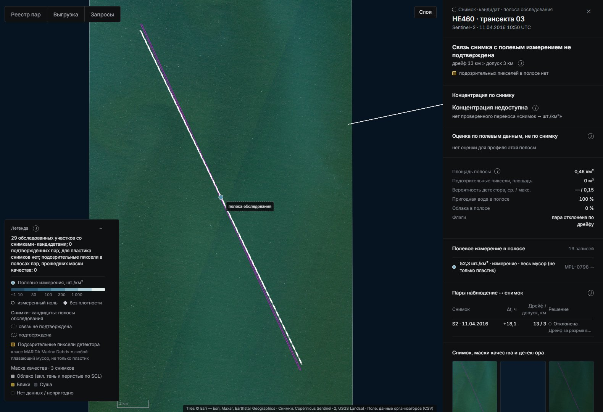

# Детектирование и оценка концентрации макропластика в морских акваториях

**Отчёт команды по кейсу КосмоХакатона 2026.** Разделы следуют критериям оценки: отраслевые О1–О6 и технические Т1–Т5. Все числа подставлены из `reports/final_numbers.json` (собирают `scripts/final_numbers.py` и `scripts/case/collect_search.py`); руками числа не пишутся. Отпечаток прогона — `278d93fb3390edeb`. Подробный рабочий отчёт — `reports/report.md`, запуск — `README.md`.

**Коротко.**

- Детектор скоплений плавающего мусора по Sentinel-2: F1 **0.871** на отложенном test MARIDA против RandomForest 0.771 и U-Net MARIDA 0.501.
- Концентрация шт./км² — по полевым данным: C = N/A с интервалом. Это главный количественный результат (Т3 допускает отдельную проверку на поле). S2: 53.9 [39.7–70.4] шт./км². На отложенном test модель не лучше медианы, поэтому на карте — медиана профиля.
- Связь «снимок → шт./км²» не подтверждена. Калибровочных пар 0: у событий CSV пар уровня A 0; в найденных нами данных ADIS — 66 пар по месту и времени, но на всех с предметами снимок ничего не показывает.

---

## О1. Корректность предметной постановки

**Целевая величина** — суммарный плавающий пластик, предметы > 2 см, шт./км², визуальная полоса 10 м с судна: профиль `S2_visual_GT2`, 63 события Саргассова моря. Второй профиль, только для полевой проверки, — трал 5–50 см в Тихом океане (83 события).

**Различение совокупностей.** «Весь мусор» (`all_litter`, Северное и Чёрное моря) пластиком не считается и используется только в экспериментах. Объектные строки — не плотности. Категории пластика не суммируются: пустое значение ≠ 0. Класс детектора Marine Debris MARIDA — любой плавающий мусор, не только пластик; маска подписана «вероятное скопление плавающего мусора».

**Отбор.** Из 935 строк реестра (318 событий) в профиль S2 входят 63. У каждого отказа записана причина: объектная строка — 337, категория пластика — 321, другой профиль — 83, весь мусор — 74, промысловый мусор — 41, аэросъёмка > 50 см — 16.

**Целевая совокупность = материал + размерный класс + единица** (что именно считает каждая ступень; `docs/LABELS.md`):

| Что считаем | Целевая совокупность | Материал | Размерный класс | Единица | Чем НЕ является | Где число |
|---|---|---|---|---|---|---|
| Поле CSV, профиль S2 (основной) | суммарный пластик (total_plastic) | пластик, все полимеры | > 2 см, визуально с судна (полоса) | шт./км², C = ΣN / ΣA | не общий мусор, не отдельная категория, не масса | case.sections.quantity.field_S2 / profiles.S2 |
| Поле CSV, профиль S1 (GPGP) | суммарный пластик (total_plastic) | пластик | 5–50 см, трал | шт./км² (N в источнике нет — медиана событий) | с S2 не смешивается (другой метод и размерный класс) | case.sections.quantity.profiles.S1 |
| Поле CSV, S3 (Сев. море) и S4 (Чёрное море) — только справка | общий мусор (all_litter) | все материалы — НЕ пластик | > 2 см (S3), > 2,5 см (S4), визуально | шт./км² | исключены из пластиковых профилей (configs/case_selection.yaml) | case.sections.quantity.profiles.S3 / S4 |
| ADIS (камера судна, The Ocean Cleanup) — полевой прогноз | все объекты детектора авторов в отрезке 10 км | по классам детектора авторов: hard plastic 79,1 %, fibrous 12,5 %, buoy 1,3 % + animal 6,3 % и plant 0,8 % (объекты в отрезках, n = 22 184) | > 10 см (основной), > 50 см (чувствительность) | шт./км², ΣN / ΣA по отрезкам | не чистый пластик: n_objects отрезка = все объекты, включая классы animal и plant (98,5 % отрезков) | case.sections.quantity.adis_forecast |
| Счётчик по фото — камера у воды (FML) | отдельные предметы одного класса «мусор» (garbage) | не определён (состав не размечен) | видимые на кадре 1920×1080; масштаба нет | шт. на кадр; шт./км² — только при известной площади воды в кадре | не шт./км² моря; не пластик отдельно | weights_exp/photo_count/model_card.json test_grouped (docs/PHOTO_COUNT.md) |
| Счётчик по фото — аэро/дрон, берег (Winans 2023) | отдельные предметы, все 8 классов в одном «предмет» | смесь: пластик по форме (буи, сети, лини) 36 %, неопознанное 50 %, дерево 7 %, шины 4 %, металл 2,5 % (доли рамок набора) | рамки ≳ 40 см по большей стороне (1 % < 36 см), GSD 2 см | шт. на 164 м² кадра берега (чип 12,8 × 12,8 м: песок + вода + растительность, не площадь пляжа) | не плавающий мусор (берег); не пластик; не шт./км² моря | weights_exp/photo_count/model_card_aerial.json test_spatial |
| Спутниковые зоны (Sentinel-2, наш детектор) | скопление плавающего материала (класс MARIDA Marine Debris против фона; пластик не подтверждён) | не определяется (суда, пена, блик, облака, берег, мелководье, ветер исключаются по флагам; водоросли и древесина не проверяются) | скопление, покрытие ≳ 25–30 % пикселя 10 м | м² маски на км² пригодной воды (доля покрытия); количество предметов по снимку не определено, шт./км² — только свёрнутый исследовательский сценарий по мишеням PLP | не измерение штук, не материал, не форма; перенос «снимок → шт.» не подтверждён (природных пар нет), сценарий — «если бы это были бутылки 1,5 л» | case.sections.scene_zones |

**Лестница единиц** — у каждой ступени своя проверка и метрика; перевода между ступенями без калибровки нет:

## О2. Достоверность количественных выводов

**Измерение ≠ оценка.** Измерение — C = N/A по трансекте с интервалом. Оценка по полевым данным — медиана профиля с подписью «не по снимку». Доля покрытия со снимка (м² маски на км² пригодной воды) — не мусор и не шт./км².

| Профиль (отложенный test) | n событий (дней рейса) | Модель | MAE, шт./км² | RMSE | MAE log1p | Покрытие 90 %-интервала | ΔMAE модель − медиана [95 % ДИ] |
|---|---:|---|---:|---:|---:|---:|---|
| S2 пластик > 2 см, визуально (основной) | 14 (5) | ridge_log | 30.0 | 41.5 | 0.849 | 71 % | 4.8 [-1.6; 12.9] |
| | | **медиана профиля (на карте)** | **25.2** | 32.3 | 0.595 | 93 % | основная модель не лучше медианы |
| S1 пластик 5–50 см, трал | 19 (5) | knn5_log | 370.0 | 522.5 | 0.605 | 89 % | -1.1 [-60.7; 49.2] |
| | | **медиана профиля (на карте)** | **371.1** | 502.4 | 0.599 | 100 % | разницы с медианой нет |

**Три числа Саргассова моря (профиль S2, пластик > 2 см) — не путать:** 53.9 шт./км² — среднее профиля ΣN/ΣA по всем событиям (измерение, 95 % с разбросом между днями [39.7–70.4]); 37.0 шт./км² — медиана события, её карта показывает как оценку для нового места; 25.2 шт./км² — средняя ошибка этой медианы на отложенном test.

- **Интервалы.** Для среднего профиля S2 даны два интервала:
  - только ошибка счёта (Пуассон) — [49.9–58.0];
  - с разбросом между днями рейса (кластерный бутстреп) — [39.7–70.4].

  Для одного нового места 95 % — 10.0–160 шт./км².
- **Полевой прогноз ADIS** (> 10 см, 20 836 отрезков):
  - ΣN/ΣA = 1.54 [1.52–1.56], нулевых отрезков 72 %;
  - ни один кандидат (B1, M1, M2) не прошёл правило на val в обеих схемах → медиана профиля остаётся;
  - на отложенных регионах у медианы MAE 1.27 шт./км².
- **Три уровня связи «снимок ↔ поле»:**

| Уровень связи | Сколько | Что это значит |
|---|---:|---|
| Пара по месту и времени (уровень A, ADIS) | **66** (детектор оценивается на 28) | пара по месту и времени (уровень A): снимок и полевой счёт совпадают по времени, месту и площади; не калибровочная пара |
| Видимый сигнал на снимке | **0** из 3 | видимый сигнал на снимке: в паре с предметами в поле и оцениваемым детектором есть срабатывания в полосе |
| Калибровочная пара «снимок → шт./км²» | **0** (нужно 4–12) | калибровочная пара «снимок → шт./км²»: пара по месту и времени с ненулевым сигналом снимка |

- **Почему нет калибровки.** Модель ln C = ln k + b · ln S требует пар с ненулевым сигналом снимка — их 0. Для множителя k в пределах ×/÷2 нужно 4–12 таких пар. Калибровка по ячейкам — калибровки по ячейкам нет: в одном периоде общих дат поле × спутник 0; климатологии разных лет ранжируют районы слабо (ρ ≈ география — удалённость от берега), правило принятия не пройдено. Авторы крупнейшего каталога мусорных полос пишут: «The current matching of satellite detections and field observations is limited to fake targets (artificial LWs), and reports of dense LW sightings» (Cózar et al. 2024, Nat Commun, раздел «A new scenario for research and management» (PMC11178853)).

## О3. Обоснованность зон загрязнения

**Зоны на отложенной сцене.** Сцена Sentinel-2 30SXE (11.03.2021) не участвовала ни в обучении, ни в подборе порога, ни в экспериментах. На ней 23 зон, из них 14 совпадают с нитями каталога Cózar 2024 (уровень B). Во всём слое 77 находок из 286 обработанных зон на 75 оцениваемых сценах:

| Статус зоны (четыре постановочных) | Подтверждение / причина | Число зон |
|---|---|---:|
| обнаружено | совпадает с разметкой Cózar 2024 (B) | 14 |
| обнаружено | независимой разметки нет (в т. ч. снимок из обучения детектора — 1) | 64 |
| недостаточно данных | признаки пены, блика, судна, берега, мелководья | 180 |
| недостаточно данных | ветер > 5 м/с: ноль не информативен | 0 |
| не обнаружено | детектор оценивается, объектов нет | 28 |

Что это у находки: плавающий материал (класс MARIDA Marine Debris; пластик не подтверждён). Количество: «Количество предметов по этому снимку не определено (перенос не подтверждён: нет природных пар; см. ISPRA 604)»; у находок статус концентрации — «исследовательская оценка» (сценарий по мишеням PLP, свёрнут; см. раздел «Как получаем шт./км² по снимку и насколько этому верить» в [README](../README.md)).

**Сложный фон.** На MARIDA test ложных срабатываний на саргассуме, мутной воде и воде со взвесью — 0; на судно и органику приходится 64 % всех ложных.

| Класс фона MARIDA (test) | Размечено пикселей | Ложных срабатываний основного детектора | Доля класса, % |
|---|---:|---:|---:|
| суда | 1 174 | 27 | 2.30 |
| природная органика | 49 | 21 | 42.86 |
| волны | 1 865 | 12 | 0.64 |
| смешанная вода | 92 | 6 | 6.52 |
| кильватерные следы | 1 570 | 5 | 0.32 |
| чистая вода | 23 443 | 2 | 0.01 |
| облака | 32 843 | 1 | 0.00 |
| пена | 387 | 1 | 0.26 |
| вода со взвесью | 93 037 | 0 | 0.00 |
| мутная вода | 32 226 | 0 | 0.00 |
| тени облаков | 3 649 | 0 | 0.00 |
| мелководье | 2 506 | 0 | 0.00 |
| саргассум разреженный | 881 | 0 | 0.00 |
| саргассум плотный | 760 | 0 | 0.00 |
| **всего** | | **75** | |

На новых размеченных данных L2A:

| Вариант детектора | Нити Cózar (≥ 1 пикс.) | Ложные на судах | Пена на снимках пар |
|---|---:|---:|---:|
| текущий (weights/lgbm) | 36 % | 26 % | 4/50 |
| + естественные B | 77–97 % | 74–91 % | 50/50 |
| + D судов | 27 % | 4 % | 0/50 |

Итог по дообучению: правило принятия (записано до экспериментов) не прошёл ни один из 13 вариантов с новыми данными (×3 seed) и контрольный r0 → остаётся weights/lgbm.

**Удача и ошибка на реальных снимках.** На снимках пар кейса текущий детектор дал 5 одиночных пикселей вне полос: 4 — пена или барашки, 1 — вероятно судно. Все они ложные, скоплений нет.

В парах ADIS при полевом нуле (25 пар с оцениваемым детектором) ложные срабатывания зависят от ветра:
- при ветре < 7 м/с — 0 пикселей на 9.5 км² полосы;
- при более сильном ветре — 0.16 объекта/км² в зоне (барашки).

**Предел видимости.** На 6 синхронных отрезках ADIS с единичными предметами детектор предметы не увидел: оценивается на 3 из 6, на всех 0 пикселей. Доля покрытия предметами ≈ 6.6·10⁻⁸. Это согласуется с физикой, но не задаёт общий предел для всех скоплений.

Независимая проверка (член команды, без наших результатов): 6 наглядных пар ADIS ↔ S2 по предметам > 50 см; снимок S2 в тот же день есть у 12 из 36 маршрутов; предметы на снимках не различимы. Выборки разные: там > 50 см, у нас > 5 см.

Чёрное море, трансекта T30 и снимок того же дня: полоса чистая, детектор объектов не дал; время и площадь трансекты не опубликованы — уровень C, не A.

Северное море, HE460 т.03: полоса чистая, но между съёмкой и трансектой вода ушла дальше допуска.

## О4. Польза вебкарты

**Первый экран — обзор Земли с реальными находками.** При открытии карта показывает точки зон из уже обработанных спутниковых сцен (накопленный архив, у точки — дата снимка и статус обработки), без выбора региона и даты. Путь эколога: **Земля → точка → карточка зоны → «В студию» → «Назад»** к прежнему масштабу → следующая точка. У каждого числа в карточке — его происхождение: «измерено в поле», «посчитано по детальному фото», «исследовательская оценка» или «нет данных»; для спутниковой зоны в графе шт./км² — «не определено по этому снимку», полевые шт./км² другого места за плотность зоны не выдаются. Полевая концентрация, счётчик по фото и метрики — во вторичной панели, в один клик от карты.

**Карта v2** (режим «Кейс» по умолчанию) показывает:

- **Слои:**
  - полевые измерения — шт./км² с интервалом, профилем, источником и признаком «пластик / весь мусор»;
  - полосы обследования со снимками-кандидатами — 29;
  - спутниковые находки — 77 из 286 обработанных зон;
  - маска качества снимка.
- **Статусы:** у каждой полосы и зоны два статуса — детекция и концентрация. Концентрация по снимку везде «не подтверждена» или «недоступна».
- **Навигация:** выбор акватории, дат, профиля и статуса; «Куда идти» — окно ближайшего пролёта.
- **Выгрузка и запросы:** выгрузка GeoJSON и CSV тех же полей; сохранённые запросы.

Версия модели (sha256) видна в легенде.

Самопроверка сравнивает по id алгоритм, JSON, CSV и GeoJSON:
- ok 268 из 284 проверок, расхождений 0;
- некорректные входы — 46 из 46 с верным кодом;
- p95 ответа ≤ 4 304 мс.

На демо-сцене выгрузка совпадает с картой: 23 зон на карте = 23 строк CSV = 23 объектов GeoJSON.

## О5. Аргументация и защита: метод, вклад, решения, ограничения

**Как искали данные.** Каждая находка получает уровень доказательности:
- **A** — снимок и полевое число связаны по времени, месту, площади и категории;
- **B** — подтверждённая разметка скопления;
- **C** — кандидат;
- **D** — отвергнутый или отрицательный пример.

Детектор учим только на B + D, «снимок → шт./км²» — только на A.

| Источник | Событий в CSV организаторов | Строк-кандидатов (событий проверено) | Сцен | A | C | D | Главные причины D |
|---|---:|---:|---:|---:|---:|---:|---|
| S1 Тихий океан, аэросъёмка 2016 | 181 | 10 (3) | 10 | **0** | 0 | 10 | датчик не видит предметы 10 |
| S2 Саргассово море, MSM41 | 63 | 63 (63) | 1 | **0** | 1 | 62 | снимка нет 62 |
| S3 Северное море, HE419/HE460 | 41 | 68 (20) | 34 | **0** | 0 | 68 | маршрут вне снимка 29; облака 21; пена/барашки 13 |
| S4 Чёрное море, DOORS 2024 | 33 | 33 (33) | 6 | **0** | 8 | 25 | снимка нет 21; блик 2; облака 2 |
| ADIS, The Ocean Cleanup — найден нами, не в CSV | 0 | 177 (177) | 40 | **66** | 3 | 108 | блик 63; облака 29; край снимка / покрытие 9 |

| Набор | Уровень | Объём | Лицензия | Текущий детектор без дообучения |
|---|---|---|---|---|
| PLP (Plastic Litter Project), искусственные мишени | B | 38 съёмок S2 | CC-BY-4.0 / не указана (зеркало MIT marinedebrisdetector) | мишени из пластика (доля ≥ 0.5): найдено 0.9 % пикселей |
| FloatingObjects + Refined, естественные скопления | B (+ D) | 27 съёмок, 25 регионов | Apache-2.0 / MIT | Refined B: 2.8 % пикселей; линии FO: 1.1 %; Refined D: 0.0 % |
| Cózar et al. 2024, нити плавучего материала | B | 14 374 окон, 4 435 съёмок, 94.46 км² | CC BY 4.0 | 85 из 234 случайных нитей на L2A (36 %: хотя бы один пиксель нити; ≥ 3 пикс. — 21 %, по пикселям 7 %); на другой выборке — 146 окнах 15 съёмок каталога — 94 |
| Суда у Финляндии (Zenodo 15019034) | D | 2 094 рамок, 18 съёмок, 12 631 пикс. корпусов | CC-BY-4.0 | ложные на 543 рамках (25.9 %) |
| Cloud Mask Catalogue (Zenodo 4172871) | D | 28 сцен, 420 000 пикс. облаков, 128 000 теней | CC-BY-4.0 | 4 пикс. облаков из 420 000 |

**Новые размеченные данные.** B: 65 съёмок PLP/FloatingObjects и 14 374 окон Cózar. D: 2 094 судов и 28 сцен облаков. Проверка утечек:
- с MARIDA по тайлу и дате — 0 совпадений;
- с MADOS по пикселям проверены PLP и FloatingObjects — 0 из 119.

**Ключевые решения** (каждое проверено экспериментом или записано до результата):
- допуск синхронности по дрейфу вместо «±1 сут» (29 пар по метаданным → 0 синхронных);
- сплит по участкам маршрута с буфером — нашли утечку через соседей того же дня;
- отложенный test открыт один раз по правилу, записанному до открытия;
- отказ от гармонизации L2A по MARIDA val;
- правило принятия нового детектора записано до экспериментов, его не прошёл ни один вариант;
- один источник чисел с тестом согласованности.

**Готовое, не наше:** разметка MARIDA и MADOS, протокол RandomForest MARIDA, веса U-Net MARIDA, индекс FDI, каталоги STAC.

**Ограничения.**
- Перенос «снимок → шт./км²» не доказан: для профилей пластика снимков нет, синхронных пар с сигналом снимка нет.
- Полевая модель — один рейс S2; интервалы на CV недопокрывают.
- Детектор на L2A по разметке проверен только на новых наборах B/D; он путает суда (26 % судов).
- Предметы > 2 см на пикселе 10 м не видны.

**Развитие.**
- Трансекты под пролёт Sentinel-2 с записанным временем: нужно 4–12 пар с сигналом.
- Снимки высокого разрешения над полосами.
- Больше рейсов и сезонов для полевой модели.
- Счётчик предметов на кадрах с известной площадью.

## О6. Дополнительные функции

- **«Подобрать снимок».** Правило дрейфа превращено в инструмент планирования: окно синхронизации |dt| ≤ 4.17 ч.
  - Для 12 событий Чёрного моря функция выдаёт окно UTC.
  - Прогноз пролётов совпал с реальной съёмкой в 82 из 88 случаев.
- **Счётчик предметов по фото** — отдельный модуль, не спутник. Отложенный test FML (1 190 кадров, сплит по сессиям):
  - MAE 0.59 шт./кадр [0.54–0.66], AP50 0.914;
  - сравнение с готовым DebrisScan на кадрах Winans (397 кадров): MAE 1.85 против 2.29 шт./кадр, разность [-0.64; -0.22] — наша модель заменяет бейзлайн DebrisScan, только если MAE ≤ 0,9 × MAE бейзлайна, ДИ разности < 0 и точность не хуже (правило записано до сравнения);
  - на кадрах с известной площадью (Winans, 164 м²) — MAE плотности 11 320 против 27 930 шт./км² у медианы.
- **Нефтяное пятно** — эксперимент, выключен по умолчанию. На MADOS test F1 0.733 против OSI 0.324. Известный разлив Wakashio на L2A голова не нашла — честный отказ.

## Т1. Подготовка и синхронизация данных

Отбор записей и сцен реализован в коде (`src/macroplastic/case/selection.py`, `scripts/case/find_pairs.py`, `pair_quality.py`), параметры — в `configs/case_selection.yaml` и `configs/case_pairs.yaml`. Реестр пар `data/case/run/registry_pairs.csv` содержит строку на каждое из 318 событий: статус, этап отказа, все причины, сцену, dt, сдвиг и допуск, решение по маскам. Повторная подготовка даёт те же sha256.

| Источник | Событий | S2 ±1 сут | Landsat ±1 сут | любая сцена ±1 | ±3 | ±5 сут |
|---|---:|---:|---:|---:|---:|---:|
| S1 Тихий океан, мусорное пятно (2015–2016) | 181 | 0 | 0 | 0 | 0 | 0 |
| S2 Саргассово море (04.2015) | 63 | 0 | 1 | 1 | 1 | 1 |
| S3 Северное море (2014, 2016) | 41 | 2 | 13 | 14 | 26 | 34 |
| S4 Чёрное море (06.2024) | 33 | 32 | 14 | 33 | 33 | 33 |
| **все** | 318 | 34 | 28 | 48 | 60 | 68 |

| Сценарий течения | м/с | Медиана сдвига за |dt|, км (p25–p75) | Проходят при допуске 3 км | 10 км | ½ длины трансекты |
|---|---:|---|---:|---:|---:|
| низкий | 0.05 | 5.9 (2.9–7.1) | 12 | 29 | 15 |
| **типичный (принят)** | 0.20 | 23.4 (11.4–28.4) | 0 | 1 | 2 |
| высокий | 0.50 | 58.5 (28.6–71.1) | 0 | 0 | 0 |

Маски качества в полосе: блик — 10, облака — 6, покрытие — 1. При типичном дрейфе синхронных пар 0.

## Т2. Алгоритм детектирования

Пиксельный LightGBM (48 признаков): 11 каналов Sentinel-2, индексы и статистики окна. Обучен на MARIDA train + MADOS, порог 0.63 выбран по val. Test MARIDA посчитан один раз: 15 сцен, 381 пиксель мусора. Неразмеченные пиксели фоном не считаются.

| Модель (test MARIDA) | F1 Marine Debris | 95 % ДИ | Точность | Полнота |
|---|---:|---|---:|---:|
| LightGBM (наш, основной) | 0.871 | [0.823–0.920] | 0.824 | 0.924 |
| RandomForest, протокол MARIDA | 0.771 | [0.709–0.834] | 0.707 | 0.848 |
| U-Net MARIDA, официальные веса, argmax | 0.501 | [0.362–0.683] | 0.392 | 0.696 |
| U-Net MARIDA, порог по val | 0.527 | [0.373–0.709] | 0.412 | 0.732 |
| окно FDI × NDVI | 0.042 | — | 0.022 | 0.580 |

| Детектор | Настройка (выбрана на val) | F1 val | Precision test | Recall test | **F1 test** | IoU test | 95 % ДИ F1 test (по сценам) | Помечено неразмеченных пикселей test, % |
|---|---|---|---|---|---|---|---|---|
| **LightGBM, MARIDA + MADOS (основной)** | `P(MD) >= 0.63` | 0.923 | 0.824 | 0.924 | **0.871** | 0.772 | 0.823–0.920 | 0.013 |
| RandomForest, протокол статьи MARIDA | `argmax of 11 classes (12-15 merged into Marine Water)` | 0.865 | 0.707 | 0.848 | **0.771** | 0.627 | 0.709–0.834 | 0.066 |
| RandomForest, порог P(MD) | `P(MD) >= 0.36` | 0.860 | 0.710 | 0.861 | **0.778** | 0.637 | 0.710–0.843 | 0.057 |
| окно FDI × NDVI (4 порога) | `FDI in [0.0234, 0.11202], NDVI in [-0.06544, inf]` | 0.415 | 0.022 | 0.580 | **0.042** | 0.022 | 0.017–0.312 | 1.774 |
| интервал FDI (2 порога) | `FDI in [0.03027, 0.05919]` | 0.323 | 0.013 | 0.457 | **0.025** | 0.013 | 0.011–0.092 | 1.838 |
| один порог FDI | `FDI <= 0.08186` | 0.020 | 0.003 | 0.971 | **0.006** | 0.003 | 0.003–0.012 | 94.943 |
| один порог NDVI | `NDVI >= 0.02161` | 0.168 | 0.012 | 0.247 | **0.024** | 0.012 | 0.007–0.078 | 6.458 |

Разница с RandomForest — 0.100 [0.049; 0.150] по парному бутстрепу сцен. Сохранённые предсказания 7 моделей (`data/case/detector_preds/`) позволяют пересчитать TP/FP/FN шагом `run_all eval`.

## Т3. Алгоритм оценки концентрации

Код `src/macroplastic/case/concentration.py`:
- C = N/A, интервал Гарвуда, агрегация ΣN/ΣA;
- контрольный пример 12 / 0.20 км² = 60.0 шт./км² [31.0–104.8];
- C = N/A совпала с опубликованной у 467 из 467 строк.

Метрики на отложенном test — MAE и RMSE против медианы на том же сплите (таблица в О2). Кросс-валидация внутри dev (S2):

| Модель | MAE, шт./км² | RMSE | медиана abs ошибки | MAE в log1p | ΔMAE к медиане [95 % ДИ] | ДИ с поправкой Бонферрони | Покрытие 90 %-интервала | Медианная ширина интервала |
|---|---:|---:|---:|---:|---|---|---:|---:|
| медиана train (бейзлайн) | 44.2 | 57.5 | 32.5 | 0.922 | — | — | 84 % | 174 |
| среднее train | 43.3 | 53.4 | 39.6 | 0.865 | −0.9 [−6.3; +5.2] | [−8.2; +7.2] | 89 % | 169 |
| геометрическое среднее | 39.7 | 54.1 | 28.5 | 0.821 | −4.5 [−7.7; −1.8] | [−9.0; −1.1] | 82 % | 166 |
| ΣN/ΣA (пуассоновская без признаков) | 43.3 | 53.3 | 39.9 | 0.864 | −0.9 [−6.6; +5.4] | [−8.7; +7.5] | 89 % | 168 |
| kNN-5 в log (соседи ±1 сут запрещены) | 28.8 | 38.1 | 18.2 | 0.593 | −15.4 [−26.2; −3.6] | [−30.6; +2.0] | 91 % | 102 |
| **ridge в log (широта, долгота, сезон, время суток) — основная** | 28.5 | 41.4 | 20.8 | 0.612 | −15.7 [−31.6; −0.3] | [−38.7; +7.3] | 84 % | 90 |
| пуассоновская GLM (вес A, offset log A) | 35.9 | 54.0 | 24.0 | 0.658 | −8.3 [−24.2; +12.7] | [−29.3; +24.5] | 89 % | 133 |
| Tweedie GLM (p = 1,5) | 31.3 | 45.3 | 20.5 | 0.619 | −12.9 [−29.1; +5.6] | [−33.9; +15.7] | 84 % | 101 |
| LightGBM в log (100 деревьев, 4 листа) | 30.9 | 41.7 | 25.3 | 0.645 | −13.3 [−24.4; −2.2] | [−28.0; +3.5] | 86 % | 172 |

Схемы разбиения (утечка через соседей того же дня найдена до моделей):

| Схема разбиения | Профиль | MAE медианы | MAE kNN-5 (log) | ΔMAE kNN − медиана [95 % ДИ] | Соседей kNN из того же или соседнего дня рейса |
|---|---|---:|---:|---|---:|
| по событиям | S2 | 33.0 | 26.3 | −6.7 [−15.1; +0.6] | 64 % |
| день × ячейка 1° | S2 | 33.1 | 24.8 | −8.2 [−19.8; +2.2] | 48 % |
| день рейса | S2 | 34.9 | 30.3 | −4.6 [−10.3; +1.4] | 42 % |
| связные компоненты ≤ 100 км и ≤ 2 сут | S2 | 37.2 | 25.6 | −11.6 [−23.1; −0.9] | 27 % |
| участки маршрута | S2 | 36.1 | 35.0 | −1.0 [−7.9; +7.1] | 9 % |
| **участки маршрута + буфер 1 сут (основная)** | S2 | 35.9 | 31.7 | −4.2 [−12.0; +3.4] | 0 % |
| по событиям | S1 | 406.3 | 323.4 | −82.8 [−142.5; −30.3] | 59 % |
| день × ячейка 1° | S1 | 402.6 | 333.4 | −69.2 [−129.6; −10.9] | 49 % |
| день рейса | S1 | 414.6 | 408.5 | −6.1 [−64.9; +55.1] | 29 % |
| связные компоненты ≤ 100 км и ≤ 2 сут | S1 | 450.0 | 425.3 | −24.7 [−88.1; +35.7] | 11 % |
| участки маршрута | S1 | 443.0 | 378.5 | −64.4 [−138.2; +13.4] | 8 % |
| **участки маршрута + буфер 1 сут (основная)** | S1 | 456.4 | 388.1 | −68.3 [−138.8; −1.0] | 0 % |

 Эталоны и предсказания лежат в `reports/case_conc/final_test_predictions.csv`. Индекс и площадь маски концентрацию не заменяют. Перенос на снимки не заявлен (О2, «три уровня»).

## Т4. Эксперименты и воспроизводимость

Сводка разделов чисел (каждый — со своим источником и протоколом):

| Раздел | Главные числа | Протокол | Источник |
|---|---|---|---|
| 1. Детектор на MARIDA test | LightGBM F1 0.871 [0.823–0.920], RF 0.771, FDI × NDVI 0.042; 15 сцен | официальный test MARIDA, один раз после заморозки; порог и настройки бейзлайнов — только по val; класс Marine Debris против остальных размеченных классов, неразмеченные не считаются фоном; ДИ — бутстреп по сценам | `reports/case_detector/metrics.json` |
| 2. Полевая dev-проверка | S2 (44 события): ridge_log MAE 28.5 против медианы 44.2, ΔMAE [−31.6; −0.3]; S1 (58): knn5_log 434.0 против 527.4 | кросс-валидация внутри dev по 5 участкам маршрута с буфером 1 сут (route_buf1); протокол и правило выбора записаны до CV; ДИ разности MAE — бутстреп по дням рейса | `reports/case_conc/dev_cv.json, configs/case_conc_model.yaml` |
| 3. Полевой отложенный test | S2 (14): ridge_log 30.0 против медианы 25.2, ΔMAE [−1.6; +12.9] — основная модель не лучше медианы; S1 (19): knn5_log 370.0 против медианы 371.1, ΔMAE [−60.7; +49.2] — разницы с медианой нет | отложенный участок маршрута (+ буфер 1 сут), состав зафиксирован до моделей (sha256 в configs/case_selection.yaml), посчитан один раз; основная модель против медианы dev на тех же событиях; ДИ — бутстреп по дням рейса test. Ограничение: ранняя разведка бейзлайнов видела все события профиля | `reports/case_conc/final_test.json, reports/case_conc/final_test_predictions.csv` |
| 4. Эксперимент на снимках | 11 пар S2 (6 групп), весь мусор, не пластик: FDI ρ -0.75, p Холма 0.12, случайная вода сцены -0.52 — связь не установлена | пары, прошедшие маски качества; эталон — полевая плотность всего мусора (all_litter), не пластика; ранговая связь Спирмена, бутстреп по группам «район × день», поправка Холма, нулевая модель — случайная вода той же сцены | `reports/case_pairs/experiment.json` |
| 5. Детектор на снимках пар (L2A), текущий режим | 5 объектов на 22 вырезках, в полосах обследования 0; гармонизация выключена (выбор по MARIDA val) | текущий режим детектора на вырезках Sentinel-2 L2A пар: LightGBM weights/lgbm, порог P ≥ 0.63, harmonize = 'none'; объекты — 8-связные компоненты на пригодной воде без объектов у облаков; «в полосе» — пересечение с растровой полосой обследования | `reports/case_pairs/detector_current.json (из data/pairs/quality/*/meta.json)` |
| 6. Прежний режим с гармонизацией (до решения об отказе от неё, docs/DECISIONS.md) — основание для отказа | 975 объектов, в полосах 6; без HE460 t03 ложные типы (блик, облака) 55.0 %; визуально «вероятное скопление» ≈ 1.7 % | 22 вырезки Sentinel-2 L2A пар; объекты пересобраны как в pair_quality.py; типы назначены правилами (grid.artifacts, край облака, мелкое облако по B11, блик по B11, берег), без ручной разметки; визуальная разметка — ИИ-агент, один аннотатор, по вырезкам, не полевая | `reports/case_pairs/detector_review.json (разбор: reports/case_pairs/detector_review.md)`, `reports/case_pairs/visual_review.json` |
| 7. Розыск снимков | события CSV: A 0, C 9; все строки-кандидаты вместе с ADIS: A 66 / C 12 / D 273 | розыск снимков под события CSV организаторов и под отрезки ADIS; уровень доказательности A–D у каждой строки; стоп-правило: нет A или убедительного C за пилот — поиск по дрейфу не расширяем; дрейф — область поиска, не доказательство | `reports/search/{s1,s2,s3,s4}_candidates.csv, reports/search/adis_candidates.csv, docs/img/funnel.json` |
| 8. Пары ADIS ↔ Sentinel-2 | A 66 (≈ 52 проходов), с предметами 6 — пикселей детектора 0 при 3.5–4.4 шт./км² | отрезки ADIS 10 км (камера судна, счёт >5/>10/>50 см, площадь обследования) × Sentinel-2 L2A; A = |dt| и дрейф в допуске, пиксели полосы годны по маскам качества, площадь и размерные классы из ADIS; детектор weights/lgbm без гармонизации, те же маски и код, что у пар CSV (pair_quality.process_s2); TP/FP по пикселям не утверждаются: пара A даёт только «на снимке N срабатываний при полевых M шт./км²» | `reports/search/adis_candidates.csv (копия data/search/adis/candidates.csv), reports/search/adis.md` |
| 9. Новые размеченные данные B/D | B: 65 съёмок PLP/FloatingObjects + 14 374 окон Cózar; D: 2 094 судов, 28 сцен облаков; с MARIDA по тайлу и дате совпадений 0, с MADOS по пикселям проверены только PLP/FO | B — подтверждённая разметка скопления (без числа предметов), D — проверенный отрицательный пример; пиксели — S2 L2A той же съёмки (тот же ридер, что у live-сцен); утечка = та же съёмка (тайл+дата) или те же пиксели (LBP) с MARIDA/MADOS/нашими сценами; текущий детектор weights/lgbm без дообучения, порог с MARIDA val | `reports/extra_data/registry.csv, registry_negatives.csv, registry_cozar2024.csv.gz, content_overlap.csv, current_detector_zero_shot.csv, fp_current_detector.json` |
| 10. Детектор v2 (дообучение на B + D) | вариантов 13 × 3 seed, принято 0; в сервисе weights/lgbm | проверка зафиксирована до экспериментов (sha256 в experiments.json): MARIDA val + 3-fold по снимкам для новых B/D; 3 seed; правило принятия записано заранее (ΔF1 val ≥ max(0.01, 2σ) и не хуже на D/B); test MARIDA не читался; порог каждой модели — по val | `reports/detector_v2/experiments_snapshot.json (снимок experiments.json), reports/detector_v2/decision.json (решение команды), configs/detector_v2_eval.yaml` |
| 11. Бейзлайн U-Net MARIDA | test F1 0.501; LightGBM лучше на 0.370 [0.215; 0.481] | официальные веса U-Net MARIDA (Kikaki et al. 2022, эпоха 44), код и предобработка авторов, не переобучали; та же функция оценки, что у LightGBM (detector_compare.evaluate); порог U-Net — только по val; test MARIDA посчитан один раз; ДИ и парная разность — бутстреп по сценам | `reports/detector_v2/unet_test.json, unet_baseline.json` |
| 12. Количество: поле и доля покрытия раздельно | калибровки нет (пар A с ненулевым сигналом 0); для k в ×/÷2 нужно 4–12 пар с сигналом | раздельно: полевая плотность C = N/A (шт./км², интервал Пуассона) и спутниковая доля покрытия подозрительного материала (м² маски на км² пригодной воды, как LWD у Cózar et al. 2024); доля покрытия ≠ мусор и ≠ шт./км²; связь между ними — только калибровка на парах A, которой нет; перевод площади в штуки не показывается | `reports/quantity/{field,calibration,coverage_live,coverage_pairs,scenario,adis_field}.json, docs/QUANTITY.md` |
| 13. Нефтяное пятно (эксперимент, выключен) | MADOS test F1 0.733 против OSI 0.324; контроль Wakashio на L2A не пройден | MADOS класс Oil Spill, сплит по сценам заморожен до обучения (без съёмок MARIDA val/test); отдельная голова LightGBM, основной детектор не тронут; выбор только по val, test открыт один раз; бейзлайн — порог OSI = (B3+B4)/B2; положительный контроль на S2 L2A — разлив Wakashio 2020; единица — площадь, км², не объём и не масса | `reports/oil/{val_runs,test,control}.json, configs/oil_eval.yaml, docs/OIL.md` |

- Одна команда: `run.ps1 -Case all -Offline` — 7.5 с без сети; 24 выходных таблиц с одинаковыми sha256 при повторе.
- Чистый клон с GitHub до карты — 7,5 мин на CPU, числа совпали (`reports/selfcheck/clean_clone_1941.md`).
- Составы всех выборок — `reports/case_splits/` (17 файлов): отложенный test, фолды по участкам маршрута, группы и сцены.
- Тесты проверяют:
  - непересечение групп, дней рейса и сцен;
  - отсутствие полей-утечек в признаках;
  - однократность test.
- Тесты кейса: 255 passed, 2 skipped, 0 failed.
- Команды пересчёта каждой метрики, в том числе чисел расследования данных, — README §7.

## Т5. Интеграция прототипа

Сервис FastAPI (`service/`, `/api/v3/*`, контракт `docs/CONTRACTS_V3.md`) и карта v2 проходят сценарий постановки: выбор акватории и даты → расчёт и статусы → зоны на карте → выгрузка → повтор сохранённого запроса.
- Числа, единицы, геометрия и статусы сверяются самопроверкой (О4).
- Пустые и некорректные входы дают понятную ошибку с кодом.
- При сбое API карта пишет «данные недоступны» и не подставляет моки.
- Эксперт повторяет расчёт без правки кода: `scripts/case/expert_check.py` (запись поля, полоса, свои N и A).

## Источники и лицензии

| Что | Лицензия / условия |
|---|---|
| MARIDA (Zenodo 5151941), MADOS (Zenodo 10664073) | CC BY 4.0 |
| ADIS, The Ocean Cleanup (4TU) | CC BY 4.0 |
| Каталог нитей Cózar et al. 2024 (Zenodo 11045944) | CC BY 4.0 |
| PLP (Zenodo 3752719); FloatingObjects / Refined | CC BY 4.0 / Apache-2.0 / MIT |
| Суда у Финляндии (Zenodo 15019034), Cloud Mask Catalogue (Zenodo 4172871) | CC BY 4.0 |
| FML (SEANOE 10.17882/106148), Winans 2023 (Zenodo 8381113) | CC BY |
| The Ocean Cleanup River Monitoring | CC BY-NC 4.0 — только исследовательское использование |
| DebrisScan | Apache-2.0 |
| Sentinel-2 / Landsat (Copernicus, USGS), ERA5 через Open-Meteo, подложка Esri | открытые условия, атрибуция на карте |
