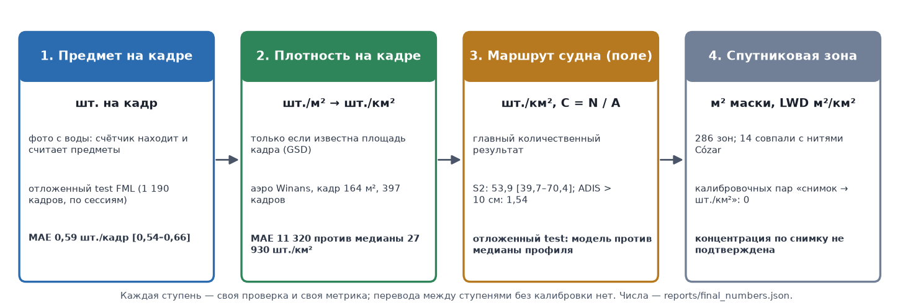
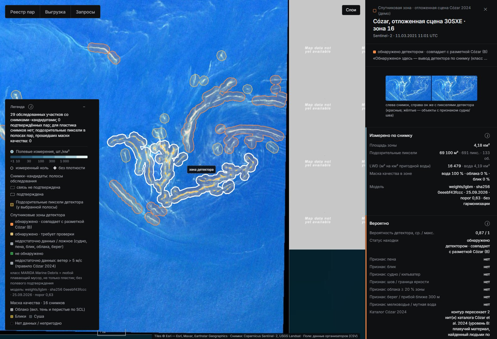
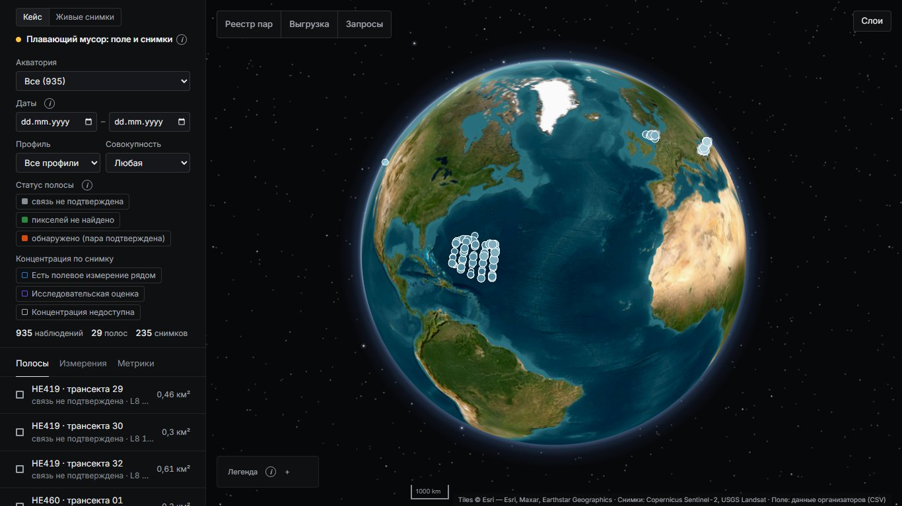

# Детектирование и оценка концентрации макропластика в морских акваториях

**Отчёт команды по кейсу КосмоХакатона 2026.** Разделы следуют критериям оценки: отраслевые О1–О6 и технические Т1–Т5. Все числа подставлены из `reports/final_numbers.json` (собирают `scripts/final_numbers.py` и `scripts/case/collect_search.py`); руками числа не пишутся. Отпечаток прогона — `3db680b6661e86d3`. Подробный рабочий отчёт — `reports/report.md`, запуск — `README.md`.

**Коротко.**

- Детектор скоплений плавающего мусора по Sentinel-2: F1 **0.871** на отложенном test MARIDA против RandomForest 0.771 и U-Net MARIDA 0.501.
- Концентрация шт./км² — по полевым данным: C = N/A с интервалом. Это главный количественный результат (Т3 допускает отдельную проверку на поле). S2: 53.9 [39.7–70.4] шт./км². На отложенном test модель не лучше медианы, поэтому на карте — медиана профиля.
- Связь «снимок → шт./км²» не подтверждена. Калибровочных пар 0: у событий CSV пар уровня A 0; в найденных нами данных ADIS — 66 пар по месту и времени, но на всех с предметами снимок ничего не показывает.

---

## О1. Корректность предметной постановки

**Целевая величина** — суммарный плавающий пластик, предметы > 2 см, шт./км², визуальная полоса 10 м с судна: профиль `S2_visual_GT2`, 63 события Саргассова моря. Второй профиль, только для полевой проверки, — трал 5–50 см в Тихом океане (83 события).

**Различение совокупностей.** «Весь мусор» (`all_litter`, Северное и Чёрное моря) пластиком не считается и используется только в экспериментах. Объектные строки — не плотности. Категории пластика не суммируются: пустое значение ≠ 0. Класс детектора Marine Debris MARIDA — любой плавающий мусор, не только пластик; маска подписана «вероятное скопление плавающего мусора».

**Отбор.** Из 935 строк реестра (318 событий) в профиль S2 входят 63. У каждого отказа записана причина: объектная строка — 337, категория пластика — 321, другой профиль — 83, весь мусор — 74, промысловый мусор — 41, аэросъёмка > 50 см — 16.

**Лестница единиц** — у каждой ступени своя проверка и метрика; перевода между ступенями без калибровки нет:

## О2. Достоверность количественных выводов

**Измерение ≠ оценка.** Измерение — C = N/A по трансекте с интервалом. Оценка по полевым данным — медиана профиля с подписью «не по снимку». Доля покрытия со снимка (м² маски на км² пригодной воды) — не мусор и не шт./км².

| Профиль (отложенный test) | n событий (дней рейса) | Модель | MAE, шт./км² | RMSE | MAE log1p | Покрытие 90 %-интервала | ΔMAE модель − медиана [95 % ДИ] |
|---|---:|---|---:|---:|---:|---:|---|
| S2 пластик > 2 см, визуально (основной) | 14 (5) | ridge_log | 30.0 | 41.5 | 0.849 | 71 % | 4.8 [-1.6; 12.9] |
| | | **медиана профиля (на карте)** | **25.2** | 32.3 | 0.595 | 93 % | основная модель не лучше медианы |
| S1 пластик 5–50 см, трал | 19 (5) | knn5_log | 370.0 | 522.5 | 0.605 | 89 % | -1.1 [-60.7; 49.2] |
| | | **медиана профиля (на карте)** | **371.1** | 502.4 | 0.599 | 100 % | разницы с медианой нет |

- **Интервалы.** Для среднего профиля S2 даны два интервала:
  - только ошибка счёта (Пуассон) — [49.9–58.0];
  - с разбросом между днями рейса (кластерный бутстреп) — [39.7–70.4].

  Для одного нового места 95 % — 10.2–157 шт./км².
- **Полевой прогноз ADIS** (> 10 см, 20 836 отрезков):
  - ΣN/ΣA = 1.54 [1.52–1.56], нулевых отрезков 72 %;
  - ни один кандидат (B1, M1, M2) не прошёл правило на val в обеих схемах → медиана профиля остаётся;
  - на отложенных регионах у медианы MAE 1.27 шт./км².
- **Три уровня связи «снимок ↔ поле»:**

| Уровень связи | Сколько | Что это значит |
|---|---:|---|
| Пара по месту и времени (уровень A, ADIS) | **66** (детектор оценивается на 28) | пара по месту и времени (уровень A): снимок и полевой счёт совпадают по времени, месту и площади; не калибровочная пара |
| Видимый сигнал на снимке | **0** из 3 | видимый сигнал на снимке: в паре с предметами в поле и оцениваемым детектором есть срабатывания в полосе |
| Калибровочная пара «снимок → шт./км²» | **0** (нужно 4–12) | калибровочная пара «снимок → шт./км²»: пара по месту и времени с ненулевым сигналом снимка |

- **Почему нет калибровки.** Модель ln C = ln k + b · ln S требует пар с ненулевым сигналом снимка — их 0. Для множителя k в пределах ×/÷2 нужно 4–12 таких пар. Калибровка по ячейкам — калибровки по ячейкам нет: в одном периоде общих дат поле × спутник 0; климатологии разных лет ранжируют районы слабо (ρ ≈ география — удалённость от берега), правило принятия не пройдено. Авторы крупнейшего каталога мусорных полос пишут: «The current matching of satellite detections and field observations is limited to fake targets (artificial LWs), and reports of dense LW sightings» (Cózar et al. 2024, Nat Commun, раздел «A new scenario for research and management» (PMC11178853)).

## О3. Обоснованность зон загрязнения

**Зоны на отложенной сцене.** Сцена Sentinel-2 30SXE (11.03.2021) не участвовала ни в обучении, ни в подборе порога, ни в экспериментах. На ней 23 зон, из них 14 совпадают с нитями каталога Cózar 2024 (уровень B). Во всём слое 286 зон на 75 оцениваемых сценах:

| Статус зоны | Число зон |
|---|---:|
| обнаружено с подтверждением B | 14 |
| срабатывание, не проверено | 64 |
| недостаточно данных (пена, блик, судно, берег, мелководье) | 180 |
| не обнаружено | 28 |
| ноль не информативен (ветер > 5 м/с) | 0 |

Главный статус концентрации у любой зоны — «концентрация по снимку не подтверждена».

**Сложный фон.** На MARIDA test ложных срабатываний на саргассуме, мутной воде и воде со взвесью — 0; на судно и органику приходится 64 % всех ложных.

| Класс фона MARIDA (test) | Размечено пикселей | Ложных срабатываний основного детектора | Доля класса, % |
|---|---:|---:|---:|
| суда | 1 174 | 27 | 2.30 |
| природная органика | 49 | 21 | 42.86 |
| волны | 1 865 | 12 | 0.64 |
| смешанная вода | 92 | 6 | 6.52 |
| кильватерные следы | 1 570 | 5 | 0.32 |
| чистая вода | 23 443 | 2 | 0.01 |
| облака | 32 843 | 1 | 0.00 |
| пена | 387 | 1 | 0.26 |
| вода со взвесью | 93 037 | 0 | 0.00 |
| мутная вода | 32 226 | 0 | 0.00 |
| тени облаков | 3 649 | 0 | 0.00 |
| мелководье | 2 506 | 0 | 0.00 |
| саргассум разреженный | 881 | 0 | 0.00 |
| саргассум плотный | 760 | 0 | 0.00 |
| **всего** | | **75** | |

На новых размеченных данных L2A:

| Вариант детектора | Нити Cózar (≥ 1 пикс.) | Ложные на судах | Пена на снимках пар |
|---|---:|---:|---:|
| текущий (weights/lgbm) | 36 % | 26 % | 4/50 |
| + естественные B | 77–97 % | 74–91 % | 50/50 |
| + D судов | 27 % | 4 % | 0/50 |

Итог по дообучению: правило принятия (записано до экспериментов) не прошёл ни один из 13 вариантов с новыми данными (×3 seed) и контрольный r0 → остаётся weights/lgbm.

**Удача и ошибка на реальных снимках.** На снимках пар кейса текущий детектор дал 5 одиночных пикселей вне полос: 4 — пена или барашки, 1 — вероятно судно. Все они ложные, скоплений нет.

В парах ADIS при полевом нуле (25 пар с оцениваемым детектором) ложные срабатывания зависят от ветра:
- при ветре < 7 м/с — 0 пикселей на 9.5 км² полосы;
- при более сильном ветре — 0.16 объекта/км² в зоне (барашки).

**Предел видимости.** На 6 синхронных отрезках ADIS с единичными предметами детектор предметы не увидел: оценивается на 3 из 6, на всех 0 пикселей. Доля покрытия предметами ≈ 6.6·10⁻⁸. Это согласуется с физикой, но не задаёт общий предел для всех скоплений.

## О4. Польза вебкарты

**Карта v2** (режим «Кейс» по умолчанию) показывает:

- **Слои:**
  - полевые измерения — шт./км² с интервалом, профилем, источником и признаком «пластик / весь мусор»;
  - полосы обследования со снимками-кандидатами — 29;
  - спутниковые зоны — 286;
  - маска качества снимка.
- **Статусы:** у каждой полосы и зоны два статуса — детекция и концентрация. Концентрация по снимку везде «не подтверждена» или «недоступна».
- **Навигация:** выбор акватории, дат, профиля и статуса; «Куда идти» — окно ближайшего пролёта.
- **Выгрузка и запросы:** выгрузка GeoJSON и CSV тех же полей; сохранённые запросы.

Версия модели (sha256) видна в легенде.

Самопроверка сравнивает по id алгоритм, JSON, CSV и GeoJSON:
- ok 284 из 284 проверок, расхождений 0;
- некорректные входы — 46 из 46 с верным кодом;
- p95 ответа ≤ 104 мс.

На демо-сцене выгрузка совпадает с картой: 23 зон на карте = 23 строк CSV = 23 объектов GeoJSON.

## О5. Аргументация и защита: метод, вклад, решения, ограничения

**Как искали данные.** Каждая находка получает уровень доказательности:
- **A** — снимок и полевое число связаны по времени, месту, площади и категории;
- **B** — подтверждённая разметка скопления;
- **C** — кандидат;
- **D** — отвергнутый или отрицательный пример.

Детектор учим только на B + D, «снимок → шт./км²» — только на A.

| Источник | Событий в CSV организаторов | Строк-кандидатов (событий проверено) | Сцен | A | C | D | Главные причины D |
|---|---:|---:|---:|---:|---:|---:|---|
| S1 Тихий океан, аэросъёмка 2016 | 181 | 10 (3) | 10 | **0** | 0 | 10 | датчик не видит предметы 10 |
| S2 Саргассово море, MSM41 | 63 | 63 (63) | 1 | **0** | 1 | 62 | снимка нет 62 |
| S3 Северное море, HE419/HE460 | 41 | 68 (20) | 34 | **0** | 0 | 68 | маршрут вне снимка 29; облака 21; пена/барашки 13 |
| S4 Чёрное море, DOORS 2024 | 33 | 33 (33) | 6 | **0** | 8 | 25 | снимка нет 21; блик 2; облака 2 |
| ADIS, The Ocean Cleanup — найден нами, не в CSV | 0 | 177 (177) | 40 | **66** | 3 | 108 | блик 63; облака 29; край снимка / покрытие 9 |

**Новые размеченные данные.** B: 65 съёмок PLP/FloatingObjects и 14 374 окон Cózar. D: 2 094 судов и 28 сцен облаков. Проверка утечек:
- с MARIDA по тайлу и дате — 0 совпадений;
- с MADOS по пикселям проверены PLP и FloatingObjects — 0 из 119.

**Ключевые решения** (каждое проверено экспериментом или записано до результата):
- допуск синхронности по дрейфу вместо «±1 сут» (29 пар по метаданным → 0 синхронных);
- сплит по участкам маршрута с буфером — нашли утечку через соседей того же дня;
- отложенный test открыт один раз по правилу, записанному до открытия;
- отказ от гармонизации L2A по MARIDA val;
- правило принятия нового детектора записано до экспериментов, его не прошёл ни один вариант;
- один источник чисел с тестом согласованности.

**Готовое, не наше:** разметка MARIDA и MADOS, протокол RandomForest MARIDA, веса U-Net MARIDA, индекс FDI, каталоги STAC.

**Ограничения.**
- Перенос «снимок → шт./км²» не доказан: для профилей пластика снимков нет, синхронных пар с сигналом снимка нет.
- Полевая модель — один рейс S2; интервалы на CV недопокрывают.
- Детектор на L2A по разметке проверен только на новых наборах B/D; он путает суда (26 % судов).
- Предметы > 2 см на пикселе 10 м не видны.

**Развитие.**
- Трансекты под пролёт Sentinel-2 с записанным временем: нужно 4–12 пар с сигналом.
- Снимки высокого разрешения над полосами.
- Больше рейсов и сезонов для полевой модели.
- Счётчик предметов на кадрах с известной площадью.

## О6. Дополнительные функции

- **«Подобрать снимок».** Правило дрейфа превращено в инструмент планирования: окно синхронизации |dt| ≤ 4.17 ч.
  - Для 12 событий Чёрного моря функция выдаёт окно UTC.
  - Прогноз пролётов совпал с реальной съёмкой в 82 из 88 случаев.
- **Счётчик предметов по фото** — отдельный модуль, не спутник. Отложенный test FML (1 190 кадров, сплит по сессиям):
  - MAE 0.59 шт./кадр [0.54–0.66], AP50 0.914;
  - на кадрах с известной площадью (Winans, 164 м²) — MAE плотности 11 320 против 27 930 шт./км² у медианы.
- **Нефтяное пятно** — эксперимент, выключен по умолчанию. На MADOS test F1 0.733 против OSI 0.324. Известный разлив Wakashio на L2A голова не нашла — честный отказ.

## Т1. Подготовка и синхронизация данных

Отбор записей и сцен реализован в коде (`src/macroplastic/case/selection.py`, `scripts/case/find_pairs.py`, `pair_quality.py`), параметры — в `configs/case_selection.yaml` и `configs/case_pairs.yaml`. Реестр пар `data/case/run/registry_pairs.csv` содержит строку на каждое из 318 событий: статус, этап отказа, все причины, сцену, dt, сдвиг и допуск, решение по маскам. Повторная подготовка даёт те же sha256.

| Источник | Событий | S2 ±1 сут | Landsat ±1 сут | любая сцена ±1 | ±3 | ±5 сут |
|---|---:|---:|---:|---:|---:|---:|
| S1 Тихий океан, мусорное пятно (2015–2016) | 181 | 0 | 0 | 0 | 0 | 0 |
| S2 Саргассово море (04.2015) | 63 | 0 | 1 | 1 | 1 | 1 |
| S3 Северное море (2014, 2016) | 41 | 2 | 13 | 14 | 26 | 34 |
| S4 Чёрное море (06.2024) | 33 | 32 | 14 | 33 | 33 | 33 |
| **все** | 318 | 34 | 28 | 48 | 60 | 68 |

Маски качества в полосе: блик — 10, облака — 6, покрытие — 1. При типичном дрейфе синхронных пар 0.

## Т2. Алгоритм детектирования

Пиксельный LightGBM (48 признаков): 11 каналов Sentinel-2, индексы и статистики окна. Обучен на MARIDA train + MADOS, порог 0.63 выбран по val. Test MARIDA посчитан один раз: 15 сцен, 381 пиксель мусора. Неразмеченные пиксели фоном не считаются.

| Модель (test MARIDA) | F1 Marine Debris | 95 % ДИ | Точность | Полнота |
|---|---:|---|---:|---:|
| LightGBM (наш, основной) | 0.871 | [0.823–0.920] | 0.824 | 0.924 |
| RandomForest, протокол MARIDA | 0.771 | [0.709–0.834] | 0.707 | 0.848 |
| U-Net MARIDA, официальные веса, argmax | 0.501 | [0.362–0.683] | 0.392 | 0.696 |
| U-Net MARIDA, порог по val | 0.527 | [0.373–0.709] | 0.412 | 0.732 |
| окно FDI × NDVI | 0.042 | — | 0.022 | 0.580 |

| Детектор | Настройка (выбрана на val) | F1 val | Precision test | Recall test | **F1 test** | IoU test | 95 % ДИ F1 test (по сценам) | Помечено неразмеченных пикселей test, % |
|---|---|---|---|---|---|---|---|---|
| **LightGBM, MARIDA + MADOS (основной)** | `P(MD) >= 0.63` | 0.923 | 0.824 | 0.924 | **0.871** | 0.772 | 0.823–0.920 | 0.013 |
| RandomForest, протокол статьи MARIDA | `argmax of 11 classes (12-15 merged into Marine Water)` | 0.865 | 0.707 | 0.848 | **0.771** | 0.627 | 0.709–0.834 | 0.066 |
| RandomForest, порог P(MD) | `P(MD) >= 0.36` | 0.860 | 0.710 | 0.861 | **0.778** | 0.637 | 0.710–0.843 | 0.057 |
| окно FDI × NDVI (4 порога) | `FDI in [0.0234, 0.11202], NDVI in [-0.06544, inf]` | 0.415 | 0.022 | 0.580 | **0.042** | 0.022 | 0.017–0.312 | 1.774 |
| интервал FDI (2 порога) | `FDI in [0.03027, 0.05919]` | 0.323 | 0.013 | 0.457 | **0.025** | 0.013 | 0.011–0.092 | 1.838 |
| один порог FDI | `FDI <= 0.08186` | 0.020 | 0.003 | 0.971 | **0.006** | 0.003 | 0.003–0.012 | 94.943 |
| один порог NDVI | `NDVI >= 0.02161` | 0.168 | 0.012 | 0.247 | **0.024** | 0.012 | 0.007–0.078 | 6.458 |

Разница с RandomForest — 0.100 [0.049; 0.150] по парному бутстрепу сцен. Сохранённые предсказания 7 моделей (`data/case/detector_preds/`) позволяют пересчитать TP/FP/FN шагом `run_all eval`.

## Т3. Алгоритм оценки концентрации

Код `src/macroplastic/case/concentration.py`:
- C = N/A, интервал Гарвуда, агрегация ΣN/ΣA;
- контрольный пример 12 / 0.20 км² = 60.0 шт./км² [31.0–104.8];
- C = N/A совпала с опубликованной у 467 из 467 строк.

Метрики на отложенном test — MAE и RMSE против медианы на том же сплите (таблица в О2). Эталоны и предсказания лежат в `reports/case_conc/final_test_predictions.csv`. Индекс и площадь маски концентрацию не заменяют. Перенос на снимки не заявлен (О2, «три уровня»).

## Т4. Эксперименты и воспроизводимость

- Одна команда: `run.ps1 -Case all -Offline` — 11.5 с без сети; 24 выходных таблиц с одинаковыми sha256 при повторе.
- Чистый клон с GitHub до карты — 7,5 мин на CPU, числа совпали (`reports/selfcheck/clean_clone_1941.md`).
- Составы всех выборок — `reports/case_splits/` (17 файлов): отложенный test, фолды по участкам маршрута, группы и сцены.
- Тесты проверяют:
  - непересечение групп, дней рейса и сцен;
  - отсутствие полей-утечек в признаках;
  - однократность test.
- Тесты кейса: 255 passed, 2 skipped, 0 failed.
- Команды пересчёта каждой метрики, в том числе чисел расследования данных, — README §7.

## Т5. Интеграция прототипа

Сервис FastAPI (`service/`, `/api/v3/*`, контракт `docs/CONTRACTS_V3.md`) и карта v2 проходят сценарий постановки: выбор акватории и даты → расчёт и статусы → зоны на карте → выгрузка → повтор сохранённого запроса.
- Числа, единицы, геометрия и статусы сверяются самопроверкой (О4).
- Пустые и некорректные входы дают понятную ошибку с кодом.
- При сбое API карта пишет «данные недоступны» и не подставляет моки.
- Эксперт повторяет расчёт без правки кода: `scripts/case/expert_check.py` (запись поля, полоса, свои N и A).

## Источники и лицензии

| Что | Лицензия / условия |
|---|---|
| MARIDA (Zenodo 5151941), MADOS (Zenodo 10664073) | CC BY 4.0 |
| ADIS, The Ocean Cleanup (4TU) | CC BY 4.0 |
| Каталог нитей Cózar et al. 2024 (Zenodo 11045944) | CC BY 4.0 |
| PLP (Zenodo 3752719); FloatingObjects / Refined | CC BY 4.0 / Apache-2.0 / MIT |
| Суда у Финляндии (Zenodo 15019034), Cloud Mask Catalogue (Zenodo 4172871) | CC BY 4.0 |
| FML (SEANOE 10.17882/106148), Winans 2023 (Zenodo 8381113) | CC BY |
| The Ocean Cleanup River Monitoring | CC BY-NC 4.0 — только исследовательское использование |
| DebrisScan | Apache-2.0 |
| Sentinel-2 / Landsat (Copernicus, USGS), ERA5 через Open-Meteo, подложка Esri | открытые условия, атрибуция на карте |
