# Детектирование и оценка концентрации макропластика в морских акваториях

**Научный отчёт команды по кейсу «Макропластик», КосмоХакатон 2026.** Команда: Кашин Глеб, Закон Марк, Панин Матвей, Ожигов Егор, Ведерников Фёдор.

Каждое число отчёта подставлено из `reports/final_numbers.json`, руками числа не пишутся. Файл собирают `scripts/final_numbers.py` и `scripts/case/collect_search.py`, у каждого раздела чисел указаны источник и протокол. Несколько чисел из журналов экспериментов приведены с путём к файлу, где они записаны. Отпечаток прогона маршрута — `278d93fb3390edeb`. Графики строит `scripts/case/report_figs.py`, PDF собирает `scripts/case/report_export.py`. Запуск описан в `README.md`, рабочий отчёт с полной хронологией — `reports/report.md`.

## Краткий проверяемый итог

| Что утверждаем | Число | Выборка и протокол | Как проверить |
|---|---|---|---|
| Детектор скоплений плавающего материала по Sentinel-2 лучше бейзлайнов | F1 **0.871** [0.823–0.920]; RandomForest 0.771, U-Net MARIDA 0.501, FDI × NDVI 0.042 | отложенный test MARIDA: 15 сцен, 381 пиксель мусора; посчитан один раз | `run_all.py eval` → `reports/case_run/detector_recomputed.json` |
| Концентрация шт./км² считается по полю: C = N/A с интервалом | S2 (пластик > 2 см): ΣN/ΣA = **53.9** шт./км², 95 % [39.7–70.4] | 63 события, 697 предметов на 12.94 км²; бутстреп по дням рейса | `expert_check.py --n 697 --area 12.94`, `field_interval_check.py` |
| Модель по полевым данным на отложенном test не лучше медианы, поэтому карта показывает медиану | S2: 30.0 против 25.2 шт./км² (MAE) | 14 событий, участок маршрута с буфером 1 сут; правило записано до открытия test | `reports/case_conc/final_test_predictions.csv` |
| Шт./км² по снимку не определяются | калибровочных пар **0**, нужно 4–12 | 66 пар ADIS по месту и времени; на всех синхронных отрезках с предметами детектор дал 0 пикселей | `collect_search.py` → `reports/search/search_numbers.json` |
| Пары с разрывом до 48 ч и сдвигом полевого учёта дрейфом не помогли | порог ≤ 50 м прошли **0 из 8** пар ISPRA | лучшие пары из 167 трансект ISPRA; OpenDrift, две гипотезы часового пояса | `docs/research/pairs/drift_shift_48h.csv` |
| Отдельные предметы на пикселе 10 м не различимы физически | ≥ 2×2 пикселя при 10 м занимают 0 % из 22 642 предметов ADIS; при 0,3 м — 25 % | размеры предметов судовой камеры ADIS | `docs/research/marine_quantity/results/resolution_physics.json` |

Разделение по типу знания. **Подтверждено измерением:** метрики детектора на размеченном test, полевые C = N/A и их интервалы, отрицательные результаты связи «снимок ↔ поле». **Сценарий:** перевод площади маски в штуки по мишеням PLP. Он свёрнут в карточке, подписан «исследовательская оценка» и не является результатом. **Синтетика:** синтетический перенос P3 проверен и отвергнут (раздел 9). **Неудавшийся поиск:** пары для профилей пластика (S1, S2) не найдены. Снимка над полосами нет.

**Где в отчёте каждый критерий.** О1 — разделы 1–3. О2 — 7, 8, 15. О3 — 6, 11. О4 — 12. О5 — 8.5, 9, 16, 18. О6 — 12.4, 13, 14. Т1 — 3, 4. Т2 — 5, 6. Т3 — 7. Т4 — 10, 17. Т5 — 12.3.

---

## 1. Постановка: пользователь, целевая величина, размерный профиль, единицы

**Пользователь** — специалист по экологическому мониторингу. Он выбирает акваторию и дату, находит вероятные зоны скопления и сравнивает их с полевыми измерениями. Ему нужно видеть качество и неопределённость каждого числа и выгружать результат.

**Целевая величина** — суммарный плавающий пластик, предметы > 2 см, шт./км². Учёт визуальный, полоса 10 м с борта судна. Это профиль `S2_visual_GT2 / total_plastic`: 63 события Саргассова моря. Контрольный пример постановки «12 предметов на 0,20 км²» совпадает именно с этим профилем. Второй профиль нужен только для полевой проверки: трал 5–50 см в Тихом океане, 83 события. Профили не смешиваются: у них разные метод, размерный класс и площадь.

**Совокупности не путаем.**
- Весь мусор (`all_litter`, Северное и Чёрное моря) — не пластик.
- Объектная строка — не плотность.
- Категория пластика — не сумма пластика. Пустое значение ≠ 0.
- Класс детектора Marine Debris (MARIDA) — любой плавающий мусор, не только пластик. Поэтому маска подписана «вероятное скопление плавающего материала».

**Формулы и единицы.**

| Величина | Формула | Единица | Контроль |
|---|---|---|---|
| Полевая концентрация | `C = N / A` | шт./км² | 12 / 0.20 км² = 60.0 шт./км² |
| Интервал счёта (Гарвуд, точный пуассоновский) | `C_lo = χ²(0,025; 2N) / (2A)`, `C_hi = χ²(0,975; 2N+2) / (2A)` | шт./км² | [31.0–104.8] для того же примера |
| Средняя по профилю | `C̄ = ΣN_i / ΣA_i` | шт./км² | совпала с опубликованной у 467 из 467 строк |
| Ошибка прогноза | `MAE = (1/n) · Σ abs(Ĉ_i − C_i)` | шт./км² | бейзлайн — медиана обучающих событий на том же сплите |
| Доля покрытия по снимку | `S = A_маски / A_пригодной воды` | м²/км² (как LWD у Cózar 2024) | это не шт./км² и не масса |
| Калибровка «снимок → шт./км²» (если бы были пары) | `ln C = ln k + b · ln S` | — | пар с ненулевым S — 0 |

**Целевая совокупность = материал + размерный класс + единица.** Таблица показывает, что считает каждая ступень (`docs/LABELS.md`):

| Что считаем | Целевая совокупность | Материал | Размерный класс | Единица | Чем НЕ является | Где число |
|---|---|---|---|---|---|---|
| Поле CSV, профиль S2 (основной) | суммарный пластик (total_plastic) | пластик, все полимеры | > 2 см, визуально с судна (полоса) | шт./км², C = ΣN / ΣA | не общий мусор, не отдельная категория, не масса | case.sections.quantity.field_S2 / profiles.S2 |
| Поле CSV, профиль S1 (GPGP) | суммарный пластик (total_plastic) | пластик | 5–50 см, трал | шт./км² (N в источнике нет — медиана событий) | с S2 не смешивается (другой метод и размерный класс) | case.sections.quantity.profiles.S1 |
| Поле CSV, S3 (Сев. море) и S4 (Чёрное море) — только справка | общий мусор (all_litter) | все материалы — НЕ пластик | > 2 см (S3), > 2,5 см (S4), визуально | шт./км² | исключены из пластиковых профилей (configs/case_selection.yaml) | case.sections.quantity.profiles.S3 / S4 |
| ADIS (камера судна, The Ocean Cleanup) — полевой прогноз | все объекты детектора авторов в отрезке 10 км | по классам детектора авторов: hard plastic 79,1 %, fibrous 12,5 %, buoy 1,3 % + animal 6,3 % и plant 0,8 % (объекты в отрезках, n = 22 184) | > 10 см (основной), > 50 см (чувствительность) | шт./км², ΣN / ΣA по отрезкам | не чистый пластик: n_objects отрезка = все объекты, включая классы animal и plant (98,5 % отрезков) | case.sections.quantity.adis_forecast |
| Счётчик по фото — камера у воды (FML) | отдельные предметы одного класса «мусор» (garbage) | не определён (состав не размечен) | видимые на кадре 1920×1080; масштаба нет | шт. на кадр; шт./км² — только при известной площади воды в кадре | не шт./км² моря; не пластик отдельно | weights_exp/photo_count/model_card.json test_grouped (docs/PHOTO_COUNT.md) |
| Счётчик по фото — аэро/дрон, берег (Winans 2023) | отдельные предметы, все 8 классов в одном «предмет» | смесь: пластик по форме (буи, сети, лини) 36 %, неопознанное 50 %, дерево 7 %, шины 4 %, металл 2,5 % (доли рамок набора) | рамки ≳ 40 см по большей стороне (1 % < 36 см), GSD 2 см | шт. на 164 м² кадра берега (чип 12,8 × 12,8 м: песок + вода + растительность, не площадь пляжа) | не плавающий мусор (берег); не пластик; не шт./км² моря | weights_exp/photo_count/model_card_aerial.json test_spatial |
| Спутниковые зоны (Sentinel-2, наш детектор) | скопление плавающего материала (класс MARIDA Marine Debris против фона; пластик не подтверждён) | не определяется (суда, пена, блик, облака, берег, мелководье, ветер исключаются по флагам; водоросли и древесина не проверяются) | скопление, покрытие ≳ 25–30 % пикселя 10 м | м² маски на км² пригодной воды (доля покрытия); количество предметов по снимку не определено, шт./км² — только свёрнутый исследовательский сценарий по мишеням PLP | не измерение штук, не материал, не форма; перенос «снимок → шт.» не подтверждён (природных пар нет), сценарий — «если бы это были бутылки 1,5 л» | case.sections.scene_zones |

Лестница единиц. У каждой ступени своя проверка и своя метрика. Без калибровки перейти с одной ступени на другую нельзя:

## 2. Данные и происхождение каждого набора

### 2.1 Реестр организаторов

`task/macroplastic_marine_samples.csv`: **935 строк, 318 событий** (`event_id`), 56 полей. Числа прочитаны из самого файла и совпадают с `case.csv`.

| Код | Источник | Район | Период | Строк | Событий | Лицензия, DOI |
|---|---|---|---|---:|---:|---|
| S1 | Lebreton et al. 2018, Sci Rep 8:4666 | Тихий океан, мусорное пятно | 2015-07-25 – 2016-10-06 | 350 | 181 | CC BY 4.0, 10.6084/m9.figshare.5873142 |
| S2 | Gutow et al. 2021 (cruise MSM41), PANGAEA | Саргассово море | 2015-04-01 – 2015-04-26 | 330 | 63 | CC BY 4.0, 10.1594/PANGAEA.931833 |
| S3 | Gutow et al. 2018, Mar Pollut Bull 131:763-772 | Северное море | 2014-04-03 – 2016-04-10 | 222 | 41 | CC BY 3.0, 10.1594/PANGAEA.890782 |
| S4 | Floating marine macro litter, DOORS cruise 3 (2024), Zenodo | Чёрное море | 2024-06-02 – 2024-06-18 | 33 | 33 | CC BY 4.0, 10.5281/zenodo.15129753 |

Состав строк по охвату: суммарный пластик — 162, категория пластика — 321, объектные строки — 337, весь мусор — 74, промысловый мусор — 41.

### 2.2 Внешние наборы: роль, уровень доказательности, лицензия

Уровни: **A** — снимок и независимое полевое число совпадают по времени, месту, площади и категории. **B** — подтверждённая разметка скопления без числа предметов. **C** — кандидат. **D** — отвергнутый или отрицательный пример. Детектор учится только на B + D. Перевод «снимок → шт./км²» допустим только на A.

| Набор | Что даёт | Уровень | Объём у нас | Роль в работе | Лицензия |
|---|---|---|---|---|---|
| MARIDA (Kikaki et al. 2022) | пиксельная разметка 15 классов, Sentinel-2 | B + D | train + val + test; test — 15 сцен | обучение, порог (val), итоговая оценка (test, один раз) | CC BY 4.0 |
| MADOS | разметка мусора и нефти | B + D | 118 сцен, 2536 пикселей мусора; исключено 16 сцен, совпадающих с val MARIDA | обучение (+ голова нефти, эксперимент) | CC BY 4.0 |
| Cózar et al. 2024, каталог нитей | нити плавучего материала по снимкам | B | 14 374 окон | проверка полноты на L2A, подтверждение зон демо-сцены | CC BY 4.0 |
| PLP (Plastic Litter Project) | искусственные мишени известного состава | B | 65 съёмок PLP и FloatingObjects вместе | мост «доля покрытия ↔ срабатывание»; сценарий PLP | CC BY 4.0 |
| FloatingObjects + Refined | естественные скопления | B (+ D) | в тех же 65 съёмках | дообучение детектора v2 (не принято) | Apache-2.0 / MIT |
| ADIS, The Ocean Cleanup (4TU) | судовая камера: отрезки 10 км со временем GPS, площадью и счётом по размерам | A (по месту и времени) | 21 444 отрезков; 177 проверено со снимком; 66 пар A | проверка «видит ли снимок предметы», полевой прогноз | CC BY 4.0 |
| ISPRA (итальянский мониторинг MSFD) | трансекты с координатами предметов | A 1, C 39, D 127 | 167 трансект | пара по месту и дню; дрейф ±48 ч | условия портала ISPRA; лицензия в файлах не указана |
| Суда у Финляндии (Zenodo 15019034) | рамки судов | D | 2 094 рамок | ложные срабатывания на судах | CC BY 4.0 |
| Cloud Mask Catalogue (Zenodo 4172871) | облака и тени | D | 28 сцен | ложные на облаках | CC BY 4.0 |
| FML (SEANOE) | фото с надводного аппарата, рамки предметов | — (кадр без площади) | 1 190 кадров test | счётчик по фото, шт. на кадр | CC BY 4.0 |
| Winans 2023 (Zenodo 8381113) | аэрофото берега с известной площадью кадра | — | 397 кадров test | шт./м² кадра, сравнение с DebrisScan | CC BY |
| Sentinel-2 L2A (Earth Search, Planetary Computer), Landsat C2 L2 | снимки | — | 1 774 строк-кандидатов | пары, живые сцены, демо | Copernicus / USGS, открыто |
| ERA5 через Open-Meteo, HYCOM ESPC, NCEP GFS | ветер и течения | — | — | маски ветра, дрейф | открытые условия |
| Natural Earth 1:10m | береговая линия | — | — | расстояние до берега | общественное достояние |

Полный реестр пар с классами A, A*, B, C и D — `docs/research/pairs/PAIRS.csv`, 442 строк.

## 3. Подготовка и причины исключений

Отбор записей написан в коде (`src/macroplastic/case/selection.py`), параметры лежат в `configs/case_selection.yaml`. Причина каждого отказа записана в `data/case/run/registry_*.csv`. Из 935 строк в профиль S2 входят 63 строк: одна строка на событие.

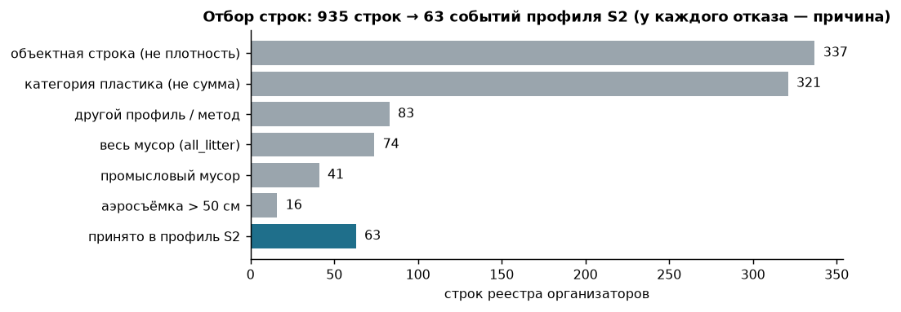

| Наблюдение в данных | Решение |
|---|---|
| 337 строк — отдельные предметы, а не плотность по площади | исключены из расчёта C: у них нет площади |
| 321 строк — отдельная категория пластика | не суммируются в «весь пластик»: у разных событий разные наборы категорий, пусто ≠ 0 |
| 74 строк — весь мусор (Северное, Чёрное моря) | пластиком не считаются; используются только в эксперименте «снимок ↔ поле» |
| 16 строк — аэросъёмка > 50 см | другой размерный класс; в пары S1 |
| В 13 полях лежит ответ или его производное (`concentration_*`, `items_count`, `reported_*`, `parent_*`) | в признаки не входят; `assert_no_leak()` и тест `test_no_leak_features` |
| Дата без времени у 64 событий | окно синхронизации расширено на ±12 ч, такие пары не считаются синхронными |

## 4. Временное и географическое согласование

Пара «событие ↔ снимок» — это пересечение полосы обследования (линия start–end с шириной полосы) со сценой. Одной центральной точки мало. Снимок в окне ±1 сут ещё не делает пару синхронной: за это время вода с мусором сдвигается.

**Правило дрейфа.** Сдвиг `d = v · abs(Δt)`. Пара синхронна, если `d ≤ w/2 + 3 км`, где w — ширина полосы. Сценарии течения — 0,05, 0,2 и 0,5 м/с. Принят типичный сценарий 0,2 м/с. Отсюда окно синхронности `abs(Δt) ≤ 4.17 ч`.

| Источник | Событий | S2 ±1 сут | Landsat ±1 сут | любая сцена ±1 | ±3 | ±5 сут |
|---|---:|---:|---:|---:|---:|---:|
| S1 Тихий океан, мусорное пятно (2015–2016) | 181 | 0 | 0 | 0 | 0 | 0 |
| S2 Саргассово море (04.2015) | 63 | 0 | 1 | 1 | 1 | 1 |
| S3 Северное море (2014, 2016) | 41 | 2 | 13 | 14 | 26 | 34 |
| S4 Чёрное море (06.2024) | 33 | 32 | 14 | 33 | 33 | 33 |
| **все** | 318 | 34 | 28 | 48 | 60 | 68 |

| Сценарий течения | м/с | Медиана сдвига за |dt|, км (p25–p75) | Проходят при допуске 3 км | 10 км | ½ длины трансекты |
|---|---:|---|---:|---:|---:|
| низкий | 0.05 | 5.9 (2.9–7.1) | 12 | 29 | 15 |
| **типичный (принят)** | 0.20 | 23.4 (11.4–28.4) | 0 | 1 | 2 |
| высокий | 0.50 | 58.5 (28.6–71.1) | 0 | 0 | 0 |

Воронка: 318 событий → 29 прошли отбор по метаданным → 12 прошли маски качества в полосе → **0 синхронных** при типичном дрейфе. Причины отказа по маскам: блик — 10, облака — 6, покрытие — 1. Для профилей пластика снимков нет вообще: у S1 (181 событие) сцен нет, у S2 есть один снимок Landsat. Sentinel-2A начал съёмку после рейса. Реестр `data/case/run/registry_pairs.csv` содержит строку на каждое из 318 событий: статус, этап отказа, причины, сцену, Δt, сдвиг и допуск.

## 5. Базовые решения (бейзлайны) на тех же выборках

| Задача | Бейзлайн | Результат бейзлайна | Наше решение | Результат | Выборка |
|---|---|---|---|---:|---|
| Детектор | одно правило FDI × NDVI (идея Biermann 2020), пороги по val | F1 0.042 | LightGBM | **0.871** | test MARIDA |
| Детектор | RandomForest по протоколу статьи MARIDA | F1 0.771 | LightGBM | **0.871** | test MARIDA |
| Детектор | U-Net MARIDA, веса авторов, без переобучения | F1 0.501 | LightGBM | **0.871** | test MARIDA |
| Концентрация, S2 | медиана обучающих событий | MAE 25.2 | ridge_log | 30.0 | отложенный test, 14 событий |
| Концентрация, S1 | медиана | MAE 371.1 | knn5_log | 370.0 | отложенный test, 19 событий |
| Полевой прогноз ADIS (> 10 см) | медиана профиля | MAE 1.27 | B1, M1, M2 | не прошли правило | отложенные регионы |
| Счётчик по фото (Winans) | DebrisScan, готовая модель | MAE 2.29 шт./кадр | Faster R-CNN | 1.85 | 397 кадров |

Вывод. Детектор уверенно лучше всех бейзлайнов. Разность с RandomForest — 0.100 [0.049; 0.150]. Для концентрации медиана не уступила ни одной модели. Поэтому на карте стоит медиана, и это решение записано до открытия test.

## 6. Детектор и сложный фон

### 6.1 Метод

Пиксельный LightGBM, 48 признаков: 19 базовых (11 каналов Sentinel-2 и спектральные индексы FDI, NDVI, FAI и др.) и 29 оконных (среднее, разброс и аномалия к медиане окна 3/7/15/31 пикселей). Обучение — MARIDA train + MADOS: 362 941 пикселей, из них 4 479 мусора. Порог 0.63 подобран только по val. Задача бинарная: класс Marine Debris против остальных размеченных классов. Неразмеченные пиксели фоном не считаются. Каналы 20 м переводятся в 10 м ближайшим соседом, без искусственной детализации.

Зона — это кластер срабатываний на пригодной воде (дилатация 150 м, ≥ 5 пикселей). Пригодность пикселя (облако, тень, блик, суша, нет данных) проверяется отдельно от класса.

### 6.2 Качество на отложенном test

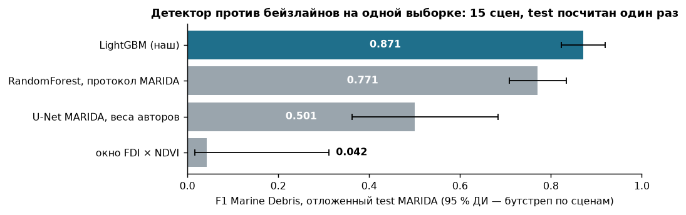

| Модель (test MARIDA) | F1 Marine Debris | 95 % ДИ | Точность | Полнота |
|---|---:|---|---:|---:|
| LightGBM (наш, основной) | 0.871 | [0.823–0.920] | 0.824 | 0.924 |
| RandomForest, протокол MARIDA | 0.771 | [0.709–0.834] | 0.707 | 0.848 |
| U-Net MARIDA, официальные веса, argmax | 0.501 | [0.362–0.683] | 0.392 | 0.696 |
| U-Net MARIDA, порог по val | 0.527 | [0.373–0.709] | 0.412 | 0.732 |
| окно FDI × NDVI | 0.042 | — | 0.022 | 0.580 |

Честность метрики проверена отдельно. Независимый пересчёт совпал с метрикой модели. Оптимизм выбора порога на val — 0.006. ДИ по сценам val — [0.877; 0.970]. На новом регионе (leave-region-out, 4 региона) F1 0.854 против 0.923 на знакомых. Для нового места честная оценка ниже на 0.069.

### 6.3 Сложный фон: суда, пена, водоросли, мутность, блик

На test MARIDA ложных срабатываний на саргассуме, мутной воде и воде со взвесью — 0. На суда и природную органику приходится 64 % всех ложных.

| Класс фона MARIDA (test) | Размечено пикселей | Ложных срабатываний основного детектора | Доля класса, % |
|---|---:|---:|---:|
| суда | 1 174 | 27 | 2.30 |
| природная органика | 49 | 21 | 42.86 |
| волны | 1 865 | 12 | 0.64 |
| смешанная вода | 92 | 6 | 6.52 |
| кильватерные следы | 1 570 | 5 | 0.32 |
| чистая вода | 23 443 | 2 | 0.01 |
| облака | 32 843 | 1 | 0.00 |
| пена | 387 | 1 | 0.26 |
| вода со взвесью | 93 037 | 0 | 0.00 |
| мутная вода | 32 226 | 0 | 0.00 |
| тени облаков | 3 649 | 0 | 0.00 |
| мелководье | 2 506 | 0 | 0.00 |
| саргассум разреженный | 881 | 0 | 0.00 |
| саргассум плотный | 760 | 0 | 0.00 |
| **всего** | | **75** | |

На новых размеченных данных L2A доля найденного считается по объектам. Нить или судно засчитаны, если хотя бы один пиксель P ≥ порога:

| Вариант детектора | Нити Cózar | Ложные на судах | Пена на снимках пар |
|---|---:|---:|---:|
| текущий (weights/lgbm) | 36 % | 26 % | 4/50 |
| + естественные B | 77–97 % | 74–91 % | 50/50 |
| + D судов | 27 % | 4 % | 0/50 |

Наблюдение → решение. На спектрах Sentinel-2 естественные нити, пена и суда разделяются плохо. Выигрыш на одном фоне оплачивается ошибками на другом. Итог по дообучению: правило принятия (записано до экспериментов) не прошёл ни один из 13 вариантов с новыми данными (×3 seed) и контрольный r0 → остаётся weights/lgbm. В карточке зоны признаки судна, пены, блика, берега и мелководья переводят зону в статус «недостаточно данных».

### 6.4 Органика: детектор бинарный, флаг NDVI/FAI — эксперимент

У рабочего детектора один выход: «Marine Debris / нет». Саргассум и прочая природная органика в обучении были фоном. **Отдельного класса «органика» у модели нет**, и интерфейс так и пишет. Поверх детектора мы проверили спектральный флаг «вероятно органика». Правило записано до расчёта: `NDVI ≥ 0,20 и FAI > 0 (медианы по пикселям детекции зоны)`, где `NDVI = (B8 − B4)/(B8 + B4)` и `FAI = B8 − [B4 + (B11 − B4)·(833 − 665)/(1614 − 665)]`. Проверка — MARIDA val (официальный), test не читался, 328 патчей.

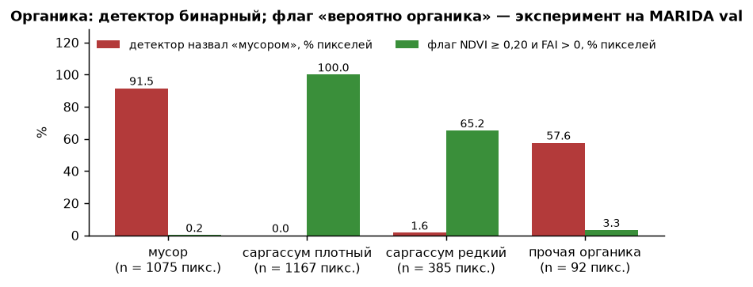

| Класс MARIDA (val) | Пикселей | Детектор назвал мусором | Объектов с флагом | 95 % (Уилсон) |
|---|---:|---:|---:|---|
| мусор | 1075 | 984 | 1 / 418 | [0.000; 0.013] |
| саргассум плотный | 1167 | 0 | 16 / 16 | [0.806; 1.000] |
| саргассум редкий | 385 | 6 | 42 / 60 | [0.575; 0.801] |
| прочая органика | 92 | 53 | 0 / 46 | [0.000; 0.077] |

Наблюдение → решение.
- Флаг почти не задевает мусор и надёжно отмечает саргассум.
- Но саргассум детектор и так не путает с мусором. Путает он прочую органику (древесину, растительные остатки): 53 из 92 пикселей. Её флаг **не ловит**: у неё NDVI ниже 0,2, как у мусора.
- Флаг оставлен подсказкой «похоже на водоросли» с подписью «эксперимент». Статус зоны он не меняет. В сервисе флаг стоит у 2 из 255 зон на 83 сценах.
- Test на флаг не открывали. Сцен мало (саргассум — 3 сцены val), поэтому доли ориентировочные.

## 7. Концентрация шт./км²: расчёт N/A и интервалы

### 7.1 Расчёт

Код — `src/macroplastic/case/concentration.py`. Для события `C = N/A`, интервал Гарвуда (раздел 1). Для профиля считается `ΣN/ΣA`. Разброс между днями рейса (сверхпуассоновский) оценивается кластерным бутстрепом: дни рейса выбираются с возвращением, 2 000 повторов, `C* = ΣN*/ΣA*`, 2,5-й и 97,5-й перцентили. Разложение разброса ln C в S2: общий SD 0.84, из них пуассоновский 0.43 (27 %). Остальное — реальная пятнистость поля.

### 7.2 Отложенный test и интервалы

| Профиль (отложенный test) | n событий (дней рейса) | Модель | MAE, шт./км² | RMSE | MAE log1p | Покрытие 90 %-интервала | ΔMAE модель − медиана [95 % ДИ] |
|---|---:|---|---:|---:|---:|---:|---|
| S2 пластик > 2 см, визуально (основной) | 14 (5) | ridge_log | 30.0 | 41.5 | 0.849 | 71 % | 4.8 [-1.6; 12.9] |
| | | **медиана профиля (на карте)** | **25.2** | 32.3 | 0.595 | 93 % | основная модель не лучше медианы |
| S1 пластик 5–50 см, трал | 19 (5) | knn5_log | 370.0 | 522.5 | 0.605 | 89 % | -1.1 [-60.7; 49.2] |
| | | **медиана профиля (на карте)** | **371.1** | 502.4 | 0.599 | 100 % | разницы с медианой нет |

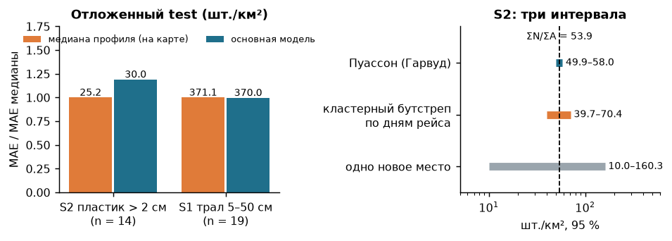

Три числа Саргассова моря (профиль S2, пластик > 2 см) не путать:
- 53.9 шт./км² — среднее профиля ΣN/ΣA по всем событиям. Это измерение.
- 37.0 шт./км² — медиана события. Карта показывает её как оценку для нового места.
- 25.2 шт./км² — средняя ошибка этой медианы на отложенном test.

Интервалы для среднего S2:
- только ошибка счёта (Пуассон) — [49.9–58.0];
- с разбросом между днями рейса — [39.7–70.4], в 3.8 раза шире;
- для одного нового места — 10.0–160.3 шт./км², покрытие на test 92.9 %.

Наблюдение → решение. Пуассоновский интервал не накрывает среднее test (46.0), бутстреп по дням накрывает. Поэтому на карте показан интервал с разбросом между днями.

### 7.3 Модели на dev и утечка маршрута

Кросс-валидация внутри dev (S2), 5 участков маршрута с буфером 1 сут. Кандидаты и правило записаны до CV (`configs/case_conc_model.yaml`):

| Модель | MAE, шт./км² | RMSE | медиана abs ошибки | MAE в log1p | ΔMAE к медиане [95 % ДИ] | ДИ с поправкой Бонферрони | Покрытие 90 %-интервала | Медианная ширина интервала |
|---|---:|---:|---:|---:|---|---|---:|---:|
| медиана train (бейзлайн) | 44.2 | 57.5 | 32.5 | 0.922 | — | — | 84 % | 174 |
| среднее train | 43.3 | 53.4 | 39.6 | 0.865 | −0.9 [−6.3; +5.2] | [−8.2; +7.2] | 89 % | 169 |
| геометрическое среднее | 39.7 | 54.1 | 28.5 | 0.821 | −4.5 [−7.7; −1.8] | [−9.0; −1.1] | 82 % | 166 |
| ΣN/ΣA (пуассоновская без признаков) | 43.3 | 53.3 | 39.9 | 0.864 | −0.9 [−6.6; +5.4] | [−8.7; +7.5] | 89 % | 168 |
| kNN-5 в log (соседи ±1 сут запрещены) | 28.8 | 38.1 | 18.2 | 0.593 | −15.4 [−26.2; −3.6] | [−30.6; +2.0] | 91 % | 102 |
| **ridge в log (широта, долгота, сезон, время суток) — основная** | 28.5 | 41.4 | 20.8 | 0.612 | −15.7 [−31.6; −0.3] | [−38.7; +7.3] | 84 % | 90 |
| пуассоновская GLM (вес A, offset log A) | 35.9 | 54.0 | 24.0 | 0.658 | −8.3 [−24.2; +12.7] | [−29.3; +24.5] | 89 % | 133 |
| Tweedie GLM (p = 1,5) | 31.3 | 45.3 | 20.5 | 0.619 | −12.9 [−29.1; +5.6] | [−33.9; +15.7] | 84 % | 101 |
| LightGBM в log (100 деревьев, 4 листа) | 30.9 | 41.7 | 25.3 | 0.645 | −13.3 [−24.4; −2.2] | [−28.0; +3.5] | 86 % | 172 |

Схемы разбиения. Утечку через соседей того же дня нашли до выбора моделей:

| Схема разбиения | Профиль | MAE медианы | MAE kNN-5 (log) | ΔMAE kNN − медиана [95 % ДИ] | Соседей kNN из того же или соседнего дня рейса |
|---|---|---:|---:|---|---:|
| по событиям | S2 | 33.0 | 26.3 | −6.7 [−15.1; +0.6] | 64 % |
| день × ячейка 1° | S2 | 33.1 | 24.8 | −8.2 [−19.8; +2.2] | 48 % |
| день рейса | S2 | 34.9 | 30.3 | −4.6 [−10.3; +1.4] | 42 % |
| связные компоненты ≤ 100 км и ≤ 2 сут | S2 | 37.2 | 25.6 | −11.6 [−23.1; −0.9] | 27 % |
| участки маршрута | S2 | 36.1 | 35.0 | −1.0 [−7.9; +7.1] | 9 % |
| **участки маршрута + буфер 1 сут (основная)** | S2 | 35.9 | 31.7 | −4.2 [−12.0; +3.4] | 0 % |
| по событиям | S1 | 406.3 | 323.4 | −82.8 [−142.5; −30.3] | 59 % |
| день × ячейка 1° | S1 | 402.6 | 333.4 | −69.2 [−129.6; −10.9] | 49 % |
| день рейса | S1 | 414.6 | 408.5 | −6.1 [−64.9; +55.1] | 29 % |
| связные компоненты ≤ 100 км и ≤ 2 сут | S1 | 450.0 | 425.3 | −24.7 [−88.1; +35.7] | 11 % |
| участки маршрута | S1 | 443.0 | 378.5 | −64.4 [−138.2; +13.4] | 8 % |
| **участки маршрута + буфер 1 сут (основная)** | S1 | 456.4 | 388.1 | −68.3 [−138.8; −1.0] | 0 % |

Наблюдение → решение. При разбиении «по событиям» kNN выглядел выигрышем. Но 64 % его соседей были из того же или соседнего дня рейса. На участках маршрута с буфером доля таких соседей 0 %, и выигрыш незначим. Основная схема — участки маршрута + буфер.

### 7.4 Полевой прогноз ADIS

Профиль > 10 см, 20 836 отрезков. ΣN/ΣA = 1.54 [1.52–1.56] шт./км², нулевых отрезков 72 %. Итог: ни один кандидат (B1, M1, M2) не прошёл правило на val в обеих схемах → медиана профиля остаётся. Медиана на отложенных регионах — MAE 1.27 шт./км². Оговорка: в счёт ADIS входят и объекты классов «животное» и «растение» (`docs/LABELS.md`), так что это не чистый пластик.

## 8. Попытки связать снимок с числом: история и негативные результаты

### 8.1 Три уровня связи и воронка поиска

| Уровень связи | Сколько | Что это значит |
|---|---:|---|
| Пара по месту и времени (уровень A, ADIS) | **66** (детектор оценивается на 28) | пара по месту и времени (уровень A): снимок и полевой счёт совпадают по времени, месту и площади; не калибровочная пара |
| Видимый сигнал на снимке | **0** из 3 | видимый сигнал на снимке: в паре с предметами в поле и оцениваемым детектором есть срабатывания в полосе |
| Калибровочная пара «снимок → шт./км²» | **0** (нужно 4–12) | калибровочная пара «снимок → шт./км²»: пара по месту и времени с ненулевым сигналом снимка |

| Источник | Событий в CSV организаторов | Строк-кандидатов (событий проверено) | Сцен | A | C | D | Главные причины D |
|---|---:|---:|---:|---:|---:|---:|---|
| S1 Тихий океан, аэросъёмка 2016 | 181 | 10 (3) | 10 | **0** | 0 | 10 | датчик не видит предметы 10 |
| S2 Саргассово море, MSM41 | 63 | 63 (63) | 1 | **0** | 1 | 62 | снимка нет 62 |
| S3 Северное море, HE419/HE460 | 41 | 68 (20) | 34 | **0** | 0 | 68 | маршрут вне снимка 29; облака 21; пена/барашки 13 |
| S4 Чёрное море, DOORS 2024 | 33 | 33 (33) | 6 | **0** | 8 | 25 | снимка нет 21; блик 2; облака 2 |
| ADIS, The Ocean Cleanup — найден нами, не в CSV | 0 | 177 (177) | 40 | **66** | 3 | 108 | блик 63; облака 29; край снимка / покрытие 9 |

| Набор | Уровень | Объём | Лицензия | Текущий детектор без дообучения |
|---|---|---|---|---|
| PLP (Plastic Litter Project), искусственные мишени | B | 38 съёмок S2 | CC-BY-4.0 / не указана (зеркало MIT marinedebrisdetector) | мишени из пластика (доля ≥ 0.5): найдено 0.9 % пикселей |
| FloatingObjects + Refined, естественные скопления | B (+ D) | 27 съёмок, 25 регионов | Apache-2.0 / MIT | Refined B: 2.8 % пикселей; линии FO: 1.1 %; Refined D: 0.0 % |
| Cózar et al. 2024, нити плавучего материала | B | 14 374 окон, 4 435 съёмок, 94.46 км² | CC BY 4.0 | 85 из 234 случайных нитей на L2A (36 %: хотя бы один пиксель нити; ≥ 3 пикс. — 21 %, по пикселям 7 %); на другой выборке — 146 окнах 15 съёмок каталога — 94 |
| Суда у Финляндии (Zenodo 15019034) | D | 2 094 рамок, 18 съёмок, 12 631 пикс. корпусов | CC-BY-4.0 | ложные на 543 рамках (25.9 %) |
| Cloud Mask Catalogue (Zenodo 4172871) | D | 28 сцен, 420 000 пикс. облаков, 128 000 теней | CC-BY-4.0 | 4 пикс. облаков из 420 000 |

### 8.2 Пары ADIS по месту и времени: что видит снимок

На 6 синхронных отрезках ADIS с единичными предметами детектор предметы не увидел. Оценить детектор можно на 3 из 6, и на всех 0 пикселей. Плотность там 3.5–4.4 шт./км², доля покрытия предметами ≈ 6.6·10⁻⁸.

При полевом нуле (25 пар) ложные срабатывания зависят от ветра:
- при ветре < 7 м/с — 0 пикселей на 9.5 км²;
- при более сильном ветре — 0.16 объекта/км² (барашки).

Независимая проверка. Член команды заново скачал первичные данные и не использовал наших результатов. Он нашёл 6 наглядных пар ADIS ↔ S2 по предметам > 50 см. Снимок S2 в тот же день есть у 12 из 36 маршрутов. Предметы на снимках не различимы. На PLP2019 связь «спектр → доля покрытия» — ρ(FDI) = 0.09. Вердикт: перевод «спектр пикселя → доля покрытия пластиком» не подтверждён: связь слабая, знак меняется по датам, модель по FDI на отложенной дате не лучше предсказания средним.

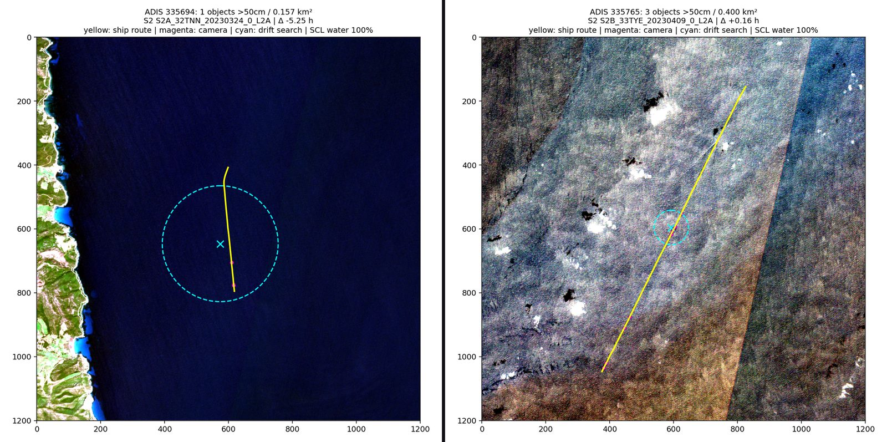

### 8.3 ISPRA и пары с разрывом до 48 ч со сдвигом дрейфом

В 167 трансектах ISPRA одна пара уровня A по месту и дню (трансекта 604, 16.09.2019). Остальные: C — 39, D — 127. Эксперт на чекпоинте разрешил разрыв до 2 суток при условии, что полевые точки сдвинуты течением и ветром к моменту снимка. Мы проверили 8 лучших пар. Только у них в буфере 500 м вокруг трека вообще есть пиксели детектора. Предметы учёта сдвигались OpenDrift (`src/macroplastic/drift/`) от времени учёта к времени снимка. Часовой пояс ISPRA не записан, поэтому проверены две гипотезы.

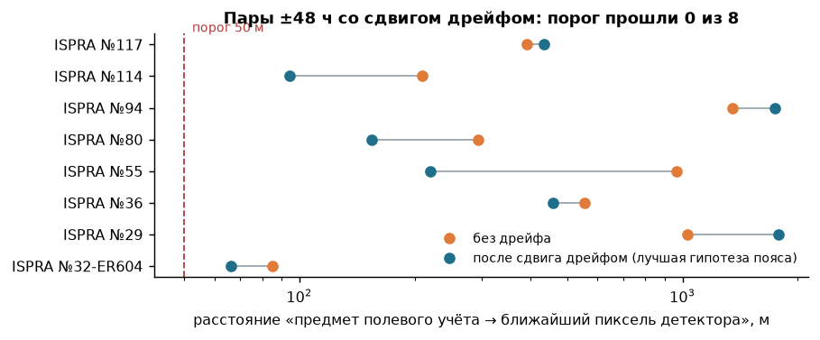

| Пара ISPRA | Трансекта | Предметов | Δt, ч (две гипотезы пояса) | Без дрейфа, м | После дрейфа, м |
|---|---|---:|---|---:|---:|
| 32-ER604 | 604 (ER604) | 16 | 0.2 / -1.8 | 85 | 66 |
| 29 | 0222-MS01380_TR12 | 7 | 3.5 / 1.5 | 1030 | 1785 |
| 36 | PLM1 | 32 | 1.2 / -0.8 | 554 | 460 |
| 55 | 1_ABR_VA13 | 12 | -0.4 / -2.4 | 964 | 220 |
| 80 | SMTS_S0518_LitA | 18 | 0.8 / -1.2 | 293 | 154 |
| 94 | NAPA_S012_Lita | 19 | 6.9 / 4.9 | 1354 | 1743 |
| 114 | 8PC03_S009_LitB | 47 | -3.4 / -5.4 | 209 | 94 |
| 117 | 9PN04_S009_LitA | 65 | 0.7 / -1.3 | 392 | 435 |

Итог: порог 50 м **не прошла ни одна пара (0 из 8)**. Лучшее сближение — 66 м. Дрейф приблизил предметы к пикселям детектора у 5 пар и отдалил у остальных. Реальные Δt не больше 6.9 ч, так что допуск 48 ч здесь не понадобился. Ограничение источника: до 2022 года в цепочке дрейфа нет реального поля течений. Для 6 из 8 пар это фактически дрейф только под ветром (`docs/research/pairs/drift_shift_48h.md`). Уровни не меняются: A по месту и дню для трансекты 604 (не калибровочная), C для остальных.

### 8.4 Все попытки перевода «снимок → число»

| Попытка | Число | Вывод | Файл |
|---|---|---|---|
| Ранговая связь признаков снимка с полевой плотностью всего мусора, 11 пар (6 групп «район × день») | FDI ρ = -0.75, p Холма 0.12; у случайной воды той же сцены -0.52 | связь не установлена | `reports/case_pairs/experiment.json` |
| Калибровка по ячейкам 0,25° (LWD Cózar и наш детектор против полевой плотности) | общих дат в одном периоде 0; климатологии разных лет ρ = 0.18 [-0.03; 0.38] | правило не пройдено | `reports/quantity/cell_calibration.md` |
| Спектр пикселя → доля покрытия (PLP2019, независимая проверка) | ρ(FDI) = 0.09; модель по FDI на отложенной дате не лучше среднего | не подтверждено | `docs/research/gleb_quantitative_link/results/` |
| Синтетический перенос P3 | MAE 893.5 против 100.9 у плоской калибровки и 113.5 у ответа «0» | отвергнуто | `reports/p3/p3_synth.json` |
| Поиск оценщика (единые ворота) | методов 5, прошли ворота 0; природных пар A 0 | ни один метод не принят | `docs/research/discovery/LEADERBOARD.csv` |
| Архивы пар (VHR, дроны, разовые кампании) | файлов 42, кандидатов 18 | калибровочных пар не дали | `docs/research/pairs/archives/` |
| Сценарий PLP в карточке: площадь маски × штук на пиксель мишени | разброс перевода при разных допущениях ×3 125 (≈ 3,5 порядка) | только свёрнутый сценарий с допущениями, не результат | `configs/zone_estimate.yaml` |
| Регрессия «снимок → шт./км²» по парам | — | **не делали**: при 0 синхронных пар это была бы подгонка | — |

Авторы крупнейшего каталога мусорных нитей пишут то же: «The current matching of satellite detections and field observations is limited to fake targets (artificial LWs), and reports of dense LW sightings» (Cózar et al. 2024, Nat Commun, раздел «A new scenario for research and management» (PMC11178853)).

### 8.5 История ошибок: наблюдение → решение

| # | Наблюдение | Решение | Где записано |
|---|---|---|---|
| 1 | kNN по полю «обыгрывал» медиану, но его соседи оказались из того же дня рейса | сплит по участкам маршрута с буфером 1 сут; выигрыш исчез | раздел 7.3, `reports/case_conc/baseline.md` |
| 2 | На отложенном test модель хуже медианы (30.0 против 25.2) | по правилу, записанному заранее, на карте медиана; модель после test не подбиралась | `docs/DECISIONS.md` |
| 3 | С гармонизацией L2A детектор дал 975 объектов на снимках пар; визуально вероятных скоплений ≈ 1.7 % | гармонизация выключена (на MARIDA val она тоже хуже); текущий режим дал 5 одиночных пикселей, все ложные | `reports/case_pairs/detector_review.md` |
| 4 | Лучшие зоны живых сцен оказались кильватером, швом детекторов и судами | фильтр линейных артефактов; зона с признаками артефакта получает статус «недостаточно данных» | `reports/artifacts.md` |
| 5 | Береговая линия 1:110m ставила морские точки «на сушу» (расстояние 0 → ложный «высокий» алерт) | контур Natural Earth 1:10m; точка на суше даёт «нет данных», а не 0; алерты пересчитаны | `docs/ALERTS.md` |
| 6 | Прогноз дрейфа на следующем снимке попал в 7/18 — столько же, сколько «нулевой дрейф» | дрейф подписан «прогноз, эксперимент»; в ранге важности — дополнительный множитель, не решающий | `reports/drift_check.md` |
| 7 | Перевод площади маски в штуки даёт разброс ×3 125 | в карточке «по снимку: не определено»; сценарий PLP свёрнут и подписан | `docs/QUANTITY.md` |
| 8 | В число ADIS входят животные и растения | ADIS — «все объекты камеры», не пластик; в таблице совокупностей указано отдельно | `docs/LABELS.md` |
| 9 | Для дат до 2022 поле течений в цепочке дрейфа пустое | для 6 из 8 пар ISPRA это записано как дрейф только под ветром | `docs/research/pairs/drift_shift_48h.md` |
| 10 | Детектор v2 с естественными B находит больше нитей, но путает суда и пену | правило принятия записано заранее, его не прошёл ни один вариант; в сервисе текущие веса | раздел 6.3 |

## 9. Реестр гипотез

Журнал экспериментов `docs/PIPELINE.md`: 71 строк вида «проверка → число → решение». Ниже гипотезы разнесены по четырём статусам. Идеи, которые не проверялись, отмечены отдельно и за эксперименты не выдаются.

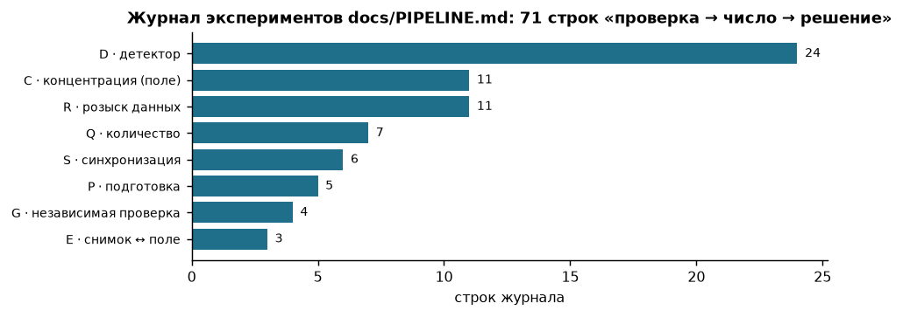

**Принято (проверено экспериментом, число и правило записаны).**

| Гипотеза | Результат | Источник |
|---|---|---|
| Оконные признаки (аномалия к медиане окна) улучшают детектор | прирост F1 val +0.013 при пороге 0.01 | `reports/experiments.md` (H1) |
| MADOS в обучении улучшает детектор | val 0.923; прирост 0.015 [0.007; 0.038]; на новом регионе 0.854 против 0.755 без MADOS | `final_numbers: metric_audit` |
| C = N/A воспроизводит опубликованные плотности | 467 из 467 строк | `src/macroplastic/case/concentration.py` |
| Синхронность нужно проверять дрейфом, а не окном ±1 сут | 29 пар по метаданным → 0 синхронных | раздел 4 |
| Интервал профиля — бутстреп по дням рейса | покрытие одного нового места на test 92.9 %; пуассоновский интервал среднее test не накрывает | `reports/quantity/field_intervals.md` |
| Флаг NDVI/FAI отмечает саргассум | плотный 16/16, мусор 1/418 объектов (val) | раздел 6.4 |

**Отвергнуто (проверено, не подтвердилось).**

| Гипотеза | Результат | Источник |
|---|---|---|
| U-Net сильнее бустинга на точечной разметке | val 0.893 против 0.923; U-Net MARIDA на test 0.501 | `reports/l4_unet.md`, `reports/detector_v2/unet_test.json` |
| Стек U-Net + LightGBM, лёгкая и средняя модели, z-оценки сцены | прирост ниже порога или хуже перенос на новый регион | `reports/experiments.md`, `docs/PIPELINE.md` D10, D14–D16 |
| Модель по полевым признакам лучше медианы | test S2 30.0 против 25.2, S1 370.0 против 371.1 | `reports/case_conc/final_test.json` |
| Дообучение детектора на новых B + D | вариантов 13 × 3 seed, принято 0 | `reports/detector_v2/experiments_snapshot.json` |
| Признаки снимка ранжируют полевую плотность | связь не установлена (ρ -0.75, p Холма 0.12) | `reports/case_pairs/experiment.json` |
| Прогноз дрейфа точнее «нулевого дрейфа» | 7/18 против 7/18 | `reports/drift_check.md` |
| Калибровка по ячейкам | калибровки по ячейкам нет: в одном периоде общих дат поле × спутник 0; климатологии разных лет ранжируют районы слабо (ρ ≈ география — удалённость от берега), правило принятия не пройдено | `reports/quantity/cell_calibration.md` |
| Флаг NDVI/FAI защищает от прочей органики | 0/46 объектов, 0 из 53 спутанных пикселей | раздел 6.4 |
| Сдвиг полевых точек дрейфом создаёт пары (±48 ч) | 0 из 8 | раздел 8.3 |
| Синтетический перенос P3 | не принята: на 11 датах мишеней A* (оставь-одну-дату) MAE 893.5 против 100.9 у плоской калибровки и 113.5 у ответа «0» | `reports/p3/p3_synth.json` |
| Счётчик по фото переносится на чужие наборы без дообучения | вне обучающих наборов найдено 92 из 193, ложных 202 (UCWD 44/78, ложных 139); на своих наборах (Winans, FML) 182 из 251, ложных 55 | `data/case/drones/pred.json` |
| Нефтяное пятно на реальных L2A | MADOS test F1 0.733 против OSI 0.324, но разлив Wakashio не найден | `docs/OIL.md` |

**Не доказано (проверка была, данных для вывода мало).**

| Гипотеза | Что есть | Чего не хватает |
|---|---|---|
| Снимок даёт шт./км² через калибровку `ln C = ln k + b · ln S` | калибровочных пар 0 | 4–12 синхронных пар с ненулевым сигналом снимка |
| Плотные нити детектор видит, единичные предметы — нет | на 3 оцениваемых парах с предметами 0 пикселей; на нитях Cózar 36 % объектов | пар «плотная нить + полевой счёт» нет |
| Пара ISPRA 604 годится для калибровки | одна пара A по месту и дню | ширина полосы 2019 г. не записана, часовой пояс не записан; одна пара ничего не калибрует |
| Облако дрейфа «сдвиг назад» лучше прогноза | 11/18 против 7/18 | проверено на 18 парах одного протокола |

**Не проверялось (идеи, не эксперименты).**
- Классификация материала (пластик против других материалов) по спектру Sentinel-2. Класс детектора — «плавающий материал».
- Масса пластика (г/км²) по снимку. Масса есть только в S1 и в продукт не входит.
- Съёмка высокого разрешения над полосами обследования. Доступа нет: коллекций VHR в Copernicus Data Space 0, продукт Pléiades — ошибка 403 (`docs/PIPELINE.md` Q4).
- Многовременной детектор, накопление нитей по серии снимков.
- Трансекты, спланированные под пролёт Sentinel-2. Инструмент «Подобрать снимок» есть, полевых данных под него нет.

## 10. Независимые тесты и защита от утечек

| Решение | Какие данные | Использовались ли финальные ответы |
|---|---|---|
| Отбор записей | правила в `configs/case_selection.yaml`, причина у каждого отказа | нет |
| Разбиение по концентрации | дни рейса → 5 участков маршрута, буфер 1 сут; test выбран по sha256 от seed | нет: состав test зафиксирован до моделей |
| Выбор модели концентрации | CV на dev (44 события S2, 19 дней), правило записано до CV | нет |
| Показываемый прогноз | правило «модель не лучше медианы → медиана» записано до открытия test | test открыт один раз (25.09.2026 19:15) |
| Порог детектора | только val MARIDA | test MARIDA открыт один раз, после заморозки |
| Детектор v2 | проверка зафиксирована до экспериментов (sha256 в `configs/detector_v2_eval.yaml`) | test MARIDA не читался |
| Демо-сцена 30SXE | не участвовала в обучении, подборе порога и экспериментах; проверено по MARIDA (тайл и дата) и MADOS (содержимое) | — |

Проверки утечек в данных:
- с MARIDA по тайлу и дате — 0 совпадений;
- с MADOS по пикселям (PLP, FloatingObjects) — 0 из 119;
- поля с ответом в признаках отсутствуют (`assert_no_leak()`).

Составы всех выборок — `reports/case_splits/` (17 файлов). Тесты проверяют непересечение групп, дней рейса и сцен, отсутствие полей-утечек и однократность test. Тесты кейса: 252 passed, 2 skipped, 3 failed. Честная оговорка: ранняя разведка бейзлайнов видела все события профиля, включая будущий test. Поэтому test не абсолютно нетронутый.

## 11. Примеры удачи и ошибки

Пять обязательных типов примеров выбраны правилом, а не вручную. Их отдаёт `/api/v3/defense_examples`, в интерфейсе они лежат во вкладке «Проверка качества» → «Примеры для защиты»:

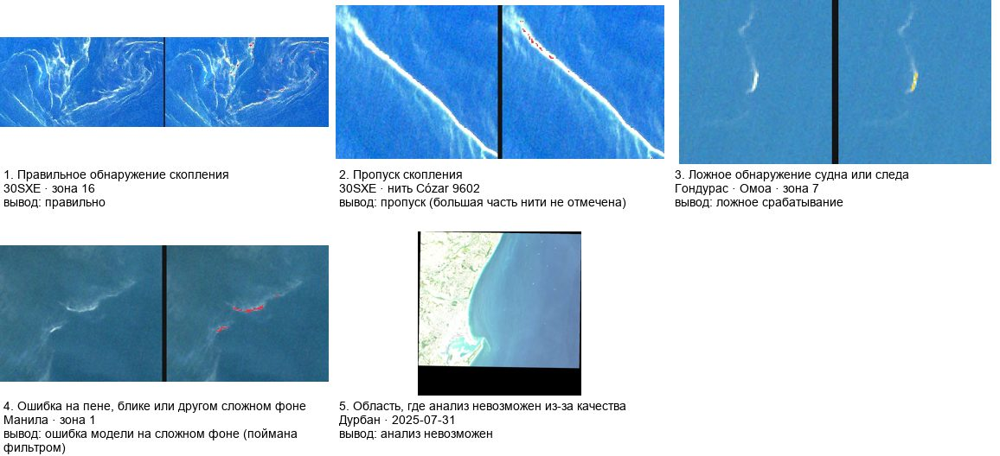

| Тип | Сцена | Эталон | Вывод |
|---|---|---|---|
| Правильное обнаружение скопления | 30SXE · зона 16 | каталог Cózar 2024, уровень B (нити проверены людьми по снимку) | правильно |
| Пропуск скопления | 30SXE · нить Cózar 9602 | каталог Cózar 2024, уровень B: нить 9602, 124 пикс. | пропуск (большая часть нити не отмечена) |
| Ложное обнаружение судна или следа | Гондурас · Омоа · зона 7 | независимой разметки нет — качественный разбор по снимку | ложное срабатывание |
| Ошибка на пене, блике или другом сложном фоне | Манила · зона 1 | независимой разметки нет — качественный разбор по снимку | ошибка модели на сложном фоне (поймана фильтром) |
| Область, где анализ невозможен из-за качества | Дурбан · 2025-07-31 | не нужен: вывод по правилу освещённости, до модели | анализ невозможен |

На полевых парах:
- Чёрное море, трансекта T30 и снимок того же дня: полоса чистая, детектор объектов не дал. Время и площадь трансекты не опубликованы, поэтому уровень C, а не A.
- Северное море, HE460 т.03: полоса чистая, но за время между съёмкой и трансектой вода ушла дальше допуска.

## 12. Карточка и веб-сервис

### 12.1 Сценарий и слои

Карта открывается обзором Земли с точками зон из уже обработанных сцен. Путь эколога: **Земля → точка → карточка зоны → «В студию» → «Назад»** к прежнему масштабу → следующая зона → выгрузка. Слои:
- полевые измерения (шт./км² с интервалом, профилем и источником);
- полосы обследования со снимками-кандидатами — 29;
- спутниковые находки — 77 из 286 обработанных зон на 75 оцениваемых сценах;
- маска качества снимка.

У каждой зоны два статуса: детекция и концентрация.

| Статус зоны | Подтверждение или причина | Число зон |
|---|---|---:|
| обнаружено | совпадает с нитями Cózar 2024 (уровень B) | 14 |
| обнаружено | независимой разметки нет | 64 |
| недостаточно данных | признаки пены, блика, судна, берега, мелководья | 180 |
| недостаточно данных | ветер > 5 м/с: ноль не информативен | 0 |
| не обнаружено | детектор оценивается, объектов нет | 28 |

Статус «обнаружено» стоит у 14 + 64 зон. Из них 1 на снимке из обучения детектора и в находки не входит. Остаётся **77 находок**.

### 12.2 Карточка зоны: что показано и откуда число

Замечания эксперта с чекпоинта (`docs/acceptance/MATVEY_CHECKPOINT_NOTES.txt`) закрыты полями карточки. Числа ниже посчитаны теми же функциями сервиса, что отдают `/api/v3` (`reports/report_extra/service_card.json`, команда `scripts/case/report_figs.py`).

| Блок карточки | Что показано | Число по всем находкам | Чего это НЕ означает |
|---|---|---|---|
| Оценка количества | «По снимку: не определено (принятых пар 0)». По полю — ближайшая полевая оценка шт./км² с датой, источником и расстоянием | полевая оценка есть у 29 из 77 находок | полевое число другого места — не плотность зоны |
| Крупные скопления | метка при площади маски ≥ 0.1 км² или большой оси ≥ 500 м | крупных 25 из 77 | размер пятна, не число предметов |
| Интегральная оценка | суммарная площадь контуров находок и доля покрытия по маске | по всем районам 21.77 км² контуров; демо-сцена — ниже | «площадь, не число предметов» |
| Берег и алерты | расстояние до берега (Natural Earth 1:10m); уровень «слабый / средний / высокий» по правилу `docs/ALERTS.md` | берег 0.1–27.9 км, медиана 11.3; алерты 24 / 53 / 0 | материал спутниковой зоны не определяется; для навигации расстояние не годится |
| Дрейф ≤ 72 ч с вероятностью | облако частиц OpenDrift OceanDrift (HYCOM ESPC-D-V02 1/12°, NCEP GFS 0.5°), изолинии 50 % и 90 %, доля частиц на берегу | прогноз есть у 33 из 77 находок; доля на берегу — медиана 12.7 %, максимум 99.7 % | модельный сценарий, не наблюдаемое перемещение: на следующем снимке 7/18, как у «нулевого дрейфа»; без прогноза — «нет расчёта», не 0 |
| Динамика района | по датам: число находок, суммарная площадь, полевая концентрация, где есть | районов 19, с ≥ 2 датами 14 | рост площади ≠ рост количества пластика |
| Органика | флаг NDVI/FAI с подписью «эксперимент» | флаг у 2 находок | органика отдельно моделью не выделяется |

**Интегральная оценка демо-сцены** (30SXE, 11.03.2021): 23 находки, из них крупных 10. Площадь контуров 11.74 км², площадь маски 0.190 км² на 198.0 км² пригодной воды. Доля покрытия 0.096 %.

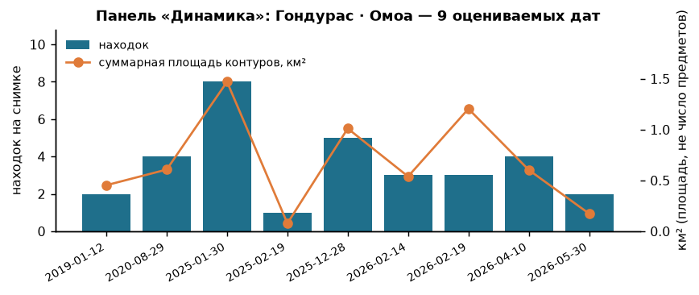

### 12.3 Согласованность и устойчивость

Самопроверка сверяет по id алгоритм, JSON, CSV и GeoJSON:
- ok 257 из 259 проверок, расхождений 0;
- некорректные входы — 46 из 46 с верным кодом;
- p95 ответа ≤ 1 128 мс.

На демо-сцене выгрузка совпадает с картой: зон на карте 23, строк CSV 23, объектов GeoJSON 23. При сбое API карта пишет «данные недоступны» и моки не подставляет. Эксперт может повторить расчёт без правки кода: `scripts/case/expert_check.py`.

### 12.4 Дополнительные функции

- **«Подобрать снимок».** Правило дрейфа превращено в инструмент планирования, окно `abs(Δt) ≤ 4.17 ч`. Для 12 событий Чёрного моря функция выдаёт окно UTC. Прогноз пролётов совпал с реальной съёмкой в 82 из 88 случаев.
- **Счётчик предметов по фото** — отдельный модуль, не спутник. Отложенный test FML: 1 190 кадров, MAE 0.59 шт./кадр [0.54–0.66], AP50 0.914. На кадрах с известной площадью (Winans, 164 м²) MAE плотности 11 320 против 27 930 шт./км² у медианы.
- **Нефтяное пятно** — эксперимент, по умолчанию выключен. MADOS test F1 0.733 против порога OSI 0.324. На L2A разлив Wakashio не найден.

**Функции последнего дня.** Статус взят из журнала `docs/LOG.md` на момент сборки отчёта. Функция считается сделанной, только если в журнале есть отметка о готовности.

| Функция | Что это за источник | Чего она НЕ доказывает | Статус |
|---|---|---|---|
| Обзор NASA «ежедневно» (GIBS: VIIRS, MODIS) | мозаика истинных цветов на выбранную дату, пиксель 250–375 м | это не обнаружение пластика: модель на этих кадрах не запускается (раздел 13) | готово по журналу (21:20) |
| «Дроны» внутри районов | 81 реальных детальных кадров из 6 открытых наборов, у каждого подписан сенсор (дрон, судно, берег) | дрон — не спутник; шт./м² только там, где известна площадь кадра. Наш счётчик как есть: найдено 274 из 444 размеченных предметов, ложных 257 (раздел 9) | готово по журналу (21:13) |
| Дорожки таймлайна (Sentinel-2 / NASA / дроны / поле / дрейф) | навигация по датам разных источников | — | готово по журналу (21:31) |
| Кнопка «Дрейф» у находки на карте | OpenDrift с HYCOM и GFS на дату снимка, ≤ 72 ч | модельный сценарий, не наблюдаемое перемещение; без данных на дату — «нет расчёта» | готово по журналу (21:21) |
| Реальное время: свежие Sentinel-2 нашей моделью | раздел 13 | зоны не проверены человеком | работает; массовый прогон продолжается, на момент сборки обработано 202 снимков |
| PRIME MODE · демо-данные (по запросу жюри) | раздел 14 | демо-макет интерфейса: изображения и числа демонстрационные, не результат модели | готово по журналу (22:24) |

## 13. Реальное время: наша модель на каждом новом снимке Sentinel-2

**Что считается «реальным временем».** Детектор запускается на каждом новом снимке Sentinel-2 L2A каждого района. Новый снимок одного места бывает раз в 2–5 дней. Порядок тот же, что и для архивных сцен: вырезка района, маски качества (облака, блик, суда, пена, ветер), детекция, зоны со статусами. У свежих зон подпись «автоматически, не проверено человеком». В числа кейса (разделы 6–12) они не входят.

Фактическая воронка на момент сборки: найдено 1077 → скачано 1077 → прошло качество 476 → обработано 202 → снимков с находками 10 → зон 477 (находок 19; исключено по качеству 600; нет пикселей в Planetary Computer 4; ошибки обработки 0; ещё в очереди 271; облачность вырезки > 40 %: 339; вырезка на краю тайла (мало валидных пикселей): 261; пикселей ещё нет в Planetary Computer: 4). Окно поиска — последние 180 сут (даты съёмки снимков в индексе — с 2026-06-09 по 2026-09-26). Последняя успешная обработка — 2026-09-26T20:47:23Z (UTC). Модель — weights/lgbm (sha256 0eeebf43fccc), те же фильтры качества, что у архивных сцен. Снимки с нулём находок показаны тоже: «0 находок» — это результат. Подпись у каждого снимка — «автоматически, не проверено человеком»; эти зоны не входят в числа кейса. Источник — `data/case/fresh_s2/index.json`.

**Почему модель не запускается на ежедневных кадрах NASA.** VIIRS и MODIS дают пиксель 250–375 м. По площади это в 625–1 406 раз больше пикселя Sentinel-2 (10 м). Детектор обучен на 10 м и 11 каналах Sentinel-2. Даже на 10 м ≥ 20 % пикселя заполняют лишь 0.076 % реальных предметов (раздел 15), а на 250 м сигнал скопления размывается ещё в сотни раз. Запуск модели на таких кадрах был бы подделкой. Поэтому NASA — ежедневный контекст: облачность, цветение, крупные пятна. Детекция идёт только на Sentinel-2.

## 14. Демо-режим по запросу жюри (PRIME MODE)

На чекпоинте жюри попросило показать, как сервис будет выглядеть, если появятся снимки нормального (детального) разрешения. Для этого в интерфейсе есть тумблер «PRIME MODE · демо-данные». **Это демонстрационный макет интерфейса, а не эксперимент и не результат модели.**

- В точках событий CSV организаторов показаны демонстрационные детальные «снимки» скоплений: реальная вода и вырезки предметов из дрон-наборов либо простая отрисовка.
- Карточка показывает будущий вид: класс предметов, «N шт.», шт./км², рамки. Числа берутся из самой строки CSV (N, площадь, категории) с подписью «данные CSV организаторов». Это не предсказание счётчика и не результат модели.
- На весь режим видна плашка «ДЕМО: как сервис будет выглядеть на детальных снимках. Изображения и числа — демонстрационные, не результат модели».
- Выключенный режим не показывает ни одного демо-объекта. С реальными слоями демо не смешивается.

Метрик качества у демо-режима нет, и в этот отчёт он не добавляет ни одного числа о точности. Статус: готово по журналу (22:24).

Отдельно от демо проведён эксперимент со счётчиком на синтетических кадрах строк CSV при разном разрешении — он описан в разделе о физическом пределе разрешения и к демо-карточкам не относится.

## 15. Физический предел разрешения Sentinel-2 и почему маска ≠ шт./км²

Снимок в тот же день и полевое число ещё не значат, что предметы различимы на Sentinel-2. Пиксель 10 × 10 м = 100 м² = 10⁻⁴ км². Посчитаем на плотности профиля S2, C = 53.9 шт./км²:
- предметов на пиксель: `C · 10⁻⁴ км² = 0.0054`, то есть один предмет примерно на 186 пикселей;
- доля площади, покрытая предметами (медианная площадь предмета ADIS s = 0.27 м²): `C · s / 10⁶ = 14.6·10⁻⁶`;
- на искусственных мишенях PLP детектор срабатывал при заполнении пикселя 28–40 % (`docs/QUANTITY.md`). Даже до уровня 20 % пикселя средней доле покрытия в поле не хватает примерно 14 000 раз.

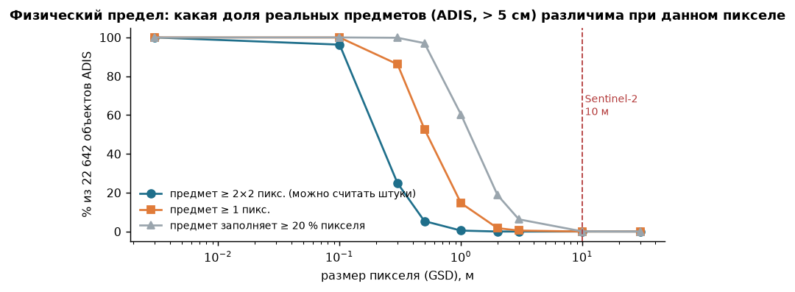

По 22 642 предметам ADIS: при пикселе 10 м поштучно (≥ 2×2 пикселя) различимы 0 %, ≥ 20 % пикселя заполняют 0.076 %. Медианный предмет занимает 0.27 % пикселя. Чтобы считать штуки, нужен пиксель 0,3–0,5 м (25 % и 5 % предметов). Это спутники VHR или дрон, а не Sentinel-2.

**Эксперимент: наш счётчик на синтетических кадрах строк CSV при разном разрешении.** Это отдельный эксперимент, не часть демо-режима. Для 220 строк CSV организаторов (187 событий, 3 372 предметов) нарисованы кадры участка: реальная вода с дрона, вырезанные реальные предметы TUN-MarineLitter, число — N строки на площади A. Счётчик по фото работает как есть, без дообучения на этих кадрах, порог 0.8. Затем кадры огрублены до 0.05, 0.2, 0.5, 1, 3, 10 м.

| Размер пикселя, м | Найдено предметов | Ложных на плитку пустой воды | Смещение, шт./км² (в CSV в среднем 139.4) |
|---:|---:|---:|---:|
| 0.05 | 23.6 % | 0.268 | 1529.9 |
| 0.2 | 4.6 % | 0.000 | -132.8 |
| 0.5 | 0.7 % | 0.000 | -138.4 |
| 1 | 0.1 % | 0.000 | -139.2 |
| 3 | 0.0 % | 0.000 | -139.4 |
| 10 | 0.0 % | 0.000 | -139.4 |

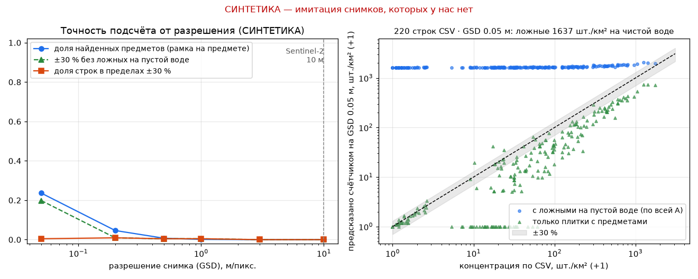

Наблюдение → решение. Даже при 0,05 м счётчик находит меньше четверти предметов и даёт ложные срабатывания на пустой воде, поэтому шт./км² сильно завышены. При 3 м и 10 м он не находит ничего. Это числовое подтверждение физического предела: на Sentinel-2 штуки не считаются, и продукт их по снимку не выдаёт. Эксперимент не доказывает точность на реальных снимках скоплений: таких снимков у нас нет, размеры предметов взяты по допущению (`reports/prime/metrics.json`, поле `not_proven`).

**Почему маску или индекс нельзя выдавать за шт./км².**
- Маска измеряет площадь пикселей с аномальным спектром, то есть долю покрытия. Число предметов зависит от неизвестного распределения размеров: при разных допущениях разброс ×3 125.
- Отклик не монотонен по числу предметов. На мишенях PLP из 9 водных пикселей с ≥ 400 бутылками детектор сработал на 2 (`docs/QUANTITY.md`).
- Класс маски — любой плавающий материал: пена, органика, суда дают такой же сигнал (раздел 6.3).
- Связь индекса с полем не найдена: ρ(FDI) = -0.75 на 11 парах, ρ = 0.09 на PLP.
- Калибровочных пар 0. Даже для множителя k с точностью ×/÷2 нужно 4–12 пар.

Поэтому в продукте нет массы и нет физической концентрации пластика по снимку. У зоны — площадь, доля покрытия, статус и подпись «количество по снимку не определено».

## 16. Ограничения переноса и развитие

**Ограничения.**
- Перенос «снимок → шт./км²» не доказан (разделы 8 и 15).
- Полевая модель построена на одном рейсе S2, и на отложенном test медиана не хуже модели. Для нового места интервал 10.0–160 шт./км².
- Детектор обучен на ACOLITE (MARIDA), а сервис работает на L2A. На L2A он проверен только на новых наборах B/D: нити Cózar 36 %, ложные на 26 % судов.
- На новом регионе F1 ниже (0.854), при низком Солнце (зенит ≥ 58°) анализ не выполняется.
- Дрейф — модельный сценарий, не наблюдаемое перемещение; на следующем снимке не подтверждён.

**Развитие.**
- Трансекты под пролёт Sentinel-2 с записанным временем и шириной полосы: 4–12 пар с сигналом снимка.
- Снимки 0,3–0,5 м или дрон над полосами. Тогда счётчик предметов на кадре даёт штуки на известной площади.
- Больше рейсов и сезонов для полевой модели.
- Разметка L2A-сцен для детектора (суда, пена, органика).

## 17. Воспроизводимость

Все команды — из корня репозитория, `.venv\Scripts\python.exe`, CPU, без сети (данные в git или в кэше).

| Число или артефакт | Команда | Выход |
|---|---|---|
| весь маршрут кейса | `run.ps1 -Case all -Offline` (7.5 с) | `reports/case_run/run_summary.json`, 24 таблиц с одинаковыми sha256 при повторе |
| метрики детектора (test) | `scripts\case\run_all.py eval` | `reports/case_run/detector_recomputed.json` = `reports/case_detector/metrics.json` |
| C = N/A и интервал профиля | `scripts\case\expert_check.py --n 697 --area 12.94`; `scripts\case\field_interval_check.py` | консоль; `reports/quantity/field_intervals.*` |
| CV и отложенный test концентрации | `scripts\case\conc_model_cv.py`; test — `final_test_conc.py` (однократный, повтор отклоняется) | `reports/case_conc/{dev_cv,final_test}.json`, `final_test_predictions.csv` |
| числа расследования, органика, пары ±48 ч, физика разрешения | `scripts\case\collect_search.py` | `reports/search/search_numbers.json` → `case.sections.*` |
| числа карточки и графики отчёта | `scripts\case\report_figs.py` | `reports/report_extra/service_card.json`, `reports/img/report/*` |
| единый файл чисел | `scripts\final_numbers.py` | `reports/final_numbers.json` |
| этот отчёт | `scripts\render_docs.py`, затем `scripts\case\report_export.py` | `reports/report_final.md` → `reports/report.docx`, `reports/report.pdf` |
| согласованность API и выгрузки | `scripts\case\consistency_check.py` | `reports/selfcheck/consistency_latest.*` |
| тесты кейса | `-m pytest -q tests\test_case_*.py tests\test_api_v3.py` | 252 passed |

Чистый клон с GitHub до карты занял 7,5 мин на CPU, числа совпали (`reports/selfcheck/clean_clone_1941.md`). Сохранённые предсказания 7 моделей детектора (`data/case/detector_preds/`) позволяют пересчитать TP/FP/FN без MARIDA. Эталоны и предсказания концентрации лежат в `reports/case_conc/`. Команды для каждой метрики — в README, раздел 7.

## 18. Источники, лицензии, вклад команды

| Что | Лицензия или условия |
|---|---|
| Реестр организаторов: Lebreton 2018 (figshare), Gutow 2021 и 2018 (PANGAEA), DOORS 2024 (Zenodo) | CC BY 4.0; Gutow 2018 — CC BY 3.0 |
| MARIDA (Zenodo 5151941), MADOS (Zenodo 10664073) | CC BY 4.0 |
| ADIS, The Ocean Cleanup (4TU) | CC BY 4.0 |
| Каталог нитей Cózar et al. 2024 (Zenodo 11045944), DOI 10.1038/s41467-024-48674-7 | CC BY 4.0 |
| PLP (Zenodo 3752719); FloatingObjects / Refined | CC BY 4.0 / Apache-2.0 / MIT |
| Суда у Финляндии (Zenodo 15019034), Cloud Mask Catalogue (Zenodo 4172871) | CC BY 4.0 |
| FML (SEANOE 10.17882/106148), Winans 2023 (Zenodo 8381113) | CC BY |
| ISPRA, мониторинг плавающего мусора (MSFD) | условия портала ISPRA; лицензия в файлах не указана |
| The Ocean Cleanup River Monitoring | CC BY-NC 4.0, только исследовательское использование |
| DebrisScan | Apache-2.0 |
| Sentinel-2 и Landsat (Copernicus, USGS), ERA5 через Open-Meteo, HYCOM, NCEP GFS, Natural Earth, подложка Esri | открытые условия, атрибуция на карте |

Литература по методу: Kikaki et al. 2022 (MARIDA, PLoS ONE 17: e0262247), Biermann et al. 2020 (FDI, Sci Rep 10: 5364), Hu 2009 (FAI, RSE 113: 2118), Cózar et al. 2024 (Nat Commun), Lebreton et al. 2018 (Sci Rep 8: 4666).

**Готовое, не наше:** разметка MARIDA и MADOS, протокол RandomForest MARIDA, веса U-Net MARIDA, индексы FDI и FAI, OpenDrift, каталоги STAC.

**Вклад команды.** Постановку, приоритеты и приёмку вела команда. Код и эксперименты выполнены с ИИ-ассистентами по постановкам команды, журнал работ — `docs/LOG.md`.

| Участник | Вклад (по документам репозитория) |
|---|---|
| Кашин Глеб | независимая проверка количественной связи (`docs/research/gleb_quantitative_link/`), сравнение с DebrisScan, приёмка интерфейса (`docs/acceptance/GLEB_UX.txt`) |
| Закон Марк | репозиторий, сборка, развёртывание сервиса |
| Панин Матвей | приёмка решения и замечания эксперта с чекпоинта (`docs/acceptance/MATVEY_ACCEPTANCE.txt`, `MATVEY_CHECKPOINT_NOTES.txt`) |
| Ожигов Егор | запасной интерфейс по контракту API v3 (`docs/CONTRACTS_V3.md`), ревью интерфейса (`docs/acceptance/egor_fix_pack/`) |
| Ведерников Фёдор | постановка задач, приоритеты и план сдачи |

---

## Приложение А. Все детекторы на test MARIDA

| Детектор | Настройка (выбрана на val) | F1 val | Precision test | Recall test | **F1 test** | IoU test | 95 % ДИ F1 test (по сценам) | Помечено неразмеченных пикселей test, % |
|---|---|---|---|---|---|---|---|---|
| **LightGBM, MARIDA + MADOS (основной)** | `P(MD) >= 0.63` | 0.923 | 0.824 | 0.924 | **0.871** | 0.772 | 0.823–0.920 | 0.013 |
| RandomForest, протокол статьи MARIDA | `argmax of 11 classes (12-15 merged into Marine Water)` | 0.865 | 0.707 | 0.848 | **0.771** | 0.627 | 0.709–0.834 | 0.066 |
| RandomForest, порог P(MD) | `P(MD) >= 0.36` | 0.860 | 0.710 | 0.861 | **0.778** | 0.637 | 0.710–0.843 | 0.057 |
| окно FDI × NDVI (4 порога) | `FDI in [0.0234, 0.11202], NDVI in [-0.06544, inf]` | 0.415 | 0.022 | 0.580 | **0.042** | 0.022 | 0.017–0.312 | 1.774 |
| интервал FDI (2 порога) | `FDI in [0.03027, 0.05919]` | 0.323 | 0.013 | 0.457 | **0.025** | 0.013 | 0.011–0.092 | 1.838 |
| один порог FDI | `FDI <= 0.08186` | 0.020 | 0.003 | 0.971 | **0.006** | 0.003 | 0.003–0.012 | 94.943 |
| один порог NDVI | `NDVI >= 0.02161` | 0.168 | 0.012 | 0.247 | **0.024** | 0.012 | 0.007–0.078 | 6.458 |

## Приложение Б. Сводка разделов чисел: источник и протокол

| Раздел | Главные числа | Протокол | Источник |
|---|---|---|---|
| 1. Детектор на MARIDA test | LightGBM F1 0.871 [0.823–0.920], RF 0.771, FDI × NDVI 0.042; 15 сцен | официальный test MARIDA, один раз после заморозки; порог и настройки бейзлайнов — только по val; класс Marine Debris против остальных размеченных классов, неразмеченные не считаются фоном; ДИ — бутстреп по сценам | `reports/case_detector/metrics.json` |
| 2. Полевая dev-проверка | S2 (44 события): ridge_log MAE 28.5 против медианы 44.2, ΔMAE [−31.6; −0.3]; S1 (58): knn5_log 434.0 против 527.4 | кросс-валидация внутри dev по 5 участкам маршрута с буфером 1 сут (route_buf1); протокол и правило выбора записаны до CV; ДИ разности MAE — бутстреп по дням рейса | `reports/case_conc/dev_cv.json, configs/case_conc_model.yaml` |
| 3. Полевой отложенный test | S2 (14): ridge_log 30.0 против медианы 25.2, ΔMAE [−1.6; +12.9] — основная модель не лучше медианы; S1 (19): knn5_log 370.0 против медианы 371.1, ΔMAE [−60.7; +49.2] — разницы с медианой нет | отложенный участок маршрута (+ буфер 1 сут), состав зафиксирован до моделей (sha256 в configs/case_selection.yaml), посчитан один раз; основная модель против медианы dev на тех же событиях; ДИ — бутстреп по дням рейса test. Ограничение: ранняя разведка бейзлайнов видела все события профиля | `reports/case_conc/final_test.json, reports/case_conc/final_test_predictions.csv` |
| 4. Эксперимент на снимках | 11 пар S2 (6 групп), весь мусор, не пластик: FDI ρ -0.75, p Холма 0.12, случайная вода сцены -0.52 — связь не установлена | пары, прошедшие маски качества; эталон — полевая плотность всего мусора (all_litter), не пластика; ранговая связь Спирмена, бутстреп по группам «район × день», поправка Холма, нулевая модель — случайная вода той же сцены | `reports/case_pairs/experiment.json` |
| 5. Детектор на снимках пар (L2A), текущий режим | 5 объектов на 22 вырезках, в полосах обследования 0; гармонизация выключена (выбор по MARIDA val) | текущий режим детектора на вырезках Sentinel-2 L2A пар: LightGBM weights/lgbm, порог P ≥ 0.63, harmonize = 'none'; объекты — 8-связные компоненты на пригодной воде без объектов у облаков; «в полосе» — пересечение с растровой полосой обследования | `reports/case_pairs/detector_current.json (из data/pairs/quality/*/meta.json)` |
| 6. Прежний режим с гармонизацией (до решения об отказе от неё, docs/DECISIONS.md) — основание для отказа | 975 объектов, в полосах 6; без HE460 t03 ложные типы (блик, облака) 55.0 %; визуально «вероятное скопление» ≈ 1.7 % | 22 вырезки Sentinel-2 L2A пар; объекты пересобраны как в pair_quality.py; типы назначены правилами (grid.artifacts, край облака, мелкое облако по B11, блик по B11, берег), без ручной разметки; визуальная разметка — ИИ-агент, один аннотатор, по вырезкам, не полевая | `reports/case_pairs/detector_review.json (разбор: reports/case_pairs/detector_review.md)`, `reports/case_pairs/visual_review.json` |
| 7. Розыск снимков | события CSV: A 0, C 9; все строки-кандидаты вместе с ADIS: A 66 / C 12 / D 273 | розыск снимков под события CSV организаторов и под отрезки ADIS; уровень доказательности A–D у каждой строки; стоп-правило: нет A или убедительного C за пилот — поиск по дрейфу не расширяем; дрейф — область поиска, не доказательство | `reports/search/{s1,s2,s3,s4}_candidates.csv, reports/search/adis_candidates.csv, docs/img/funnel.json` |
| 8. Пары ADIS ↔ Sentinel-2 | A 66 (≈ 52 проходов), с предметами 6 — пикселей детектора 0 при 3.5–4.4 шт./км² | отрезки ADIS 10 км (камера судна, счёт >5/>10/>50 см, площадь обследования) × Sentinel-2 L2A; A = |dt| и дрейф в допуске, пиксели полосы годны по маскам качества, площадь и размерные классы из ADIS; детектор weights/lgbm без гармонизации, те же маски и код, что у пар CSV (pair_quality.process_s2); TP/FP по пикселям не утверждаются: пара A даёт только «на снимке N срабатываний при полевых M шт./км²» | `reports/search/adis_candidates.csv (копия data/search/adis/candidates.csv), reports/search/adis.md` |
| 9. Новые размеченные данные B/D | B: 65 съёмок PLP/FloatingObjects + 14 374 окон Cózar; D: 2 094 судов, 28 сцен облаков; с MARIDA по тайлу и дате совпадений 0, с MADOS по пикселям проверены только PLP/FO | B — подтверждённая разметка скопления (без числа предметов), D — проверенный отрицательный пример; пиксели — S2 L2A той же съёмки (тот же ридер, что у live-сцен); утечка = та же съёмка (тайл+дата) или те же пиксели (LBP) с MARIDA/MADOS/нашими сценами; текущий детектор weights/lgbm без дообучения, порог с MARIDA val | `reports/extra_data/registry.csv, registry_negatives.csv, registry_cozar2024.csv.gz, content_overlap.csv, current_detector_zero_shot.csv, fp_current_detector.json` |
| 10. Детектор v2 (дообучение на B + D) | вариантов 13 × 3 seed, принято 0; в сервисе weights/lgbm | проверка зафиксирована до экспериментов (sha256 в experiments.json): MARIDA val + 3-fold по снимкам для новых B/D; 3 seed; правило принятия записано заранее (ΔF1 val ≥ max(0.01, 2σ) и не хуже на D/B); test MARIDA не читался; порог каждой модели — по val | `reports/detector_v2/experiments_snapshot.json (снимок experiments.json), reports/detector_v2/decision.json (решение команды), configs/detector_v2_eval.yaml` |
| 11. Бейзлайн U-Net MARIDA | test F1 0.501; LightGBM лучше на 0.370 [0.215; 0.481] | официальные веса U-Net MARIDA (Kikaki et al. 2022, эпоха 44), код и предобработка авторов, не переобучали; та же функция оценки, что у LightGBM (detector_compare.evaluate); порог U-Net — только по val; test MARIDA посчитан один раз; ДИ и парная разность — бутстреп по сценам | `reports/detector_v2/unet_test.json, unet_baseline.json` |
| 12. Количество: поле и доля покрытия раздельно | калибровки нет (пар A с ненулевым сигналом 0); для k в ×/÷2 нужно 4–12 пар с сигналом | раздельно: полевая плотность C = N/A (шт./км², интервал Пуассона) и спутниковая доля покрытия подозрительного материала (м² маски на км² пригодной воды, как LWD у Cózar et al. 2024); доля покрытия ≠ мусор и ≠ шт./км²; связь между ними — только калибровка на парах A, которой нет; перевод площади в штуки не показывается | `reports/quantity/{field,calibration,coverage_live,coverage_pairs,scenario,adis_field}.json, docs/QUANTITY.md` |
| 13. Нефтяное пятно (эксперимент, выключен) | MADOS test F1 0.733 против OSI 0.324; контроль Wakashio на L2A не пройден | MADOS класс Oil Spill, сплит по сценам заморожен до обучения (без съёмок MARIDA val/test); отдельная голова LightGBM, основной детектор не тронут; выбор только по val, test открыт один раз; бейзлайн — порог OSI = (B3+B4)/B2; положительный контроль на S2 L2A — разлив Wakashio 2020; единица — площадь, км², не объём и не масса | `reports/oil/{val_runs,test,control}.json, configs/oil_eval.yaml, docs/OIL.md` |

## Приложение В. Карточка полевого измерения и прерванная трансекта

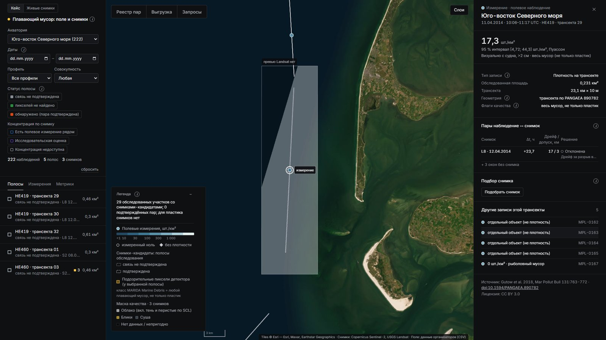

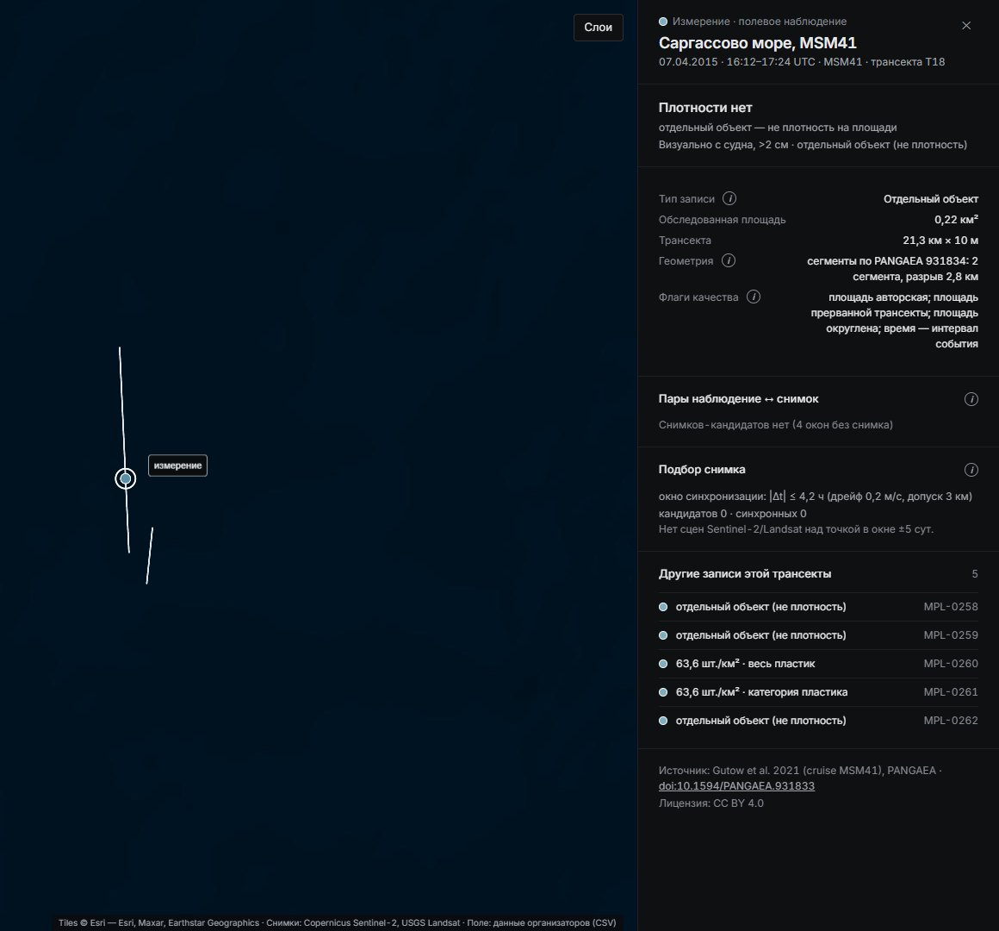
